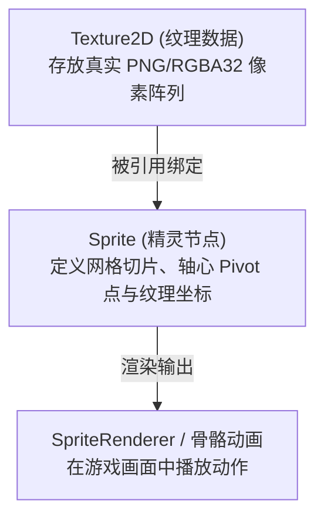

# 02. 贴图 Bundle 解构与实例分析

PVZH 中的单位贴图包并非单一的整体大图，而是为了骨骼动画（Spine/Unity 2D Animation）拆分成的散图部件与合订图集。

本篇以资源目录下的真实文件 **[1f826228d36c6f0478c72b56f17541d2_1](../资源/1f826228d36c6f0478c72b56f17541d2_1)**（康加僵尸 / Conga Zombie 贴图包）为例，深入解构单位贴图包的内部资源组织。

---

## 一、 Bundle 节点类型统计

通过工具解析 [1f826228d36c6f0478c72b56f17541d2_1](../资源/1f826228d36c6f0478c72b56f17541d2_1) 数据包，其内部共包含 99 个 Unity 资源节点，核心类型如下：

```text
Types: {
  'Texture2D': 8,             # 8 个 2D 纹理贴图对象（主要修改目标）
  'Sprite': 8,                # 8 个 2D 精灵切片对象
  'SpriteRenderer': 15,       # 15 个渲染组件
  'AnimationClip': 6,         # 6 个动画剪辑（攻击、受伤、闲置等动画）
  'AnimatorOverrideController': 1
}
```

---

## 二、 8 个 `Texture2D` 部件贴图详细表

在该贴图包中，康加僵尸的外观被拆解为了以下 8 张 `Texture2D` 散图/图集：

| 贴图节点名称 (`m_Name`) | 图像像素尺寸 (宽 x 高) | 对应部位 / 用途说明 |
| :--- | :---: | :--- |
| **`conga_head`** | `169 x 248` | **头部贴图**。包含表情与头发细节。 |
| **`conga_body`** | `96 x 96` | **身体/上衣贴图**。躯干衣物部分。 |
| **`conga_arm`** | `72 x 91` | **手臂贴图**。大臂与小臂切片。 |
| **`conga_palm`** | `60 x 28` | **手掌贴图**。 |
| **`conga_fingers`** | `88 x 36` | **手指贴图**。 |
| **`conga_congo`** | `70 x 84` | **康加鼓贴图**。单位所携带的敲击乐器部件。 |
| **`allstar_arm1`** | `28 x 101` | **手臂辅助切片**。 |
| **`51457c7b...`** | `256 x 256` | **主图集 / 集合切片**。带有卡牌 GUID 命名的聚合贴图。 |

---

## 三、 `Texture2D` 与 `Sprite` 的关系

很多初学者容易混淆 `Texture2D` 与 `Sprite`：



1. **`Texture2D`** 是真正存储图像像素颜色（RGBA）的底层资源。
2. **`Sprite`** 是 Unity 封装的渲染切片视图，记录了该贴图在屏幕上旋转、拉伸和切片的位置。

> [!NOTE]
> **修改技巧**：
> 在进行简单的贴图改版（例如给康加僵尸换帽子颜色、改衣服图案）时，**我们只需要导出并替换对应的 `Texture2D` 图像即可**。`Sprite` 会自动使用替换后的新像素，无需重新调整 Sprite 切片坐标！
