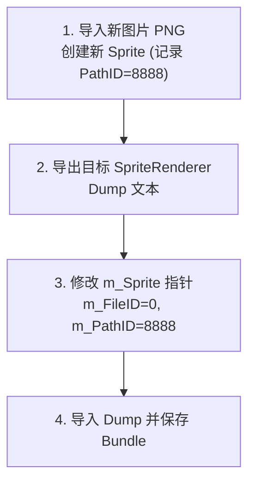

# 01. A包与B包及指针重定向机制

在 Unity 引擎中，游戏对象的视觉素材与逻辑结构是解耦存储的。理清 Unity 资源的打包机制与双元组指针引用关系，是进行贴图中级修改的基础。

---

## 一、 核心概念：资源包（A包）与结构包（B包）

Unity 游戏的底层资源在逻辑上划分为两大类：

1. **资源包（通常称为 A 包）**：
   专门用于存放具体的视觉与音频素材，例如 2D 贴图 (`Texture2D`)、精灵图切片 (`Sprite`) 等。
2. **结构包（通常称为 B 包）**：
   用于定义游戏对象的逻辑与层级结构，包含游戏实体 (`GameObject`)、空间变换 (`Transform`)、渲染器 (`SpriteRenderer`) 以及动画片段 (`AnimationClip`)。

> [!NOTE]
> **PVZH 包体的合并与分离**：
> 虽然逻辑上区分 A 包与 B 包，但在 PVZH 的实际打包中，大部分普通随从卡牌（如 [1f826228d36c6f0478c72b56f17541d2_1](../资源/1f826228d36c6f0478c72b56f17541d2_1) 康加僵尸）的**贴图素材与骨骼结构是物理合并打包在同一个 AssetBundle 文件里的**。

---

## 二、 指针引用机制：`{ m_FileID, m_PathID }`

在 B 包的结构组件（如 `SpriteRenderer`）中，通过一个名为 `{ m_FileID, m_PathID }` 的双元组指针来引用目标贴图或精灵图：

```yaml
m_Sprite: {fileID: 0, pathID: 1028}
```

### 1. `m_FileID`（文件索引）填写规则
- **`m_FileID = 0`**：表示目标 `Sprite` 资源与当前正在编辑的组件位于**同一个 AssetBundle** 文件内部（同包引用）。
- **`m_FileID > 0`**：表示目标资源位于外部依赖 Bundle 内（跨包引用）。
  - 该数值对应结构包在 `AssetBundle` 资源项声明的 `m_Dependencies` 预加载依赖项列表中从 1 开始数的索引。
  - 例如：若目标贴图位于第 1 个依赖包中，则 `m_FileID` 填 `1`；若在第 2 个，则填 `2`。

### 2. `m_PathID`（资源路径ID）
- 目标资源在 Bundle 内的全局唯一 64 位整型 ID（例如 `1028` 或 `8888`）。在 UABEA 的 Asset Info 视窗列表中可直接看到。

---

## 三、 指针重定向替换法 (Pointer Redirection)

### 1. 适用场景
当你希望保留原有官方贴图，或者不想直接覆盖已有 `Texture2D` 像素，仅需让游戏对象改用一张全新导入的 `Sprite` 时，使用**指针重定向法**最为妥当。

### 2. 标准实战步骤



1. **导入新资源**：在 UABEA 中导入新 PNG 贴图，右键创建 `Sprite`，在列表栏记录该新 `Sprite` 的 `PathID`（假设为 `8888`）。
2. **导出 Dump 文本**：在 UABEA 中找到需要修改的 `SpriteRenderer` 组件，右键选择 **`Export Dump`** 保存为 txt 文本。
3. **重定向指针**：
   打开 Dump 文本，找到 `m_Sprite` 字段，将其修改为：
   ```yaml
   m_Sprite: {fileID: 0, pathID: 8888}
   ```
4. **导入并保存**：选择 **`Import Dump`** 将修改后的文本重新载入 UABEA，并保存导出 Bundle 文件。
