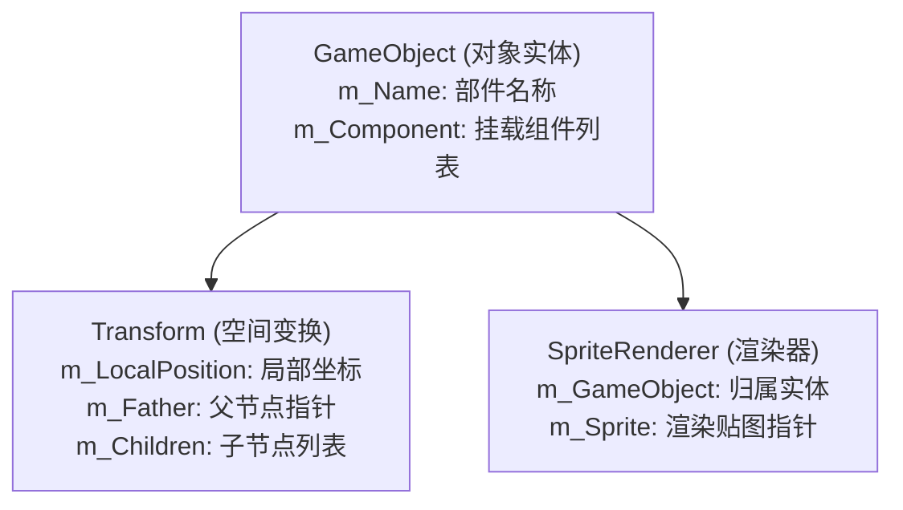

# 02. 三位一体结构与 Dump 安全扩容

若需要在已有卡牌随从的骨骼节点树中**追加一个原本不存在的新部件**（例如为随从追加一个独立渲染的小配件），必须构建标准的 Unity 实体结构，并遵循严格的 Dump 安全修改流。

---

## 一、 可见实体的“三位一体”结构

在 Unity 引擎中，任何能在画面中被绘制且拥有空间坐标的对象，在底层都由以下 3 个核心数据块绑定组成，缺一不可：

| 组件类型 | 核心职责 | 关键控制字段 | 闭环关联配置 |
| :--- | :--- | :--- | :--- |
| **GameObject** | 声明对象身份与挂载表 | `m_Name`, `m_Component` | `m_Component` 指向 Transform 和 SpriteRenderer。 |
| **Transform** | 管理坐标、旋转与父子层级 | `m_LocalPosition`, `m_Father`, `m_Children` | `m_GameObject` 指向 GameObject；`m_Father` 指向父节点。 |
| **SpriteRenderer** | 读取贴图进行绘制 | `m_GameObject`, `m_Sprite` | `m_GameObject` 指向 GameObject；`m_Sprite` 指向图片。 |

---

## 二、 节点双向绑定原则

在向现有随从（如康加僵尸）的节点树中挂载新部件时，必须建立**双向父子关系**：

1. **子节点指向父节点**：
   新部件 Transform 的 `m_Father` 字段，必须填入目标父节点（如头部或身体节点）Transform 的 PathID。
2. **父节点包含子节点**：
   目标父节点 Transform 的 `m_Children` 数组必须扩容，并在末尾追加新部件 Transform 的 PathID。

---

## 三、 Dump 文本安全修改流（防崩溃规范）

> [!CAUTION]
> **严禁直接在 UABEA 可视化 GUI 界面的 `size` 输入框中修改数组大小！**
> 
> 在 UABEA 界面中直接改动 `size` 数值，不会自动重算后续二进制数据的字节偏移量，会导致保存时程序崩溃或生成的 Bundle 文件结构损坏（引发游戏闪退）。

### 标准安全扩容工作流

$$\text{导出 Dump (.txt)} \longrightarrow \text{文本编辑器修改} \longrightarrow \text{重新导入 Dump}$$

1. **导出 Dump 文本**：在 UABEA 中选中需要扩容的对象（如父节点 Transform），右键选择 **`Export Dump`** 保存为文本。
2. **文本编辑器扩容**：使用 VS Code 或 Sublime Text 打开 txt 文件，找到 `m_Children` 或 `m_Component` 数组：
   - 将 `size` 从 `N` 修改为 `N + 1`。
   - 在数组末尾追加新的数据元素项。
3. **重新导入 Dump**：在 UABEA 中选中该节点，右键选择 **`Import Dump`** 载入修改后的 txt 文件。编译器会自动重新计算所有字节偏移量与数据对齐，确保 100% 安全无损坏！
