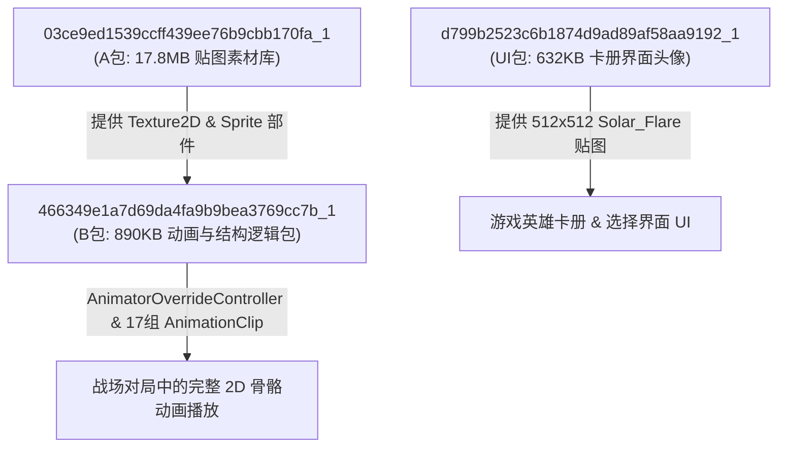

# 02. 耀斑花娘化 Mod 架构深度剖析

本篇基于工作区根目录下的真实大型手改 Mod **[耀斑花娘化v1.1.zip](../耀斑花娘化v1.1.zip)**，深度剖析大型角色/英雄贴图与动画 Mod 的“三包联动”架构。

---

## 一、 耀斑花娘化 Mod 三包协同架构

解压 [耀斑花娘化v1.1.zip](../耀斑花娘化v1.1.zip) 后，可以看到 3 个无后缀的 AssetBundle 核心文件：

---

## 二、 三大 AssetBundle 文件功能拆解

### 1. `03ce9ed1539ccff439ee76b9cbb170fa_1` —— 贴图素材库 (A包)

容量达 **17.8 MB**，提供了耀斑花娘化全套高精度部件与表情贴图：

- **18 张 `Texture2D`**：
  - 多表情头部：`head_open`、`head_close`、`head_lol`、`head_unhappy`、`head_damage1`（均规范为 `404 x 396` 像素）。
  - 躯干与四肢：`body` (`511 x 630`)、`hair` (`708 x 719` 发型）、`hand_l` / `hand_r`、`leg_l` / `leg_r`。
  - 配件与 UI：`glass` (眼镜配件)、`title` (标题框)、`card` (手牌框)、`think` (思考气泡)。
- **58 个 `Sprite`**：
  - 将上述 18 张贴图按照骨骼切片与锚点（Pivot）划分出来的 58 个渲染精细切片。

---

### 2. `466349e1a7d69da4fa9b9bea3769cc7b_1` —— 动画与结构包 (B包)

容量 **890 KB**，是整个角色动作与节点骨骼的核心驱动包：

- **`AnimatorOverrideController` (`Sunflower_Override`)**：
  覆盖重定向控制器，将标准植物英雄的动作映射重写为耀斑花的专属动作。
- **99 个 `GameObject` & `Transform`**：
  构建了完整的娘化骨骼节点树（包含头、发丝、手臂、腿部、眼镜等双向父子绑定）。
- **72 个 `SpriteRenderer`**：
  将 `03ce...` A 包中的 `Sprite` 部件绑定到对应的骨骼节点上。
- **17 个 `AnimationClip`**：
  完整包含了耀斑花从登场到对局结束的所有 17 组关键帧动画动作（详见第 03 篇）。

---

### 3. `d799b2523c6b1874d9ad89af58aa9192_1` —— 卡册 UI 界面包

容量 **632 KB**：
- 包含 `512 x 512` 像素的 **`Solar_Flare`** 高清卡册展示贴图。
- 确保玩家在英雄选择菜单、组卡界面及对局开始前的英雄亮相框中，看到的是全新的娘化精美立绘。

---

## 三、 大型 Mod 制作的开发经验提示

> [!TIP]
> 1. **资源拆分化**：把复杂的重制 Mod 拆分为“素材包（A包）”、“结构动画包（B包）”与“界面头像包（UI包）”，不仅便于管理，而且能有效提高解包重打包的效率。
> 2. **表情部件多切片**：在娘化 Mod 中，作者将头部拆分为了 `head_open`、`head_close`、`head_damage1` 等多个 `Texture2D` 节点，并在不同的 `AnimationClip` 中通过切换 `SpriteRenderer.m_Sprite` 指针实现丰富表情变化。
