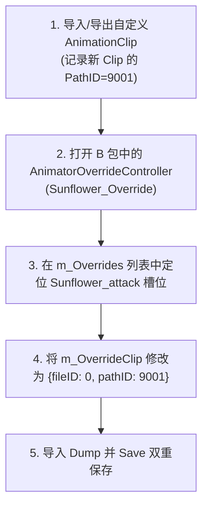

# 03. 17 组核心动作序列与重定向实战

在 PVZH 中，一个完整的英雄或高级随从角色并非只使用单个动画，而是根据战斗局势播放几十组不同的 `AnimationClip`。

本篇结合 [耀斑花娘化v1.1.zip](../耀斑花娘化v1.1.zip) 中的真实 `AnimationClip` 资源，详解 17 组核心动作序列及其重定向替换方法。

---

## 一、 17 组核心动画序列功能说明

提取自 `466349e1a7d69da4fa9b9bea3769cc7b_1` 包中的全量 17 组 `AnimationClip` 详细映射如下：

| 动画片段名称 (`AnimationClip`) | 游戏战斗状态映射 | 动作内容与表情表现 |
| :--- | :--- | :--- |
| **`Sunflower_enter`** | **登场亮相** | 战斗开始阶段英雄入场并亮出姿势。 |
| **`Sunflower_idle`** | **标准待机** | 默认回合中的呼吸、身体轻微摇晃。 |
| **`Sunflower_idle_02`** | **闲置动作 2** | 随机触发的眨眼、摸头或表情切换。 |
| **`Sunflower_idle_03`** | **闲置动作 3** | 随机触发的摆身动作。 |
| **`Sunflower_tense`** | **紧张/警备** | 血量偏低或对方打出高攻随从时的戒备姿态。 |
| **`Sunflower_think`** | **思考出牌** | 玩家拖拽手牌或考虑出牌时的思考姿态。 |
| **`Sunflower_attack`** | **发起攻击** | 发射火球/进行普通攻击的出招动作。 |
| **`Sunflower_power_activated`** | **释放大招** | 激活英雄超能力（Superpower）时的华丽动作。 |
| **`Sunflower_damage`** | **常规受击** | 受到普通伤害时的后仰受击表现。 |
| **`Sunflower_damage_02`** | **重伤受击** | 受到高额伤害或致命攻击时的剧烈后仰。 |
| **`Sunflower_block`** | **护盾挡伤** | 触发超级护盾（Super-Block）挡住伤害的防御姿态。 |
| **`Sunflower_celebrate`** | **打出强卡庆贺** | 打出核心强力卡牌时的开心小动作。 |
| **`Sunflower_nod`** | **回应/点头** | 回应操作的点姿态。 |
| **`Sunflower_take`** | **获得加成** | 获得属性 Buff 或治疗时的吸收姿态。 |
| **`Sunflower_win`** | **胜利结算** | 彻底击败敌方英雄时的欢呼胜利动作。 |
| **`Sunflower_lose`** | **战败倒下** | 我方英雄血量归零时的倒地击晕动画。 |
| **`Sunflower_KO_idle`** | **击晕待机** | 战败后倒在场上的持续躺倒状态。 |

---

## 二、 使用 `AnimatorOverrideController` 进行动作替换实战

如果你想为英雄/随从替换某个动作（例如将攻击动作 `Sunflower_attack` 替换为自定义的施法动画）：



### 操作步骤：
1. **准备动作**：在 UABEA 中将制作好的新动作导入 Bundle，生成 `AnimationClip`，记录其 `PathID`（假设为 `9001`）。
2. **打开控制器**：定位到 B 包中的 `AnimatorOverrideController` 资源项（如 `Sunflower_Override`），右键导出 Dump 文本。
3. **重定向替换**：
   找到对应动作槽位（如 `Sunflower_attack`）：
   ```yaml
   - m_OriginalClip: {fileID: 0, pathID: 2005}  # 原版攻击动作句柄
     m_OverrideClip: {fileID: 0, pathID: 9001}  # 重写为你新 Clip 的 PathID (9001)
   ```
4. **保存打包**：重新导入 Dump 并导出 Bundle。进入游戏后，当英雄发起攻击时，就会自动切换播放你的全新动作！
