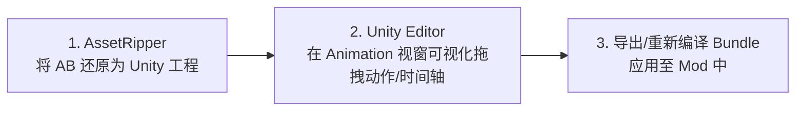

# 04. 关键帧 Dump 与动画避坑指南

修改或自定义 Unity 的 `AnimationClip` 需要直接接触时间轴关键帧、插值曲线与 Sprite 帧动画指针。

本篇汇总了 `AnimationClip` 的底层 Dump 结构解析与动画修改中的 4 大避坑指南。

---

## 一、 `AnimationClip` Dump 文本核心结构

通过 UABEA 将 `AnimationClip`（如 `Sunflower_idle`）导出为 Dump 文本后，其核心结构如下：

```yaml
0 string m_Name = "Sunflower_idle"
0 float m_SampleRate = 30           # 动画采样率 (30帧/秒)
0 TransformType m_WrapMode = 2      # 循环模式 (2 表示循环 Loop)
0 vector m_PositionCurves           # 坐标位移平移动画曲线
0 vector m_RotationCurves           # 旋转角度动画曲线
0 vector m_ScaleCurves              # 缩放比例动画曲线
0 vector m_PPtrCurves               # Sprite 切片贴图替换帧动画曲线
```

### `m_PPtrCurves`（Sprite 帧动画）详解
在眨眼、切换表情或变换手势时，动画系统使用 `m_PPtrCurves` 随时间替换 `SpriteRenderer` 的贴图指针：

```yaml
m_PPtrCurves:
  size: 1
  data:
  - path: 384756281                 # 目标节点的相对路径 Hash 值 (如 "body/head")
    attribute: "m_Sprite"           # 动画控制的组件属性
    script: {fileID: 0, pathID: 0}
    classID: 212                    # 212 代表 SpriteRenderer 组件
    curve:
      size: 3
      data:
      - time: 0                     # 第 0 秒，显示 head_open
        value: {fileID: 0, pathID: 8001}
      - time: 0.1                   # 第 0.1 秒，切换为 head_close (眨眼)
        value: {fileID: 0, pathID: 8002}
      - time: 0.2                   # 第 0.2 秒，恢复 head_open
        value: {fileID: 0, pathID: 8001}
```

---

## 二、 专业动画开发工具链：AssetRipper + Unity Editor

> [!CAUTION]
> **绝对警告**：
> 手动编辑 `AnimationClip` 文本 Dump **在实际改版中几乎是不可能完成的**（包含上千个平移旋转矩阵、四元数计算与贝塞尔切线切点）。
> 尝试纯手工手写 Dump 文本制作动画会导致极高的时间成本与不可预测的崩溃错误！

### 专业工作流：



1. **资源还原 (AssetRipper)**：
   使用 **AssetRipper** 将包含 `AnimationClip` 的 AssetBundle（如 `4663...` 包）还原导出为标准的 Unity 2022.x 工程。
2. **可视化编辑 (Unity Editor)**：
   在 **Unity 引擎编辑器**中打开还原出的工程，使用 Unity 内置的 **Animation / Animator** 可视化窗口：
   - 可以在时间轴（Dope Sheet）上直观拖拽帧位置；
   - 可以在曲线图（Curve Window）中平滑调整骨骼旋转与平移动画；
   - 可以可视化预览表情与 `Sprite` 贴图切换。
3. **重新打包 (Build / UABEA)**：
   在 Unity 编辑器中调试完成后，重新打包生成新的 AssetBundle，或将生成的 `.anim` 文件导入重定向控制器应用到游戏中。

---

## 三、 动画修改 4 大避坑指南

### 1. 采样率 (m_SampleRate) 与时间戳必须对齐

- **原则**：PVZH 的动画采样率通常统一为 **`24`** 或 **`30`** fps。
- **踩坑后果**：若 `m_SampleRate` 设为 `30`，关键帧的时间戳（`time`）必须按 `1/30 = 0.0333` 秒的整数倍增长。若随意填写乱码时间戳，会导致动画在帧与帧转换时出现严重的肌肉拉伸错位或卡顿。

### 2. 节点路径 Hash 匹配一致性

- **原则**：`path` 字段中的数字是节点相对路径（如 `"root/head"`）的 32 位 Hash 计算结果。
- **踩坑后果**：切勿随意在 `GameObject` 层级中增删中转父节点。如果改变了层级结构，原版的 `path` Hash 将无法匹配到新的 `GameObject`，导致动画播放时部件归位到 (0,0) 坐标漂移。

### 3. `PPtrCurves` 中的 `fileID` 同包/跨包验证

- **原则**：在 `PPtrCurves` 曲线中填写的 `value: {fileID: X, pathID: Y}` 指针：
  - 若贴图在同包，`fileID` 填 `0`。
  - 若贴图在外部 A 包，`fileID` 必须填入对应的依赖包索引（通常为 `1`）。

### 4. 保持 17 组动画前缀一致

- **原则**：在重制作英雄动画 Mod 时，建议严格参照 [耀斑花娘化v1.1.zip](../耀斑花娘化v1.1.zip) 的命名方式，保持统一的英雄前缀（如 `Sunflower_...`），防止 `AnimatorOverrideController` 出现空引用重定向故障。
