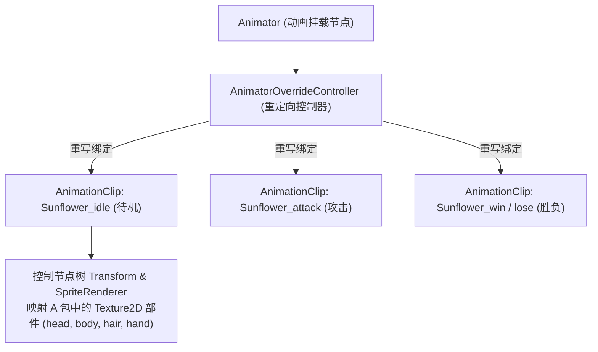

# 06. 动画修改

在 PVZH 中，除了静态的卡牌属性与贴图外，英雄角色与单位随从在战场上发起的攻击、受伤、胜利庆祝、败北、技能释放以及闲置摆动，均由 Unity 的 2D 骨骼与关键帧动画系统驱动。

本章节基于真实的实操大型 Mod 源码包 [耀斑花娘化v1.1.zip](../耀斑花娘化v1.1.zip)，深入讲解 PVZH 2D 动画系统的底层组成、多包协同架构、17 组核心动作序列解构以及重定向修改技术。

---

## 目录导航

| 序号 | 专题文档 | 核心涵盖内容 |
| :---: | :--- | :--- |
| **01** | [01. Unity 2D 动画机制与核心组件](01.Unity2D动画机制与核心组件.md) | 详解 Unity 动画核心四要素：`Animator`（状态机）、`AnimatorOverrideController`（重定向控制器）、`AnimationClip`（关键帧动作）与节点 Hash 路径检索。 |
| **02** | [02. 耀斑花娘化 Mod 架构深度剖析](02.耀斑花娘化Mod架构深度剖析.md) | 结合真实实操案例 [耀斑花娘化v1.1.zip](../耀斑花娘化v1.1.zip)，剖析大型 Mod 的“贴图素材包 + 动画结构包 + UI 卡册包”三包协同架构。 |
| **03** | [03. 17 组核心动作序列与重定向实战](03.17组核心动作序列与重定向实战.md) | 详解 PVZH 英雄与单位的核心动画序列（idle, attack, damage, win, lose, celebrate, power 等 17 组），以及基于 `AnimatorOverrideController` 的动作替换法。 |
| **04** | [04. 关键帧 Dump 与动画避坑指南](04.关键帧Dump与动画避坑指南.md) | 详解 `AnimationClip` 的 Dump 文本解析、关键帧采样率 (SampleRate) 维护、时间戳对齐与动画骨骼漂移修复。 |

---

## 核心架构概览

1. **解耦设计**：动画动作（`AnimationClip`）只记录**节点名称路径的平移/旋转/缩放与帧切片**，具体的贴图像素由绑定的 `SpriteRenderer` 在运行期读取。
2. **重定向机制**：官方英雄或单位通过 `AnimatorOverrideController` 实现通用状态机与个性化动作片段的动态替换。

---

> [!IMPORTANT]
> **动画修改黄金法则：强烈推荐使用 AssetRipper + Unity 引擎组合！**
> 动画关键帧包含成百上千条复杂的贝塞尔曲线、旋转四元数、三维平移坐标与插值时间戳。**手改 Dump 文本在实际开发中几乎是不可能完成的任务！**
> **专业工作流**：使用 **AssetRipper** 将 AssetBundle 逆向还原为标准的 Unity 工程 -> 在 **Unity Editor** 的可视化动画面板（Animation Window）中直观拉取关键帧与动作曲线 -> 重新编译导出 Bundle！

