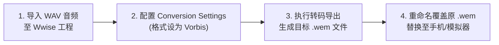

# 02. 明文 wem 音频与 Wwise 软件替换

对于位于 `files/audio/` 目录中的明文 `.wem` 音频文件（如对战 BGM、英雄台词与系统音效），我们可以直接使用官方音频引擎工具 **Audiokinetic Wwise** 将自制的 MP3/WAV 转换导出为同格式 `.wem` 进行覆盖替换。

---

## 一、 准备工作与软件版本推荐

> [!IMPORTANT]
> **Wwise 官方黄金推荐版本：`2019.2.15.7667`**
> - **原因 1**：版本低于此版本将**无法支持 CLI 命令行自动化转码导出**。
> - **原因 2**：版本高于此版本可能会导出高版本引擎的数据块结构，导致与 PVZH 游戏旧版 Wwise 运行时**不兼容而无法播放**。

1. 下载并安装 **Audiokinetic Wwise `2019.2.15.7667`**。
2. 准备好你想要替换的自制音频源文件（格式推荐为 `.wav` 44.1kHz 或 48kHz 无损音频）。

---

## 二、 Wwise 转码实战四步法

### 第一步：创建 Wwise 工程并导入音频
1. 打开 Wwise，新建一个工程。
2. 在左侧 `Actor-Mixer Hierarchy` 中右键 -> **`Import Audio Files`**。
3. 选择你准备好的 `my_bgm.wav` 导入工程中。

### 第二步：配置转换格式 (Conversion Settings)
1. 在选中的音频属性面板中，找到 **`Conversion Settings`** 项。
2. 双击打开格式设置窗口：
   - **Format (编码格式)**：选择 **`Vorbis`**（与 PVZH 官方音频压缩算法保持一致）。
   - **Sample Rate (采样率)**：设为 `44100` 或 `48000` Hz。
   - **Quality (品质系数)**：建议设置为 `4` 或 `5`（兼顾音质与文件体积）。

### 第三步：生成与导出 `.wem`
1. 选中音频节点，右键选择 **`Convert Audio Files`**（或按快捷键 `Shift+C`）。
2. 转码完成后，打开 Wwise 工程的输出目录：
   `Project_Directory/.cache/Voices/Windows/SoundBanks/...`
3. 即可在输出文件夹中找到编译生成的标准 **`.wem`** 扩展名音频文件。

### 第四步：重命名覆盖替换
1. 查找游戏原版 BGM 或英雄台词的 `.wem` 文件名（例如 `123456789.wem`）。
2. 将我们转码导出的新 `.wem` 文件重命名为 `123456789.wem`。
3. 替换回安卓设备的 `files/cache/bundles/files/audio/` 路径中即可生效！
