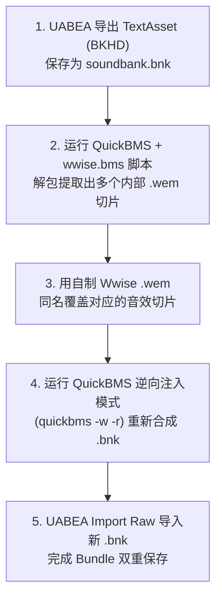

# 04. QuickBMS 与社区工具自动化替换

针对 `autotagged` 贴图包中内嵌的 `BKHD` (Wwise SoundBank) 数据块，本篇详细介绍两套标准的专业解包与自动化替换工作流。

---

## 方案一：QuickBMS 提取与重新注入工作流

**QuickBMS** 是一款通用的二进制数据提取与重打包工具，配合 `wwise_bnk_extractor.bms` 脚本可自动化计算并修补 `BKHD` 的指针偏移量。



### 操作步骤：
1. **导出 Raw 数据**：
   在 UABEA 中打开贴图包（如 [1f826228d36c6f0478c72b56f17541d2_1](../1f826228d36c6f0478c72b56f17541d2_1)），选中 `BKHD` 开头的 `TextAsset` 节点，点击右侧 **`Export Raw`**，保存为 `soundbank.bnk`。
2. **QuickBMS 解包**：
   运行 `quickbms.exe`，选择 `wwise_bnk_extractor.bms` 脚本，选择刚才导出的 `soundbank.bnk`。QuickBMS 会自动将内部切割出多个 `.wem` 音频文件。
3. **同名替换**：
   找到你要替换的动作音效（如出招音效对应的 `.wem`），将你自己用 Wwise 导出的新 `.wem` 重命名为相同文件名进行覆盖。
4. **逆向重新注入 (Reinject)**：
   打开命令行，运行 QuickBMS 的重新打包指令：
   ```cmd
   quickbms.exe -w -r wwise_bnk_extractor.bms soundbank.bnk output_folder
   ```
   QuickBMS 会**自动重新计算内部所有 `BKHD` 与 `HIRC` 的字节偏移量**，并合成为全新的 `soundbank.bnk`。
5. **导入并保存 Bundle**：
   回到 UABEA 视窗，选中该 `TextAsset` 节点，点击 **`Import Raw`** 选择新合成的 `soundbank.bnk`，进行主界面双重保存导出 Bundle 即可！

---

## 方案二：休切尔社区专属工具一键替换 (推荐)

如果你不想在命令行中使用 QuickBMS 手动输入指令，强烈推荐使用社区开发者（**休切尔**）制作的 PVZH 专属 GUI 工具链（详见 [01.社区专属工具集](../01.工具链介绍/01.社区专属工具集.md)）。

### 社区工具优势：
- **图形化一键解析**：直接导入 `autotagged` 贴图包文件，自动搜索识别包内的 `BKHD` 音频节点。
- **自动偏移修补**：选中目标音效节点后，选择你的自制 `.wem` 文件，工具在后台自动调用打包算法重新算好所有 Chunk 指针，**免去复杂的命令行与中转步骤，一步到位生成替换好的 Mod 资源包**！
