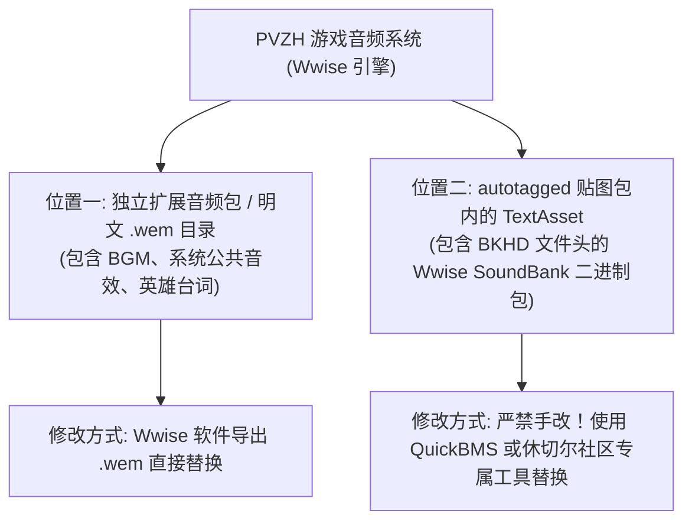

# 07. 音频修改

在 PVZH 中，除了卡牌属性、贴图与动画外，单位登场音效、出招打击声、背景音乐（BGM）以及英雄台词构成了完整的视听体验。

本章节详细讲解 PVZH 音频的两处核心存储位置、Wwise 格式解构、明文 `.wem` 替换以及 `BKHD` 音频包的自动化工具替换工作流。

---

## 目录导航

| 序号 | 专题文档 | 核心涵盖内容 |
| :---: | :--- | :--- |
| **01** | [01. 音频双重存储路径解析](01.音频双重存储路径解析.md) | 详解 PVZH 音频存放的两处位置：独立的明文 `.wem` 目录与 `autotagged` 包内自带的 `BKHD` 数据块。 |
| **02** | [02. 明文 wem 音频与 Wwise 软件替换](02.明文wem音频与Wwise软件替换.md) | 详解使用 Audiokinetic Wwise 软件将 WAV/MP3 转换导出为标准 `.wem` 音频流并进行明文替换。 |
| **03** | [03. AB包内 BKHD SoundBank 解构与手改警告](03.AB包内BKHD SoundBank解构与手改警告.md) | 结合 [1f826228d36c6f0478c72b56f17541d2_1](../1f826228d36c6f0478c72b56f17541d2_1) 实测解构 `BKHD` (Wwise SoundBank)，并给出绝对禁止手改 Dump 的避坑警告。 |
| **04** | [04. QuickBMS 与社区工具自动化替换](04.QuickBMS与社区工具自动化替换.md) | 详解专业工具链：使用 QuickBMS 提取封包，以及使用休切尔社区专属工具图形化一键解析与替换。 |

---

## 核心架构概览

1. **音频引擎技术栈**：PVZH 采用了游戏行业标准的 **Audiokinetic Wwise** 音频解决方案。推荐使用官方黄金兼容版本 **`2019.2.15.7667`**（低版本不支持 CLI 命令行转码，高版本不兼容 PVZH 运行期算法）。
2. **定位与策略分化**：明文 `.wem` 音频可以通过 Wwise 软件一键导出替换；而包裹在 AssetBundle `TextAsset` 内的 `BKHD` 二进制包必须依靠自动化脚本或专业社区工具处理。

