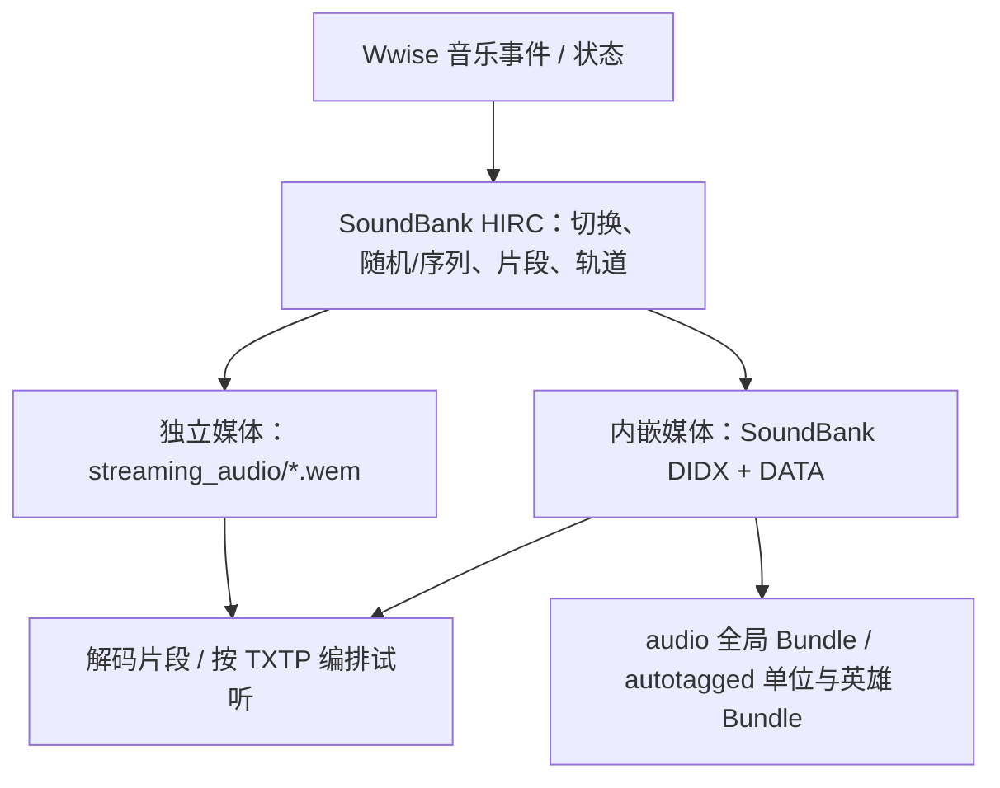

# 07. 音频修改与背景音乐提取

PVZH 使用 Wwise 管理背景音乐、英雄台词、卡牌音效及 UI 声音。本章既保留音频替换入门，也补充从原始资源提取 BGM、还原简单编排和实机核对的方法。

> [!IMPORTANT]
> **提取、还原编排、修改游戏资源是三件不同的事。** 仅导出试听不需要替换游戏文件，也不需要修改账号、卸载游戏或清数据。先在资源副本上操作。

## 目录导航

| 序号 | 专题文档 | 内容 |
| :---: | :--- | :--- |
| 01 | [音频双重存储路径解析](01.音频双重存储路径解析.md) | 独立流文件与 Bundle 内嵌媒体；三个相关目录的分工 |
| 02 | [明文 WEM 音频与 Wwise 软件替换](02.明文wem音频与Wwise软件替换.md) | 自制音频转码、平台/版本选择、独立 WEM 替换 |
| 03 | [AB 包内 BKHD SoundBank 解构与手改警告](03.AB包内BKHD SoundBank解构与手改警告.md) | BKHD、DIDX、DATA、HIRC 的区别与二进制完整性 |
| 04 | [QuickBMS 与社区工具自动化替换](04.QuickBMS与社区工具自动化替换.md) | 提取与重导入的边界；正确写回 TextAsset |
| 05 | [背景音乐结构与完整提取](05.背景音乐结构与完整提取.md) | 全局/英雄银行、WEM 与 MIDI、音乐来源清单 |
| 06 | [wwiser 与 vgmstream 音乐编排导出](06.wwiser与vgmstream音乐编排导出.md) | 可复现三段实例、TXTP、随机变体与批量导出策略 |
| 07 | [动态音频追踪与导出质量核对](07.动态音频追踪与导出质量核对.md) | 事件/状态/文件访问、音量为零的影响、结果验收与人工交接 |

只想提取音乐：按 **01 → 05 → 06 → 07** 阅读。需要替换声音：按 **01 → 02 → 03 → 04** 阅读。

## 音频架构概览

游戏可能按状态切换、循环、随机选择或同时叠加声部。**一个 WEM 不一定是一首完整曲子，多个 WEM 也不能只按文件名排序拼接。** SoundBank 的音乐结构同样是还原素材。

## 本次补充的验证范围

2026-10-01 的记录基于 **PVZH 1.67.8、Android arm64** 的 dump 与缓存，以及随机 PvE 的只读追踪。其他版本需重新核对文件、银行和工具兼容性。

- 已定位当前 `Global_Data.bnk` 音乐轨道引用的 4731 个去重来源：260 个 Vorbis、4471 个 Wwise MIDI；这不是曲目数，也不是全游戏 OST 完整性证明。
- 一个三段循环实例已获试听反馈认可；广覆盖导出保留了 1824 个编排/轨道版本和 260 个原始片段，其中大量版本缺少 MIDI 声部，不能当作完整混音。
- 本章只提交方法、结构和核对记录，不附带原始 WEM、银行或音频包。能提取并不代表拥有将官方音乐用于同人游戏公开分发的授权；参见[仓库许可与使用条款](../许可与使用条款.md)。

