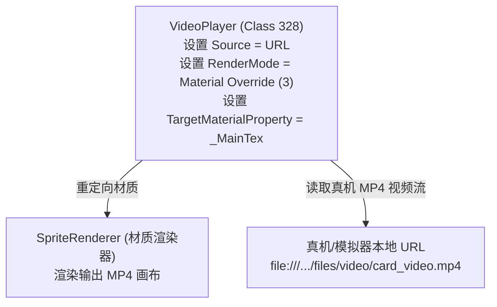

# 01. 视频播放原理与 Unity 模板生成

在 PVZH 中实现卡牌动态视频播放，核心是利用 Unity 的 **`VideoPlayer`** 组件（Class ID `328`），将其渲染输出重定向（Material Override）到随从实体的 `SpriteRenderer` 材质上，并配置真机 MP4 文件加载 URL。

为了避免在 UABEA 中徒手构建复杂的类型数据树，我们需要借助 Unity Editor 导出一份纯净的 `VideoPlayer` 组件模板。

---

## 一、 视频播放组件架构

---

## 二、 在 Unity Editor 中制作“视频组件模板”

在 UABEA 中直接手写 `VideoPlayer` 复杂的序列化结构极其繁琐。最稳妥、最快捷的做法是在 Unity 中生成模板并导出 Dump 基因文件。

### 详细步骤：

1. **创建 Unity 工程**：
   打开 Unity Editor（推荐与 PVZH 大版本兼容的 **Unity 2022.3.x**），在 Build Settings 中将 Platform 切换为 **Android**。
2. **创建模板节点**：
   在场景中新建一个空 GameObject，命名为 `VideoTemplate`。
3. **添加 VideoPlayer 组件**：
   为该物体添加 **VideoPlayer** 组件，参数配置如下：
   - **`Source`** $\rightarrow$ 切换为 **`URL`**。
   - **`Play On Awake`** 与 **`Loop`** $\rightarrow$ 均勾选 `True`。
   - **`Render Mode`** $\rightarrow$ 选择 **`Material Override`**（底层枚举值为 `3`）。
   - **`Target Material Property`** $\rightarrow$ 手动录入 **`_MainTex`**（**必须手动填写，不能留空或保持 `<noninit>`**）。
   - **`URL`** $\rightarrow$ 填写真机视频播放路径：
     `file:///storage/emulated/0/Android/data/com.ea.gp.pvzheroes/files/cache/bundles/files/video/card_video.mp4`
4. **打包模板 AssetBundle**：
   将此物体打包为 Android 平台的 AssetBundle 文件，命名为 `temp_video`。
5. **提取组件 Dump 基因**：
   - 运行 UABEA，打开生成的 `temp_video`，点击 `Info`。
   - 在列表中找到 **Class 328 (VideoPlayer)** 对象。
   - 选中它，点击右侧 **`Export Dump`**，导出保存为 `VideoPlayer_dump.txt`。

---

> [!TIP]
> 导出的 `VideoPlayer_dump.txt` 包含了整套合法的 `VideoPlayer` 序列化数据树，后续向任何卡牌 AssetBundle 注入视频功能时，都可以重复使用这份 Dump 模板文件！

---

## 三、 方法论扩展：任意 Unity 内置组件注入

本章以 `VideoPlayer` 组件为例，但这套**“Unity Editor 生成模板 Dump $\rightarrow$ UABEA 注入 Class ID $\rightarrow$ 双向 PPtr 重绑”**的注入模式，是**修改 Unity AssetBundle 接入任意新组件的通用法则**！

### 常见扩展组件 Class ID 表：

| 组件名称 | Class ID | 用途与效果描述 |
| :--- | :---: | :--- |
| **ParticleSystem** | `198` | 粒子系统。为卡牌随从挂载火花、漫天雪花、烟雾或光环特效。 |
| **TrailRenderer** | `96` | 拖尾渲染器。为随从挥拳、子弹飞行挂载流光拖尾。 |
| **Light** | `108` | 光源组件。为随从场景添加动态点光源或聚光灯效果。 |
| **LineRenderer** | `120` | 线段渲染器。在两点之间绘制激光线或能量连接线。 |
| **AudioSource** | `82` | 音频源组件（需配合独立 2D 声音包配置）。 |

**通用结论**：掌握了 `VideoPlayer` 的注入流，你就可以轻松在 PVZH 的 AssetBundle 中注入任意你想添加的 Unity 组件！

