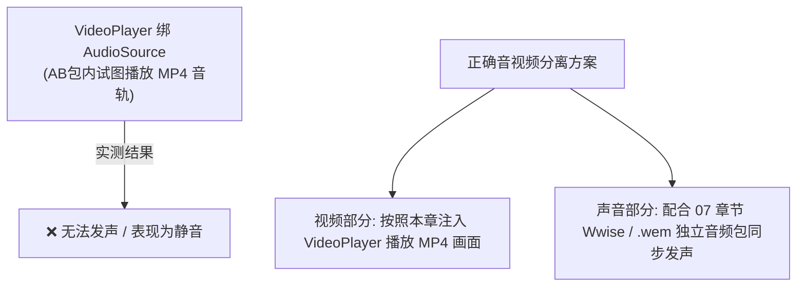

# 03. 网格 FullRect 化与声音处理避坑指南

向卡牌注入 `VideoPlayer` 后，还需要解决**原厂抠图网格对视频画面的裁剪问题**，以及**视频音频无法发声的实战避坑**。

---

## 一、 网格 Full Rect 化重构（解决视频剪裁问题）

### 1. 为什么视频会被裁剪？
PVZH 原厂随从卡牌的 Sprite 在 Unity 打包时默认启用了 `Tight` 剪影裁剪网格。如果不进行修改，播放的 MP4 视频会被限制并分割在原版随从不规则的镂空剪影形状中。

我们需要将网格修改为标准的四顶点正方形矩形（**Full Rect**）。

---

### 2. 免手改十六进制的 Full Rect 替换小技巧

1. **制作 Full Rect 模板**：
   在 Unity Editor 中导入一张纯白 PNG 贴图，在属性面板的 `Mesh Type` 中将 `Tight` 修改为 **`Full Rect`**，打包为 AssetBundle。
2. **导出 Raw Data**：
   使用 UABEA 打开该模板包，选中对应的 `Sprite` 节点，点击右侧 **`Export Raw`** 导出保存为 `full_rect.dat` 数据块。
3. **覆盖目标卡牌 Sprite**：
   用 UABEA 打开目标卡牌包，选中卡牌身体的 `Sprite` 节点，点击 **`Import Raw`**，选择 `full_rect.dat` 覆盖导入。
4. **恢复引用**：
   在导入后的 `Sprite` 数据树中：
   - 将 `m_Name` 改回原厂名字。
   - 将底层的 `m_Texture` 指针重新改回指向包内原厂的 `Texture2D`。
5. **画框尺寸与位置微调**：
   - **画面放大**：在 `Sprite` 的数据树中，将 `m_PixelsToUnits` 数值调小（例如从 `22.9` 降低为约 `7.6`），即可等比放大视频渲染画面。
   - **高度对齐**：在卡牌身体的 `Transform` 组件中，将 `m_LocalPosition.y` 适当增加（如向上平移 `8.0`），使视频画框完美对齐手牌/卡册框。

---

## 二、 音频处理实战避坑指南

> [!WARNING]
> **硬核实战经验提醒：**
> 在 AssetBundle 内部试图通过向 `VideoPlayer` 绑定 `AudioSource`（Class ID 82）来实现 MP4 视频自带声音播放的方法，在 PVZH 实际真机测试中**无法成功发声**！

### 推荐解决方案：
- **画音分离策略**：在 `VideoPlayer` 中专注进行 MP4 纯画面的渲染。
- **声音同步**：若想让视频卡牌播放匹配的特效音效，请配合 **[07. 音频修改](../07.音频修改/README.md)** 中讲解的 Wwise 声音包/明文 `.wem` 音频流，在卡牌打出或登场时同步播放音频，即可完美实现视听合一！
