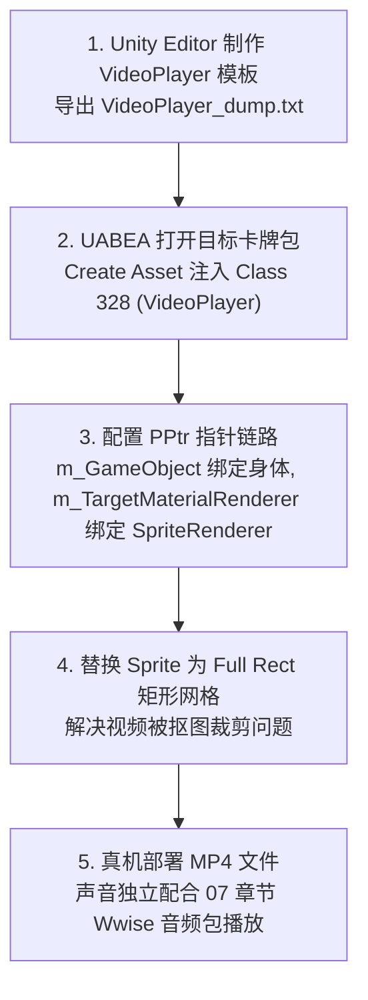

# 08. 加入新组件-视频 (视频卡牌接入)

在 PVZH 中，除了静态贴图与骨骼动画外，我们还可以通过向 AssetBundle 中注入 Unity 的 `VideoPlayer` 组件，实现手牌或战场随从卡牌实时播放 MP4 动态视频的酷炫 Mod 效果。

本章节基于实操修补包 [2ceeb890a69397041ba1fd559056c358_1_patched](../2ceeb890a69397041ba1fd559056c358_1_patched)（鳄梨鳄视频卡牌 Mod）与实战经验，详细讲解视频组件的注入、PPtr 链路重绑、网格矩形化（Full Rect）以及音频避坑方案。

---

## 目录导航

| 序号 | 专题文档 | 核心涵盖内容 |
| :---: | :--- | :--- |
| **01** | [01. 视频播放原理与 Unity 模板生成](01.视频播放原理与Unity模板生成.md) | 详解 Unity `VideoPlayer` (Class 328) 组件工作原理，以及如何在 Unity Editor 中制作并导出干净的模板 Dump 文本。 |
| **02** | [02. UABEA 组件注入与 PPtr 链路重绑](02.UABEA组件注入与PPtr链路重绑.md) | 结合 [2ceeb890a69397041ba1fd559056c358_1_patched](../2ceeb890a69397041ba1fd559056c358_1_patched) 解构，讲解 UABEA 中 `Create Asset` 新建组件、绑定 `m_GameObject` 与 `m_TargetMaterialRenderer` 及 MP4 URL 配置。 |
| **03** | [03. 网格 FullRect 化与声音处理避坑指南](03.网格FullRect化与声音处理避坑指南.md) | 详解将 Sprite 网格替换为 Full Rect 矩形解决视频剪裁问题，以及**视频音频在 AB 包内无法成功发声的实战总结与 07 章节 Wwise 配合方案**。 |

---

## 核心工作流概览

---

## 🌟 通用 Unity 组件注入法则

> [!NOTE]
> **举一反三**：
> 本章以注入 `VideoPlayer`（Class ID `328`）播放视频为例，但**这一套组件注入逻辑适用于 Unity 中的绝大多数内置 C# 组件**！
> 无论你是想注入：
> - **粒子系统 (ParticleSystem / Class 198)**：为卡牌随从添加拖尾火花、光环或火焰特效；
> - **拖尾渲染器 (TrailRenderer / Class 96)**：为随从出招添加拖尾光带；
> - **光源组件 (Light / Class 108)**：添加点光源或聚光灯渲染；
> - **线段渲染器 (LineRenderer / Class 120)**：绘制激光或连接线；
>
> 均可遵循**完全相同的通用三步法**：  
> **`Unity Editor 生成模板 Dump` $\rightarrow$ `UABEA Create Asset 注入对应 Class ID` $\rightarrow$ `双向 PPtr (m_GameObject & m_Component) 指针重绑`**。

---

> [!IMPORTANT]
> 视频播放采用 **真机绝对路径 URL 加载** 模式。
> 视频文件（如 `card_video.mp4`）需存放在安卓设备路径：
> `file:///storage/emulated/0/Android/data/com.ea.gp.pvzheroes/files/cache/bundles/files/video/card_video.mp4`

