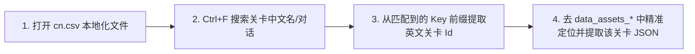

# 01. 关卡存储路径与中文映射查找

在 PVZH 中，所有的单人关卡、随机挑战与剧情解密关卡均存放在 `data_assets_*` 数据包中。

本篇讲解关卡的存储路径特征以及**如何在 `cn.csv` 中根据中文名精确定位关卡 ID**。

---

## 一、 关卡资源存放路径

在安卓设备或模拟器中，关卡资源包存放于：

```text
/storage/emulated/0/Android/data/com.ea.gp.pvzheroes/files/cache/bundles/files/data_assets_*
```

### 多底包优先级规则：
在缓存目录下可能存在多个 `data_assets_*` 文件（例如 `data_assets_38`、`data_assets_39`、`data_assets_40`）：
- 游戏引擎在加载关卡时，会按文件名末尾的**数字从大到小**优先读取。
- 数字越大的包优先级越高。若同一个关卡 ID 在多个包中重复存在，游戏将只加载数字最大的包里的关卡数据。

---

## 二、 核心技巧：在 `cn.csv` 中反查关卡 ID

在 `data_assets_*` 资源包中，每个关卡表现为一个 JSON 格式的 `TextAsset`，但名称均为英文 ID 标识。如果你想修改某关特定中文名称的关卡，请使用以下高效的反查技巧：

### 操作步骤：



1. **搜索中文文本**：
   打开本地化文件 [cn.csv](../资源/cn.csv)，按下 `Ctrl+F` 搜索你要查找的关卡中文名称、剧情对话或关卡提示文字。
2. **提取关卡 Id**：
   在匹配到的文本条目左侧，观察其 Key 的前缀字符串。例如找到剧情对话 Key，其前缀就是该关卡在 `data_assets_*` 包内的真实英文 **`Id`**。
3. **定位 AssetBundle 节点**：
   拿着反查到的英文 `Id`，直接在 UABEA 或 [PVZH-Level-Editor](https://github.com/Show-o4210/PVZH-Library/tree/main/tools/level-editor) 的关卡搜索框中输入，即可 100% 精确锁定目标关卡的数据节点！
