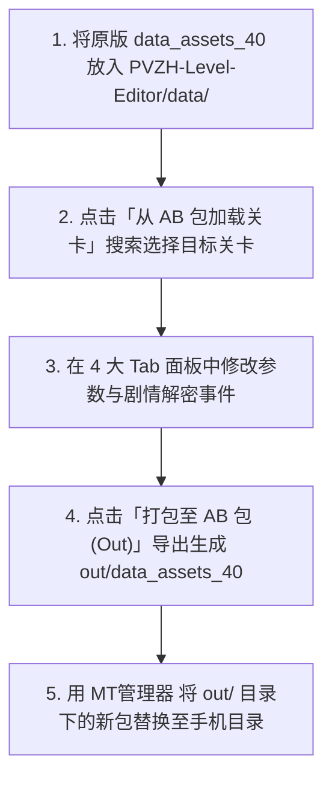

# 04. PVZH-Level-Editor 工具使用指南

为了让开发者摆脱繁琐易错的手改关卡 JSON，社区开发了基于 PySide6 + UnityPy 的图形化关卡编辑器 **[PVZH-Level-Editor](https://github.com/Show-o4210/PVZH-Level-Editor)**。

本篇详细讲解该工具的安装环境、界面功能以及从底包加载至打包导出的完整工作流。

---

## 一、 工具架构与环境配置

[PVZH-Level-Editor](https://github.com/Show-o4210/PVZH-Level-Editor) 核心源码模块组织如下：

```text
PVZH-Level-Editor/
├── main.py                 # 主视窗入口与 UI ↔ JSON 双向同步
├── unity_manager.py        # 基于 UnityPy 的 data_assets_* 扫描与回写
├── data_manager.py         # 载入 index.json (卡牌中文名) 与 decks.json (卡组)
├── data/                   # 放置输入的关卡底包 data_assets_* (必需)
├── out/                    # 输出导出的 JSON 或打包好的 data_assets_*
├── ui/                     # 基础、角色、战场分路与游戏事件编辑页
└── 开始.bat                # 快捷启动脚本
```

### 准备工作：
1. 确保已安装 Python 3.10+ 及依赖：`pip install PySide6 UnityPy`。
2. 从 [PVZH-Level-Editor 仓库](https://github.com/Show-o4210/PVZH-Level-Editor) 下载源代码。
3. 将游戏原始关卡包（如 `data_assets_40`）放入编辑器的 `data/` 目录下。

---

## 二、 图形化编辑 4 大核心 Tab

点击 `开始.bat` 运行编辑器，加载关卡后可使用以下 4 个面板进行调整：

| 面板选项卡 | 控制功能与实战应用 |
| :--- | :--- |
| **基础配置 (Tab Basic)** | 调整关卡 ID、人机 ELO 难度、战斗场景背景以及解密/墓碑/跳过选择等规则开关。 |
| **人机/玩家配置 (Tab Character)** | 配置双方英雄、卡组、初始费用与血量上限；内置 **SuperBlockTable 护盾权重自动校验**（若和不等于 100 将拦截导出并提示）。 |
| **战场分路 (Tab Board)** | 配置 5 条路线的地形分类（高地 / 平地 / 水路），以及开局放置在场上的初始植物/僵尸。 |
| **游戏事件 (Tab Events)** | 剧情对话、解密发牌与强制出牌事件库。支持鼠标拖拽排序、快捷键 `Ctrl+↑/↓` 移动与双击编辑。 |

> [!TIP]
> 界面支持**左右分屏**，左侧修改 UI 参数，右侧会实时防抖更新 JSON 源码；也可以直接在右侧修改 JSON，UI 会实时反向同步。

---

## 三、 从底包加载到打包导出工作流



### 详细步骤：
1. **加载关卡**：点击主界面 **「从 AB 包加载关卡」** 按钮，在分类或搜索弹窗中选择目标关卡。
2. **可视化修改**：在四大 Tab 中调整关卡数值与事件，系统自动校验护盾权重（各 100%）。
3. **打包导出**：
   - 点击 **「导出 JSON 文件」**：生成独立的 `out/<关卡Id>.json` 文本备份。
   - 点击 **「打包至 AB 包 (Out)」**：工具通过 UnityPy 自动找到底包中对应的 `TextAsset` 并完成重打包，生成新包到 `out/data_assets_*`。
4. **真机部署**：将 `out/` 目录下的新 AssetBundle 覆盖回手机的 `files/cache/bundles/files/` 目录，重启游戏即可体验全新的自定义关卡！
