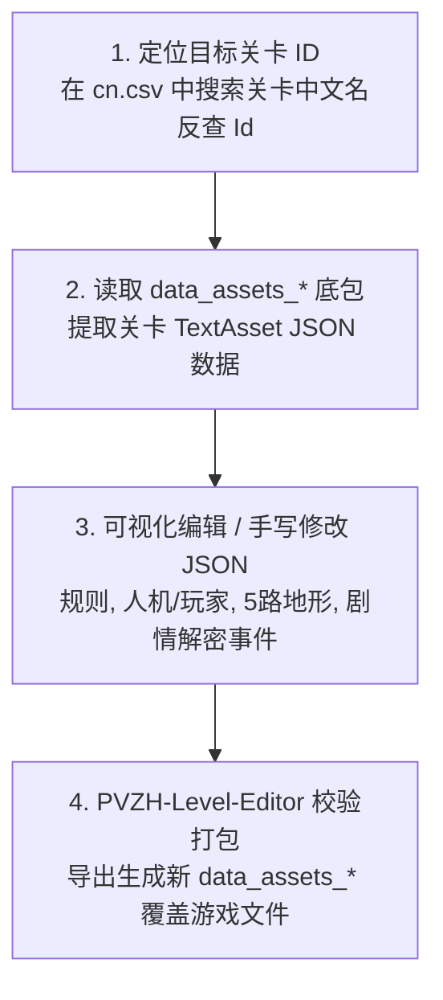

# 09. 关卡修改

在 PVZH 中，单人战役、英雄关卡与解密挑战（Puzzle Party）的所有数据均存放在 `data_assets_*` 资源包内。

本章节详细讲解 PVZH 关卡数据的存储机制、JSON 属性结构、剧情与解密发牌事件配置，以及基于社区工具 [PVZH-Level-Editor](https://github.com/Show-o4210/PVZH-Library/tree/main/tools/level-editor) 的可视化编辑与打包注入流程。

---

## 目录导航

| 序号 | 专题文档 | 核心涵盖内容 |
| :---: | :--- | :--- |
| **01** | [01. 关卡存储路径与中文映射查找](01.关卡存储路径与中文映射查找.md) | 详解关卡包路径 `files/data_assets_*`，以及**在 `cn.csv` 本地化文件中通过中文名反查关卡 ID** 的高效定位技巧。 |
| **02** | [02. 关卡 JSON 数据结构详解](02.关卡JSON数据结构详解.md) | 详解关卡基础规则标志位、人机与玩家参数 (`OpponentConfig`/`PlayerConfig`)、SuperBlock 100% 护盾权重与 5 路地形预置卡牌。 |
| **03** | [03. 剧情与解密发牌事件配置](03.剧情与解密发牌事件配置.md) | 详解关卡中的 4 大游戏事件 (`GameEvents`)：剧情对话、解密发牌、强制抽卡与强制出牌。 |
| **04** | [04. PVZH-Level-Editor 工具使用指南](04.PVZH-Level-Editor工具使用指南.md) | 结合社区工具 [PVZH-Level-Editor](https://github.com/Show-o4210/PVZH-Library/tree/main/tools/level-editor) 讲解图形化编辑、实时 JSON 分屏与 AB 包导出注入。 |

---

## 核心工作流概览

1. **结构解耦**：关卡文件本质上是标准的 `TextAsset` JSON 文本，包含英雄卡组、场地属性与游戏事件链。
2. **校验铁律**：关卡配置中人机与玩家的护盾概率权重 `SuperBlockTable.TableEntries` 的 `RngWeight` **之和必须严格等于 100**，否则会导致关卡加载失败崩溃。
