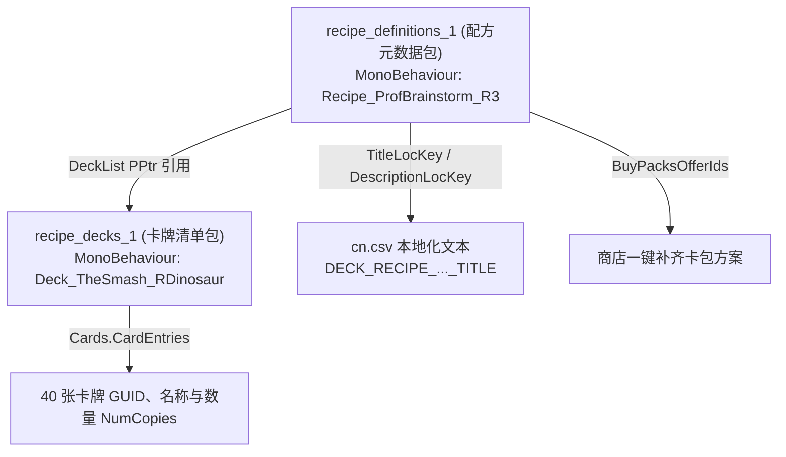

# 01. 卡组存储位置与 decks.json 解析

在 PVZH 中，卡组（Deck）用于定义一套包含卡牌集合及其归属英雄的数据结构。

本篇讲解卡组数据在客户端资源包中的存放路径，基于本仓库 [资源/recipe_definitions_1](../资源/recipe_definitions_1) 与 [资源/recipe_decks_1](../资源/recipe_decks_1) 真实资源例包解构 Unity TextAsset 与 MonoBehaviour 数据格式，对照官方 `cn.csv` 本地化文件解析英雄内部代号与职业掩码，并说明如何借助 [decks.json](../资源/decks.json) 索引库检索预设卡组。

---

## 一、 卡组数据的三大存储位置与结构对比

在 PVZH 客户端资源缓存路径下（详见 [00. 游戏介绍](../00.游戏介绍/README.md)），通过 Python 库 `UnityPy` 对游戏 Bundle 包进行底层解包提取，卡组数据分散在以下三个核心位置：

| 存储位置 | 物理路径与资源节点形式 | 核心 JSON / 数据结构字段 | 修改与读取方式 |
| :--- | :--- | :--- | :--- |
| **位置一：官方策略配方包 (`recipes`)** | `files/recipes/recipe_definitions_*`<br/>`files/recipes/recipe_decks_*`<br/>*(MonoBehaviour 节点)* | **`recipe_definitions`**：`TitleLocKey`, `DescriptionLocKey`, `DeckList` (PPtr 引用)<br/>**`recipe_decks`**：`Cards.CardEntries` (`CardGuid`, `NumCopies`) | 卡册“策略推荐”界面展示的所有标准英雄套牌。<br/>**核心双包解耦架构**！可参考 [资源/recipe_definitions_1](../资源/recipe_definitions_1) 与 [资源/recipe_decks_1](../资源/recipe_decks_1) 示例，使用 UABEA Dump 或 Python `UnityPy` 修改。 |
| **位置二：全局通用卡组包 (`decks`)** | `files/decks/deck_data_*`<br/>*(TextAsset 节点)* | `DeckId`, `HeroId` (GUID), `ignoreDeckLimit`, `Cards` (`CardGuid`, `Count`) | 人机 AI 默认出战卡组（如 `AutoPlay_...`）、活动卡组。<br/>标准 JSON 格式，可借助 [decks.json](../资源/decks.json) 检索或由 [PVZ-H Deck Editor](https://pvz-h-tools.onrender.com/deck-editor) 一键生成。 |
| **位置三：关卡与资产底包 (`data_assets`)** | `files/data_assets_*`<br/>*(TextAsset 节点)* | **独立卡组**：`DeckName`, `MainDeckCardIds` (数字 ID 数组), `SuperpowerOverrideCardIds`<br/>**关卡节点**：`OpponentConfig.DeckId`, `OpponentConfig.HeroId` | 单人战役关卡、每日挑战（BOTD）、FTUE 教学关出战套牌。<br/>共包含 760+ 独立卡组 TextAsset 及 1060+ 关卡节点配置（详见 [09. 关卡修改](../09.关卡修改/README.md)）。 |

---

## 二、 官方策略配方双包解构 (`recipe_definitions` + `recipe_decks`)

基于工作区资源目录下的真实样例包 **[recipe_definitions_1](../资源/recipe_definitions_1)** 与 **[recipe_decks_1](../资源/recipe_decks_1)** 进行底层 UnityPy 解析，官方策略推荐卡组采用了**解耦的双包架构**：



### 1. 配方定义包 (`recipe_definitions_1`)

- **节点类型**：`MonoBehaviour`（例如 `Recipe_ProfBrainstorm_R3` 代表狂野研究者僵点子教授的推荐套牌 3）。
- **核心字段**：
  - **`TitleLocKey`**：策略标题文本 Key（如 `DECK_RECIPE_PROFESSORBRAINSTORM_R3_TITLE`，在 [cn.csv](../资源/cn.csv) 或 [03. 本地化说明](../03.本地化说明/README.md) 中映射中文名）。
  - **`DescriptionLocKey`**：策略套牌的核心玩法描述字幕 Key。
  - **`DeckList`**：`PPtr` 指针，精准指向 `recipe_decks_1` 包内对应的卡牌清单。

### 2. 配方卡组包 (`recipe_decks_1`)

- **节点类型**：`MonoBehaviour`（例如 `Deck_TheSmash_RDinosaur` 代表摔跤狂恐龙推荐套牌）。
- **核心字段**：
  - **`Faction`**：阵营归属（`0` 植物 / `1` 僵尸）。
  - **`Cards.CardEntries`**：40 张卡牌的编组清单数组：
    - `CardGuid` / `Guid`：卡牌的数字 GUID 或 UUID 字符串标识（如 `Gravity Well`）。
    - `NumCopies`：单卡携带份数（如 `4`、`2`、`1` 张）。

---

## 三、 `data_assets` 独立卡组与关卡配置解构

在底层 `data_assets` 资源包中，卡组以纯 JSON 文本（`TextAsset`）存放，主要分为两类应用形态：

### 1. 独立卡组资产 (`DeckName` + `MainDeckCardIds`)

如 `Deck_GrassKnuckles_R3`、`Soft_PVE_Deck_Zombie_SuperBrainz_019` 或 `botd_w15d6_zombie`：

```json
{
  "DeckName": "",
  "MainDeckCardIds": [
    472, 472, 472, 125, 125, 125, 125, 426, 426, 426, 426,
    451, 451, 451, 451, 156, 156, 156, 156, 448, 448, 448,
    424, 424, 424, 82, 82, 84, 84, 94, 94, 418, 418, 418, 115, 324, 324
  ],
  "SuperpowerOverrideCardIds": []
}
```

- **`MainDeckCardIds`**：卡牌使用**数字整型 ID**（例如 `472`, `125`）按张数重复排列，而非字符串 UUID。
- **`SuperpowerOverrideCardIds`** / **`SuperpowerPoolCardIds`**：用于覆写或指定该套牌默认带有的超能技能卡牌。

### 2. 关卡节点关联卡组 (`OpponentConfig` / `PlayerConfig`)

在关卡 TextAsset（如 `botd_week45_day4`，详见 [09. 关卡修改](../09.关卡修改/README.md)）中，通过 `OpponentConfig` 指定出战英雄代号与卡组 ID：

```json
{
  "Id": "botd_week45_day4",
  "OpponentConfig": {
    "HeroId": "NightCap",
    "DeckId": "Deck_NightCap_R2",
    "HeroSelection": 0,
    "Parameters": {
      "Faction": 1,
      "MinimumDeckSize": 0,
      "InitialCardsToDrawFromDeck": 4,
      "InitialSunCount": 1,
      "ShuffleDeckAtStartOfGame": true,
      "InitialHealth": 20,
      "BlockMeterMax": 80
    }
  }
}
```

---

## 四、 官方英雄底层内部代号与职业掩码 (对照 `cn.csv` 官方中文)

通过 UnityPy 提取 `data_assets` 中 24 个英雄定义资产，对照官方本地化文本 [cn.csv](../资源/cn.csv)（`C:\Users\15731\Desktop\pvzh工具包\U源文件\cn.csv`），官方底层逻辑采用了**位掩码（Colors Bitmask）**定义英雄的两个属性职业。同时，由于早期开发历史原因，**底层内部代号（`Guid`）与最终官方中文显示名存在错位**：

### 1. 职业位掩码 (Bitmask) 计算规则

- **植物阵营职业 (`Faction: 0`)**：
  - `1`: 爆花 (Kabloom) | `2`: 猛长 (Mega-Grow) | `4`: 守卫 (Guardian) | `8`: 聪明 (Smarty) | `16`: 光能 (Solar)
- **僵尸阵营职业 (`Faction: 1`)**：
  - `32`: 饥饿/野兽 (Beastly) | `64`: 有脑/脑力 (Brainy) | `128`: 疯帽/疯狂 (Crazy) | `256`: 健壮/坚固 (Hearty) | `512`: 狡猾/潜行 (Sneaky)

### 2. 24 位官方英雄数据全景对照表

| 底层内部代号 (`Guid`) | 官方 `cn.csv` 中文译名 | 阵营 | 掩码数值 (`Colors`) | 计算得出官方双职业 | 默认超能力 ID 列表 |
| :--- | :--- | :---: | :---: | :--- | :--- |
| **`Penelopea`** | **绿影侠** (Green Shadow) | 植物 (0) | `10` (2+8) | 猛长 + 聪明 | `[25, 135, 136, 42]` |
| **`Sunflower`** | **耀斑花** (Solar Flare) | 植物 (0) | `17` (1+16) | 爆花 + 光能 | `[75, 47, 295, 48]` |
| **`WallKnight`** | **坚果骑士** (Wall-Knight) | 植物 (0) | `20` (4+16) | 守卫 + 光能 | `[72, 155, 96, 86]` |
| **`Chomper`** | **霸王大嘴花** (Chompzilla) | 植物 (0) | `18` (2+16) | 猛长 + 光能 | `[263, 44, 155, 48]` |
| **`Spudow`** | **土豆仔** (Spudow) | 植物 (0) | `5` (1+4) | 爆花 + 守卫 | `[289, 86, 37, 38]` |
| **`NightCap`** | **暗夜菇** (Nightcap) | 植物 (0) | `9` (1+8) | 爆花 + 聪明 | `[261, 295, 136, 37]` |
| **`Rose`** | **玫瑰** (Rose) | 植物 (0) | `24` (8+16) | 聪明 + 光能 | `[262, 146, 135, 47]` |
| **`Grass_Knuckles`** | **拳王菜** (Grass Knuckles) | 植物 (0) | `6` (2+4) | 猛长 + 守卫 | `[188, 44, 283, 305]` |
| **`Citron`** | **香橼猎手** (Citron) | 植物 (0) | `12` (4+8) | 守卫 + 聪明 | `[341, 146, 96, 305]` |
| **`Scortchwood`** | **火爆队长** (Cpt Combustible) | 植物 (0) | `3` (1+2) | 爆花 + 猛长 | `[73, 38, 42, 283]` |
| **`BetaCarrotina`** | **贝塔胡萝卜素** (Beta-Carrotina) | 植物 (0) | `12` (4+8) | 守卫 + 聪明 | `[572, 573, 574, 575]` |
| **`ZMech`** | **Z机甲** | 僵尸 (1) | `576` (64+512) | 有脑 + 狡猾 | `[265, 55, 69, 68]` |
| **`CptBrainz`** | **霹雳舞王** (Electric Boogaloo) | 僵尸 (1) | `160` (32+128) | 饥饿 + 疯帽 | `[27, 319, 172, 245]` |
| **`Witch`** | **摔跤狂** (The Smash - 早期代号) | 僵尸 (1) | `288` (32+256) | 饥饿 + 健壮 | `[329, 301, 185, 210]` |
| **`Professor`** | **急冻魔** (Brain Freeze - 代号) | 僵尸 (1) | `544` (32+512) | 饥饿 + 狡猾 | `[264, 301, 319, 236]` |
| **`BrainFreeze`** | **Z机甲** (Z-Mech - 早期代号) | 僵尸 (1) | `384` (128+256) | 疯帽 + 健壮 | `[269, 246, 210, 63]` |
| **`Disco`** | **海妖** (Neptuna - 早期代号) | 僵尸 (1) | `768` (256+512) | 健壮 + 狡猾 | `[267, 236, 185, 68]` |
| **`Neptuna`** | **僵点子教授** (Prof Brainstorm) | 僵尸 (1) | `192` (64+128) | 有脑 + 疯帽 | `[268, 246, 219, 258]` |
| **`Impfinity`** | **无穷小子** (Impfinity) | 僵尸 (1) | `640` (128+512) | 疯帽 + 狡猾 | `[291, 245, 258, 69]` |
| **`Cyborg`** | **锈铁侠** (Rustbolt) | 僵尸 (1) | `96` (32+64) | 饥饿 + 有脑 | `[74, 56, 172, 55]` |
| **`HugeGigantacus`** | **大王** (Huge-Gigantacus) | 僵尸 (1) | `160` | 有脑 + 狡猾 (特化) | `[576, 577, 578, 579]` |

> [!NOTE]
> **开发避坑提醒**：在修改关卡 JSON 中的 `HeroId` 时，**必须填写左列的底层内部代号**（如配置耀斑花需填 `"HeroId": "Sunflower"`，配置僵点子教授需填 `"HeroId": "Neptuna"`，配置绿影侠需填 `"HeroId": "Penelopea"`），填入右列显示名将导致客户端无法装载英雄！

---

## 五、 使用 Python (UnityPy) 提取与解析 Bundle 资源

借助 Python 的 `UnityPy` 库（详见 [01. 工具链介绍](../01.工具链介绍/README.md)），开发者可以非常便捷地从本地 Bundle 包中读取卡组数据：

```python
import UnityPy
import json

# 加载本地缓存 bundle 文件 (如 files/data_assets_40)
env = UnityPy.load("path/to/data_assets_bundle")

for obj in env.objects:
    if obj.type.name == "TextAsset":
        data = obj.read()
        # 筛选卡组 JSON
        if "MainDeckCardIds" in data.m_Script:
            deck_info = json.loads(data.m_Script)
            print(f"卡组资源名: {data.m_Name}, 卡牌张数: {len(deck_info['MainDeckCardIds'])}")
```

---

## 六、 `decks.json` 预设卡组索引库

在 Mod 开发与工具对接时，可以参考本仓库资源目录下的 [decks.json](../资源/decks.json) 索引库（包含了全游戏 654+ 个预设卡组的 ID 与中文映射）。

### 典型索引结构

```json
[
  {
    "id": "AutoPlay_Plants",
    "form": "通用/未分类",
    "cn": "植物通用出战卡组"
  },
  {
    "id": "Deck_SolarFlare_Strategy1",
    "form": "阳光英雄推荐",
    "cn": "耀斑花策略卡组 1"
  }
]
```
