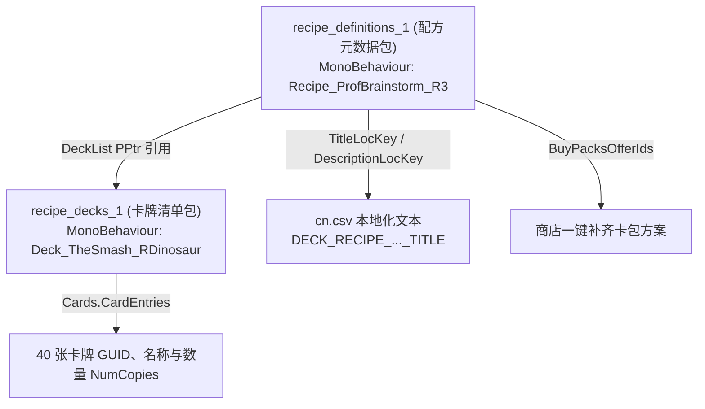

# 01. 卡组存储位置与 decks.json 解析

在 PVZH 中，卡组（Deck）用于定义一套包含 40 张卡牌的集合及其归属英雄。

本篇讲解卡组数据在游戏资源包中的存放路径，以及如何借助 [decks.json](../资源/decks.json) 索引库检索预设卡组。

---

## 一、 卡组数据的三大存储位置与官方配方双包

| 存储位置 | 物理路径与文件形式 | 包含的卡组类型 | 修改与读取方式 |
| :--- | :--- | :--- | :--- |
| **位置一：官方策略配方包 (`recipe`)** | `files/recipes/recipe_definitions_*`<br/>`files/recipes/recipe_decks_*` | 官方卡册“策略推荐”面板中展示的所有标准英雄套牌（MonoBehaviour 结构）。 | **核心双包结构**！必须使用 UABEA 的 **`Export Dump` / `Import Dump`** 修改 MonoBehaviour（插件/Plugins 在此不管用）。 |
| **位置二：全局通用卡组包 (`decks`)** | `files/decks/deck_data_*` | AI 随机对战默认卡组 (如 `AutoPlay_...`)、活动对局卡组 (TextAsset/JSON 结构)。 | 使用 UABEA 导出或通过 [PVZ-H Deck Editor](https://pvz-h-tools.onrender.com/deck-editor) Web 工具一键生成成品后导入。 |
| **位置三：关卡底包 (`data_assets`)** | `files/data_assets_*` | 关卡专属出战卡组（如单人战役 BOSS 卡组、解密固定卡组）。 | 在关卡 JSON 内通过 `DeckId` 关联或直接修改。 |

---

## 二、 官方策略配方双包解构 (`recipe_definitions` + `recipe_decks`)

通过对工作区资源目录下的真实资源包 **[recipe_definitions_1](../资源/recipe_definitions_1)** 与 **[recipe_decks_1](../资源/recipe_decks_1)** 进行底层 UnityPy 解析，官方在卡册界面展示的策略推荐卡组采用了**解耦的双包架构**：



### 1. 配方定义包 (`recipe_definitions_1`)
- **节点类型**：`MonoBehaviour`（例如 `Recipe_ProfBrainstorm_R3` 代表狂野研究者脑王博士的推荐套牌 3）。
- **核心字段**：
  - **`TitleLocKey`**：策略标题文本 Key（如 `DECK_RECIPE_PROFESSORBRAINSTORM_R3_TITLE`，在 [cn.csv](../资源/cn.csv) 中映射中文名）。
  - **`DescriptionLocKey`**：策略套牌的核心玩法描述字幕 Key。
  - **`DeckList`**：`PPtr` 指针，精准指向 `recipe_decks_1` 包内对应的卡牌清单。
  - **`BuyPacksOfferIds`**：缺少卡牌时，点击“一键补齐”调用的内购卡包优惠 ID 列表（如 `DeckRec_Set3Pack`）。

### 2. 配方卡组包 (`recipe_decks_1`)
- **节点类型**：`MonoBehaviour`（例如 `Deck_TheSmash_RDinosaur` 代表粉碎者恐龙推荐套牌）。
- **核心字段**：
  - **`Faction`**：阵营归属（`0` 植物 / `1` 僵尸）。
  - **`Cards.CardEntries`**：40 张卡牌的编组清单数组：
    - `CardGuid` / `Guid`：卡牌的数字 GUID 或 UUID 字符串标识（如 `Gravity Well`）。
    - `NumCopies`：单卡携带份数（如 `4`、`2`、`1` 张）。
  - **`SuperpowerOverrides`**：英雄超能技能重定向/覆写选项。

---

## 三、 `decks.json` 预设卡组索引库

在社区工具 [PVZH-Level-Editor](https://github.com/Show-o4210/PVZH-Level-Editor) 中，提供了一份包含全游戏 654 个预设卡组的索引文件 [decks.json](../资源/decks.json)。

### 典型索引结构：

```json
[
  {
    "id": "AutoPlay_Plants",
    "form": "通用/未分类",
    "cn": "植物通用出战卡组"
  },
  {
    "id": "Deck_SolarFlare_Strategy1",
    "form": "阳光英雄推荐",
    "cn": "耀斑花策略卡组 1"
  }
]
```

---

## 四、 预设卡组三大分类

1. **AI 出战卡组 (`AutoPlay_...`)**：
   人机 AI 在无固定关卡配置时使用的默认随机卡组。
2. **英雄策略推荐卡组 (`Deck_[HeroName]_StrategyX` / `Recipe_...`)**：
   玩家在卡册构筑界面中点击“策略推荐”时看到的官方组牌方案。
3. **剧情 BOSS 专属卡组 (`Deck_Boss_...`)**：
   单人战役每章守门 BOSS 拥有的超标/特殊机制卡组。

