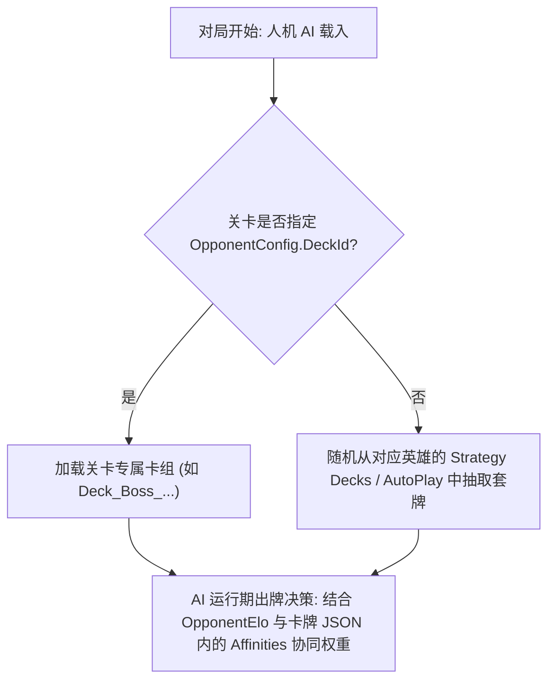

# 03. AI 构筑逻辑与策略推荐卡组修改

在 PVZH 中，人机 AI 并非凭空打出卡牌，而是必须遵循卡组与 `Affinities` 协同权重的控制。

本篇讲解 AI 的卡组决策逻辑、手工修改卡组的 UABEA Dump 实战操作以及 Web 端一键卡组编辑器推荐。

---

## 一、 人机 AI 出牌与卡组决策架构

---

## 二、 影响 AI 智能决策的两大关键

1. **`OpponentElo` (智商层数)**：
   在关卡 JSON（详见 [09. 关卡修改](../09.关卡修改/README.md)）中配置。ELO 数值越高，AI 对多步考量的树状模拟演算深度就越深。
2. **`Affinities` (协同权重表)**：
   在卡牌数据 JSON（详见 [02. 卡牌数据说明](../02.卡牌数据说明/README.md)）中定义。例如墓碑建筑与墓碑随从的 `Affinities` 权重较高，AI 就会优先将它们打出在同路线组合触发效果。

---

## 三、 手工修改卡组实战（UABEA Dump 法）

> [!IMPORTANT]
> **避坑关键：为什么不能用 UABEA 插件（Plugins）？**
> 在 UABEA 中处理卡组与策略配方包（`recipe_definitions_*` 与 `recipe_decks_*`）时，目标节点均为 Unity 的 **`MonoBehaviour`** 自定义数据结构。
> UABEA 的 `Plugins` 按钮仅用于特定标准类型（如 `Texture2D` 图片导入/导出），**在此处插件完全不管用（会提示无适用插件或无法解包）**！
> **必须使用 UABEA 的 Dump 功能（`Export Dump` / `Import Dump`）进行手工修改。**

### 1. 通用 TextAsset 格式卡组修改 (针对 `decks/deck_data_*`)
1. 使用 UABEA 打开 `files/decks/deck_data_*` 资源包。
2. 进入 `Info` 视窗，在列表中检索目标卡组节点（如 `Deck_SolarFlare_Strategy1`）。
3. 选中节点，点击右侧 **`Export Dump`**，导出为 `.txt` 文本文件。
4. 用文本编辑器打开，修改 `Cards` 数组中的 `CardGuid` 及 `Count` 数量。
5. 在 UABEA 中选中该节点，点击右侧 **`Import Dump`** 选择修改后的文本导入。
6. 点击 `File` -> `Save` 保存 Info 视窗，返回主界面 `File` -> `Save` 导出新 bundle 文件。

### 2. 官方深度策略配方双包手工修改 (针对 recipe_definitions_1 与 recipe_decks_1)
1. 使用 UABEA 打开 `files/recipes/recipe_definitions_*` 与 `recipe_decks_*` 资源包。
2. **修改卡牌清单 (`recipe_decks_*`)**：
   - 选中对应的 `Deck_[Hero]_[Name]` MonoBehaviour 节点。
   - 点击右侧 **`Export Dump`** 导出 Dump 文本。
   - 找到 `Cards.CardEntries` 节点，修改 `CardGuid` / `Guid` 以及 `NumCopies` 数量。
   - 选中节点点击 **`Import Dump`** 覆盖写入。
3. **修改显示标题与描述 (`recipe_definitions_*`)**：
   - 选中对应的 `Recipe_[Hero]_R*` MonoBehaviour 节点，使用 **`Export Dump`** 导出。
   - 修改 `TitleLocKey` 与 `DescriptionLocKey` 字段，导入更新。
   - 在 [cn.csv](../资源/cn.csv) 中补全对应 LocKey 的中文标题与配方说明。
4. 保存并打包替换。不仅玩家在卡册中点击“策略推荐一键装载”会应用新套牌，人机 AI 在随机对战中也会自动打出你配置的全新卡组！

---

## 四、 Web 端在线编辑器一键制作成品卡组（推荐）

如果觉得手工查找 `CardGuid` 与编辑 UABEA Dump 文本过于繁琐，推荐使用玩家社区维护的 Web 端可视化卡组编辑器：

> [!TIP]
> 🌐 **PVZ-H 在线卡组编辑器**：[https://pvz-h-tools.onrender.com/deck-editor](https://pvz-h-tools.onrender.com/deck-editor)

### 工具优势与一键流程：
1. **可视化图形选卡**：直接在线挑选英雄、按卡牌名称/技能搜索，点击即可增减单卡数量，无需手动查询长串的卡牌 GUID。
2. **一键生成成品文件**：在网页端配置完成后，可一键导出适配 UABEA 的成品卡组 Dump / JSON 数据。
3. **自动校验卡组合法性**：内置 40 张总数限制与英雄双职业校验（同时支持一键开启破限模式）。
4. **快速导入游戏**：将 Web 端生成的一键成品文本，通过 UABEA 的 **`Import Dump`** 直接导入回 `files/decks/` 或 `files/recipes/` Bundle 资源包即可使用！

