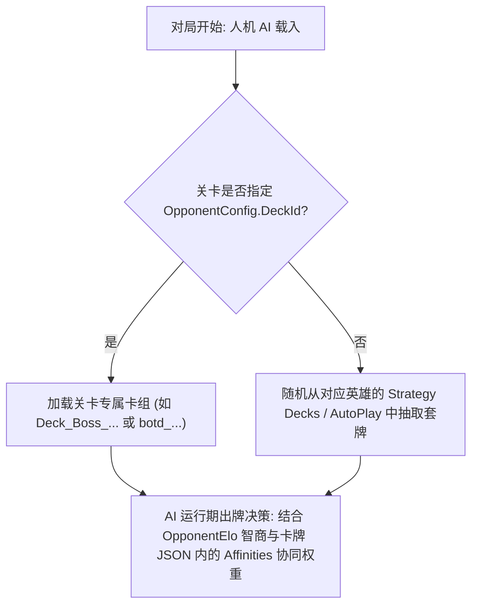

# 03. AI 构筑逻辑与策略推荐卡组修改

在 PVZH 中，人机 AI 并非随机打出卡牌，而是必须遵循关联的卡组、关卡参数配置以及 `Affinities` 协同权重的控制。

本篇讲解 AI 的卡组决策逻辑、基于 Python `UnityPy` 的自动化资源包修改流程以及 UABEA Dump 手工修改实战。

---

## 一、 人机 AI 出牌与卡组决策架构



---

## 二、 影响 AI 智能决策的关键参数

1. **`OpponentConfig.HeroId` (底层英雄代号)**：
   在关卡 JSON（详见 [09. 关卡修改](../09.关卡修改/README.md)）中配置。必须传入底层内部代号（例如配置脑王博士需填 `"HeroId": "Neptuna"`，配置超级脑子需填 `"HeroId": "ZMech"`）。
2. **`OpponentElo` (AI 智商模拟深度)**：
   在关卡 JSON 中配置。ELO 数值越高，AI 对多步考量与预判的树状演算深度就越深。
3. **`Affinities` (协同权重表)**：
   在卡牌数据 JSON 中定义（详见 [02. 卡牌数据说明](../02.卡牌数据说明/README.md)）。例如墓碑建筑与墓碑随从的 `Affinities` 权重较高，AI 就会优先将它们打出在同一路线组合触发效果。

---

## 三、 工作流一：Python (UnityPy) 自动化卡组包修改（推荐）

对于批量修改或无需依赖 UABEA 图形界面的自动化开发，使用 Python 库 `UnityPy`（详见 [01. 工具链介绍](../01.工具链介绍/README.md)）是最简便高效的方式。

### Python 脚本修改 `data_assets` / `decks` 中的 TextAsset 示例：

```python
import UnityPy
import json

# 1. 加载本地客户端 bundle 文件 (替换为实际 bundle 路径)
bundle_path = "path/to/data_assets_bundle"
output_path = "path/to/data_assets_bundle_modified"

env = UnityPy.load(bundle_path)

# 2. 遍历并修改指定的 TextAsset 卡组
for obj in env.objects:
    if obj.type.name == "TextAsset":
        data = obj.read()
        
        # 找到目标卡组 (以修改抓抓草推荐卡组为例)
        if data.m_Name == "Deck_GrassKnuckles_R3":
            deck_json = json.loads(data.m_Script)
            
            # 修改 MainDeckCardIds (放置需要的卡牌数字 ID)
            # 例如替换为 40 张相同卡牌 (ID: 472)
            deck_json["MainDeckCardIds"] = [472] * 40
            
            # 写回修改后的 JSON 文本
            data.m_Script = json.dumps(deck_json, indent=2)
            data.save()

# 3. 保存导出更新后的 Bundle 文件
with open(output_path, "wb") as f:
    f.write(env.file.save())

print("卡组 Bundle 重新打包完成！")
```

---

## 四、 工作流二：UABEA Dump 手工修改实战

> [!IMPORTANT]
> **避坑关键：为什么不能用 UABEA 插件（Plugins）？**
> 在 UABEA 中处理策略配方包（可参考 [资源/recipe_definitions_1](../资源/recipe_definitions_1) 与 [资源/recipe_decks_1](../资源/recipe_decks_1) 示例）时，目标节点均为 Unity 的 **`MonoBehaviour`** 自定义数据结构。
> UABEA 的 `Plugins` 按钮仅用于特定标准类型（如 `Texture2D` 图片导入/导出），**在此处插件完全不管用（会提示无适用插件）**！
> **必须使用 UABEA 的 Dump 功能（`Export Dump` / `Import Dump`）进行文本导出与导入。**

### 1. 修改 `decks/deck_data_*` 通用卡组
1. 使用 UABEA 打开客户端的 `files/decks/deck_data_*` 资源包。
2. 进入 `Info` 视窗，检索目标卡组节点（如 `Deck_SolarFlare_Strategy1`，也可在 [decks.json](../资源/decks.json) 中检索）。
3. 选中节点，点击右侧 **`Export Dump`** 导出为 `.txt` 文本。
4. 用文本编辑器打开，修改 `Cards` 数组中的 `CardGuid` 及 `Count` 数量。
5. 在 UABEA 中选中该节点，点击右侧 **`Import Dump`** 选择修改后的文本导入。
6. 点击 `File` -> `Save` 保存 Info 视窗，返回主界面 `File` -> `Save` 导出新 bundle 文件。

### 2. 修改策略配方双包 (`recipe_definitions_*` 与 `recipe_decks_*`)
1. 使用 UABEA 打开 `recipe_definitions_*` 与 `recipe_decks_*` 资源包。
2. **修改卡牌清单 (`recipe_decks_*`)**：
   - 选中对应的 `Deck_[Hero]_[Name]` MonoBehaviour 节点。
   - 点击右侧 **`Export Dump`** 导出 Dump 文本。
   - 找到 `Cards.CardEntries` 节点，修改 `CardGuid` / `Guid` 以及 `NumCopies` 数量。
   - 选中节点点击 **`Import Dump`** 覆盖写入。
3. **修改显示标题与描述 (`recipe_definitions_*`)**：
   - 选中对应的 `Recipe_[Hero]_R*` MonoBehaviour 节点，使用 **`Export Dump`** 导出。
   - 修改 `TitleLocKey` 与 `DescriptionLocKey` 字段并导入更新。
   - 在 [cn.csv](../资源/cn.csv)（详见 [03. 本地化说明](../03.本地化说明/README.md)）中补全对应 LocKey 的中文标题与配方说明。
4. 保存打包替换至客户端 `files/` 路径即可生效！

---

## 五、 Web 端在线卡组编辑器一键生成

如果不想手动查询卡牌 GUID 与编辑文本，可使用社区 maintenance 的 Web 可视化编辑器（详见 [01. 工具链介绍](../01.工具链介绍/README.md)）：
- 🌐 **PVZ-H 在线卡组编辑器**：[https://pvz-h-tools.onrender.com/deck-editor](https://pvz-h-tools.onrender.com/deck-editor)
