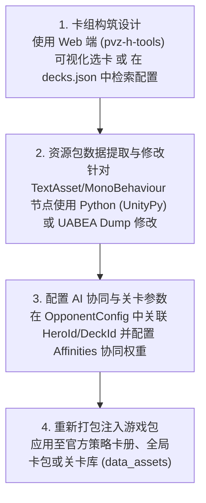

# 10. 卡组与 AI 构筑修改

在 PVZH 中，卡牌需要组装成**卡组（Deck）**才能在对战、天梯、单人战役及人机 AI 随机模式中使用。官方卡组库包含了预设推荐卡组（Strategy Decks）、人机 AI 出战卡组以及玩家自定义卡组。

本章节详细讲解卡组数据的存储位置、底层 JSON 与 Unity 资源包结构、40 张编组与破限规则、人机 AI 出牌协同机制以及全卡牌解锁调试方法。

---

## 目录导航

| 序号 | 专题文档 | 核心涵盖内容 |
| :---: | :--- | :--- |
| **01** | [01. 卡组存储位置与 decks.json 解析](01.卡组存储位置与decks.json解析.md) | 详解卡组存储的三大位置（`decks`、`recipes` 与 `data_assets`），基于本仓库 [资源/recipe_definitions_1](../资源/recipe_definitions_1) 与 [资源/recipe_decks_1](../资源/recipe_decks_1) 解构 Unity TextAsset 与 MonoBehaviour 数据格式，解析官方英雄内部代号（`Sunflower`, `Neptuna` 等）与职业掩码，以及 [decks.json](../资源/decks.json) 索引库检索。 |
| **02** | [02. 卡组 JSON 数据结构与 40 张构筑规则](02.卡组JSON数据结构与40张构筑规则.md) | 对比解析客户端 JSON (`DeckId`, `Cards`) 与关卡内嵌 JSON (`MainDeckCardIds`) 两种卡组格式，结合 [09. 关卡修改](../09.关卡修改/README.md) 详解 40 张构筑规则与 PVE/Mod `ignoreDeckLimit` 破限机制（包含 2~440 张极端套牌数据分析）。 |
| **03** | [03. AI 构筑逻辑与策略推荐卡组修改](03.AI构筑逻辑与策略推荐卡组修改.md) | 结合 [02. 卡牌数据说明](../02.卡牌数据说明/README.md) 中的 `Affinities` 协同权重，详解人机 AI 的 `OpponentConfig` 决策机制，提供基于 Python `UnityPy` 脚本自动化解包/修改卡组与 [01. 工具链介绍](../01.工具链介绍/README.md) 中 UABEA Dump 手工修改两种完整工作流。 |
| **04** | [04. 全卡牌解锁与本地存档调试](04.全卡牌解锁与本地存档调试.md) | 详解 `new_player_inventory` 初始卡库配置、本地客户端缓存数据结构，结合 [11. 静态高级实战](../11.静态高级实战/README.md) 讲解全卡牌/全英雄免氪调试方案以及网络同步防封号注意事项。 |

---

## 核心工作流概览

1. **40 张构筑标准与破限**：常规天梯与对局卡组严格限制为 40 张卡牌；但在自定义关卡（详见 [09. 关卡修改](../09.关卡修改/README.md)）或残局解密（BOTD）中，可突破该限制（底层真实数据中涵盖 2 张至 440 张不等的官方特化套牌）。
2. **英雄职业校验与代号映射**：卡组内卡牌必须符合英雄双职业属性。修改底层数据时需注意：底层 `HeroId` 使用了早期开发代号（如 `Sunflower` = 耀斑花, `CptBrainz` = 电音巨星, `ZMech` = 超级脑子, `Neptuna` = 脑王博士）。
3. **技术工具推荐**：
   - 🛠️ **手工修改必备**：修改 `recipe_decks_*` 等 MonoBehaviour 节点时，UABEA 的 Plugins 插件功能不可用，必须使用 **`Export Dump` / `Import Dump`** 导出/导入文本（详见 [01. 工具链介绍](../01.工具链介绍/README.md)）。
   - 🐍 **Python 自动化批处理**：推荐使用 Python 配合 `UnityPy` 库直接读取与修改 Asset Bundle 中的 TextAsset 与 MonoBehaviour 节点。
   - 🌐 **一键生成成品神器**：可以使用在线 Web 工具 **[PVZ-H Deck Editor](https://pvz-h-tools.onrender.com/deck-editor)** 进行可视化选卡与成品卡组导出。
