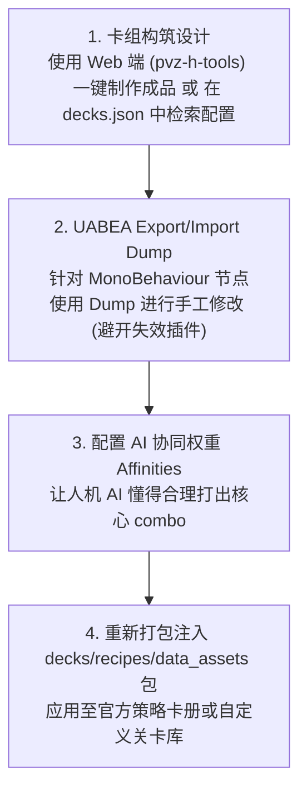

# 10. 卡组与 AI 构筑修改

在 PVZH 中，卡牌需要组装成**卡组（Deck）**才能在对战、天梯、单人战役及人机 AI 随机模式中使用。官方卡组库包含了预设推荐卡组（Strategy Decks）、人机 AI 出战卡组以及玩家自定义卡组。

本章节详细讲解卡组数据的存储位置、JSON 构筑结构、40 张编组规则、人机 AI 出牌协同机制以及全卡牌解锁调试方法。

---

## 目录导航

| 序号 | 专题文档 | 核心涵盖内容 |
| :---: | :--- | :--- |
| **01** | [01. 卡组存储位置与 decks.json 解析](01.卡组存储位置与decks.json解析.md) | 详解卡组数据存储包 `decks/deck_data_*`、基于 [recipe_definitions_1](../recipe_definitions_1) 与 [recipe_decks_1](../recipe_decks_1) 解构官方卡册配方双包，以及 [decks.json](../PVZH-Level-Editor/decks.json) 索引库的检索。 |
| **02** | [02. 卡组 JSON 数据结构与 40 张构筑规则](02.卡组JSON数据结构与40张构筑规则.md) | 详解卡组 JSON 核心属性（`DeckId`, `HeroId` 英雄绑定, `Cards` 卡牌 GUID 数组与单卡上限），以及 `ignoreDeckLimit` 忽略上限规则。 |
| **03** | [03. AI 构筑逻辑与策略推荐卡组修改](03.AI构筑逻辑与策略推荐卡组修改.md) | 详解人机 AI 的卡组检索机制、手工修改卡组（必须用 UABEA Dump 避开失效插件）以及 [PVZ-H Deck Editor](https://pvz-h-tools.onrender.com/deck-editor) Web 工具一键制作成品。 |
| **04** | [04. 全卡牌解锁与本地存档调试](04.全卡牌解锁与本地存档调试.md) | 详解玩家本地卡库与存档数据结构、全卡牌解锁调试技巧以及网络同步防封号注意要点。 |

---

## 核心工作流概览

1. **40 张构筑标准**：常规天梯与对局卡组严格限制为 40 张卡牌；但在自定义关卡或残局解密中，可突破该限制。
2. **英雄职业校验**：卡组中包含的卡牌必须属于该英雄的两个指定职业（Class/Color），否则无法合法装载（非同职业卡牌需通过 `ignoreDeckLimit` 或关卡规则配置）。
3. **工具推荐与避坑**：
   - 🛠️ **手工修改必备**：修改 `recipe_decks_*` 等 MonoBehaviour 数据时，UABEA 的 Plugins 插件功能不可用，必须使用 **`Export Dump` / `Import Dump`** 导出/导入文本。
   - 🌐 **一键生成成品神器**：可以使用在线 Web 工具 **[PVZ-H Deck Editor](https://pvz-h-tools.onrender.com/deck-editor)** 进行可视化选卡与成品卡组导出。

