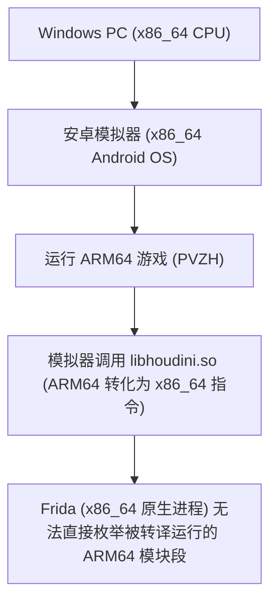

# 01. 从 Frida 避坑到全静态 Patch 方案选择

在对 PVZH 进行深入 Mod 拓展（例如制作全新的自定义卡牌）时，仅修改 `card_data` 数据包往往是不够的。

本篇讲解为什么动态调试工具 Frida 在部分开发环境下会遭遇瓶颈，以及为什么**静态二进制 Patch 方案（Static SO Patching）**是生产环境与社区分发的首选。

---

## 一、 卡牌 Mod 终极瓶颈：数据定义与拥有权分离

很多 Mod 开发者在向 `card_data` JSON 中成功注入新卡牌定义后，会遇到一个诡异的现象：

```text
卡牌定义存在 (card_data)  ──► 卡册中可以查看到卡牌图标与数值
                           但卡牌呈现灰色灰色不可选 ──► 无法拖入卡组编组！
```

### 根本原因：
PVZH 客户端采用**双轨校验机制**：
1. **定义层 (Card Definition)**：保存在 `card_data_*` 文件中，决定卡牌费用、攻防、贴图与技能节点。
2. **拥有权层 (Player Inventory)**：保存在内存中的 `PlayerInventory.Cards` 字典中。当服务器同步或本地读档完成时，若 `Cards` 字典中没有该卡牌 GUID，游戏就会认定玩家**“未拥有该卡”**，从而锁定编组功能。

---

## 二、 动态 Hook (Frida) 在模拟器中的踩坑档案

在探索如何拦截并修改内存中 `PlayerInventory.Cards` 字典时，开发者通常首先会尝试使用 **Frida** 进行动态 Hook。

但在 PC 安卓模拟器（如雷电9、MuMu12、逍遥模拟器）环境调试时，常常会触发如下异常故障：

### 异常现象：

```bash
# 模拟器环境中 frida-server 正常运行，进程也能正常附加
frida -U -n com.ea.gp.pvzheroes

# 执行模块枚举：
Process.enumerateModules()
```

此时控制台输出只有系统库和 `libhoudini.so`，**根本搜不到 `libil2cpp.so` 或 `libunity.so` 等游戏核心 SO 模块**！

```text
❌ Process.getModuleByName("libil2cpp.so") ──► 报错: Module not found
❌ Interceptor.attach(Module.findBaseAddress("libil2cpp.so").add(...)) ──► 执行失败崩溃
```

---

## 三、 避坑诊断：x86_64 模拟器 + ARM64 游戏 + Houdini 转译层冲突

这一故障并非由于 Frida 安装错误或 Root 权限缺失，而是由**指令集架构与转译层（Binary Translator）机制**决定的：



1. **架构不匹配**：模拟器系统内核是 `x86_64`，而 PVZH 游戏 APK 中只有 `arm64-v8a/libil2cpp.so`。
2. **转译层隐匿**：模拟器通过 `libhoudini.so` 在指令执行层实时将 ARM64 指令翻译为 x86_64。在 Frida 看脑图中，ARM64 的内存模块被包裹在转译上下文内部，无法以标准的 `Native Module` 视角暴出来。

---

## 四、 解决方案对比：动态 Hook vs 全静态 Patch

为了解决上述问题并方便 Mod 成品的社区传播，方案选型对比如下：

| 维度 | 动态 Hook 方案 (Frida / Xposed) | 全静态 Patch 方案 (Static SO Patching) |
| :--- | :--- | :--- |
| **工作原理** | 运行期在内存中注入 agent 脚本、拦截函数。 | 直接在 ELF 二进制文件（`libil2cpp.so`）中修改汇编指令并嵌入 Payload。 |
| **环境要求** | 手机/模拟器必须 Root，必须常驻 `frida-server` 后台。 | **零环境要求**！普通手机、未 Root 环境与模拟器通用。 |
| **模拟器兼容性** | 受限于 Houdini 转译层，在 x86_64 模拟器上极易枚举失败。 | **100% 兼容**！Houdini 转译静态 Patch 后的 ARM64 SO 无任何阻碍。 |
| **玩家交付形态** | 玩家需配置复杂 Python/Frida 环境与运行脚本。 | **极简分发**！直接替换 APK 中的 `libil2cpp.so` 或重签发布安装包。 |

因此，基于开源框架 **[pvzh-local-inventory-mod](https://github.com/Show-o4210/pvzh-local-inventory-mod)** 的**全静态 Patch 方案**成为了 PVZH 离线全卡解锁与高级 Mod 机制扩展的最佳选择。

