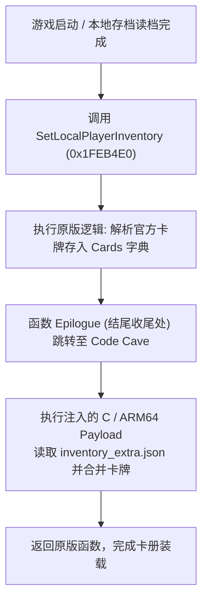

# 02. libil2cpp.so 静态 Patch 原理与 v3c 汇编注入

本篇深入解析 `libil2cpp.so` 静态补丁的底层原理、ARM64 汇编代码洞（Code Cave）切入机制，以及二进制 ELF 结构在真机（Bionic Linker）上从 v3a 到 **v3c** 的演进踩坑过程。

---

## 一、 静态 Hook 切入点选型

要实现本地自定义卡牌的拥有权注入，必须选择一个合适的 C# 方法切入点。

通过查看 IL2CPP 的 `dump.cs`，定位到了目标函数：
- **目标类**：`PvZCards.Engine.PlayerInventory`
- **目标方法**：`SetLocalPlayerInventory`
- **对应 arm64-v8a 偏移量 (Offset)**：`0x1FEB4E0`



在原版 `SetLocalPlayerInventory` 的末尾（Epilogue），通过修改汇编指令插入一条跳转指令（`B` 或 `BL`），引导 CPU 执行我们注入在空白代码洞（Code Cave）中的自定义 Payload 数据。

---

## 二、 Code Cave 代码洞注入与 Payload 结构

在 ELF 二进制文件中，只读可执行段（`RX Segment`）往往留有填充 padding 的空白区域，或者可以通过扩展 ELF 段结构开辟出一块可执行代码空间。

在开源项目 [pvzh-local-inventory-mod](https://github.com/Show-o4210/PVZH-Library/tree/main/mods/local-inventory)（代码详见 [native/merge_inventory_extra.c](../mods/local-inventory/native/merge_inventory_extra.c)）中，自定义的 Native C 代码实现了如下注入逻辑：

```c
// 伪代码流程示意：被 Code Cave 调用的合并函数
void patch_merge_inventory_extra(void* inventory_ptr) {
    // 1. 打开本地扩展卡库文件
    FILE* fp = fopen("/storage/emulated/0/Android/data/com.ea.gp.pvzheroes/files/cache/mod/inventory_extra.json", "r");
    if (!fp) return;

    // 2. 解析 JSON 获得 GUID 与 数量
    // 3. 循环调用 Il2Cpp 的 AddCardToInventory(inventory_ptr, guid, count)
    // 4. 关闭文件，恢复寄存器上下文
}
```

---

## 三、 真机闪退演进史：从 v3a 到 v3c 避坑指南

在直接篡改 Android ELF 二进制文件时，安卓系统的动态链接器（`linker64` / Bionic）对 SO 的文件头结构与段对齐要求极高。

修改过程中经历的三代补丁演进记录如下：

### 1. v3a 策略：直接修改 PT_LOAD 段
- **原理**：在 `libil2cpp.so` 尾部追加一个新的 `PT_LOAD` 段并设置 `RX`（可读可执行）权限。
- **踩坑现象**：模拟器运行良好，但安卓 10+ 真机直接报 `SIGSEGV` 或 `SIGBUS` 闪退。
- **原因**：Android Bionic Linker 强制要求所有 `PT_LOAD` 段必须按 `0x1000` (4KB) 页边界对齐，且文件偏移与虚拟地址取模必须一致。

---

### 2. v3b 策略：使用现有 RX 段空洞
- **原理**：不新增段，直接利用 `libil2cpp.so` 内部现有的 `.text` 末尾 RX 空白对齐区域。
- **踩坑现象**：部分手机安装后启动即黑屏/白屏卡死。调试 `logcat` 抛出 `dlopen failed: invalid ELF header`。
- **原因**：ELF 文件的段头表（Section Header Table, SHT）与程序头表（Program Header Table, PHT）中的 `.dynamic` 节区偏移量不一致。

---

### 3. v3c 策略（当前完美稳定版本）
- **核心修复**：**SHT `sh_offset` 对齐与动态同步**！
- **补丁策略**：
  1. 准确在 RX 代码段末尾安全字节处写入编译好的 Payload。
  2. 严格同步修补 ELF 的 `sh_offset` 节头表，确保 `PT_DYNAMIC` 与 Section Header 中的 `.dynamic` 偏移完全一字节不差地对齐。
  3. 修正跳转指令与上下文寄存器保护（`STP X29, X30, [SP, #-16]!` 与 `LDP X29, X30, [SP], #16`）。

> [!IMPORTANT]
> **结论**：真机与模拟器部署时，必须使用经过 **v3c** 策略修正后的 `libil2cpp.so`，才能确保 100% 不闪退、不白屏！
