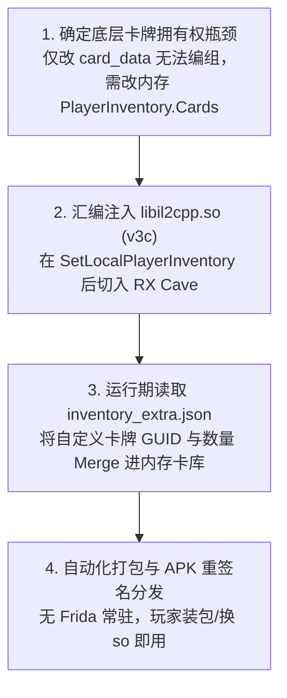

# 11. 静态高级实战：libil2cpp.so 静态补丁与本地全卡牌解锁

在 PVZH Mod 开发中，除了修改 AssetBundle 静态资产与 JSON 配置文件（如 02~10 章节所述），很多高级玩法涉及**底层游戏逻辑与内存数据的改写**（例如让本地离线卡册拥有自定义卡牌、突破服务器校验限制等）。

由于安卓模拟器（x86_64）通过 Houdini 转译层运行 ARM64 游戏时，动态调试工具（如 Frida）在枚举 Native 模块时极易失效崩溃，社区探索出了一套**无需 Frida、零运行期开销的全静态 ELF 汇编补丁（Static SO Patching）方案**。

本章节详细拆解基于社区开源框架 **[pvzh-local-inventory-mod](https://github.com/Show-o4210/PVZH-Library/tree/main/mods/local-inventory)**（源码位于本仓库 [mods/local-inventory](../mods/local-inventory)）的 `libil2cpp.so` 静态 Hook 原理、v3c 汇编代码洞注入、`inventory_extra.json` 内存合并机制以及自动化构建部署工作流。

---

## 目录导航

| 序号 | 专题文档 | 核心涵盖内容 |
| :---: | :--- | :--- |
| **01** | [01. 从 Frida 避坑到全静态 Patch 方案选择](01.从Frida避坑到全静态Patch方案选择.md) | 详解 x86_64 模拟器 + Houdini 架构下 Frida 枚举不到 `libil2cpp.so` 的根本原因，以及全静态 Patch 相比动态 Hook 的优势。 |
| **02** | [02. libil2cpp.so 静态 Patch 原理与 v3c 汇编注入](02.libil2cpp.so静态Patch原理与v3c汇编注入.md) | 详解 `SetLocalPlayerInventory` 函数 Epilogue 截获机制、RX Code Cave 汇编注入、SHT `sh_offset` 对齐及 v3a $\rightarrow$ v3c 的真机避坑演进。 |
| **03** | [03. inventory_extra.json 本地卡库合并机制](03.inventory_extra.json本地卡库合并机制.md) | 详解双轨数据架构：`card_data_*` 实体定义 $\leftrightarrow$ `inventory_extra.json` 拥有权声明、JSON Schema 格式与本地持久化。 |
| **04** | [04. 自动化 Patch 构建与真机部署实战](04.自动化Patch构建与真机部署实战.md) | 详解基于 `build_and_patch.py` 自动化打补丁、替换重签 APK、真机/模拟器部署流及故障排查档案。 |

---

## 核心工作流概览

---

> [!TIP]
> 🌐 **开源仓库**：[Show-o4210/pvzh-local-inventory-mod](https://github.com/Show-o4210/PVZH-Library/tree/main/mods/local-inventory)  
> 本章节配套的全部开源 Python 补丁构建脚本、C 语言 Native 逻辑源码及配置模板，均存放于 本仓库目录 **[pvzh-local-inventory-mod](../mods/local-inventory)** 中。
>
> 在库存 Merge 稳定之后，若需继续扩展战斗规则（例如 **Grant 赋甲 type=19**、装甲 UI、多 Hook 共洞），请接读 **[12. 静态高级实战 2](../12.静态高级实战2/README.md)**。
