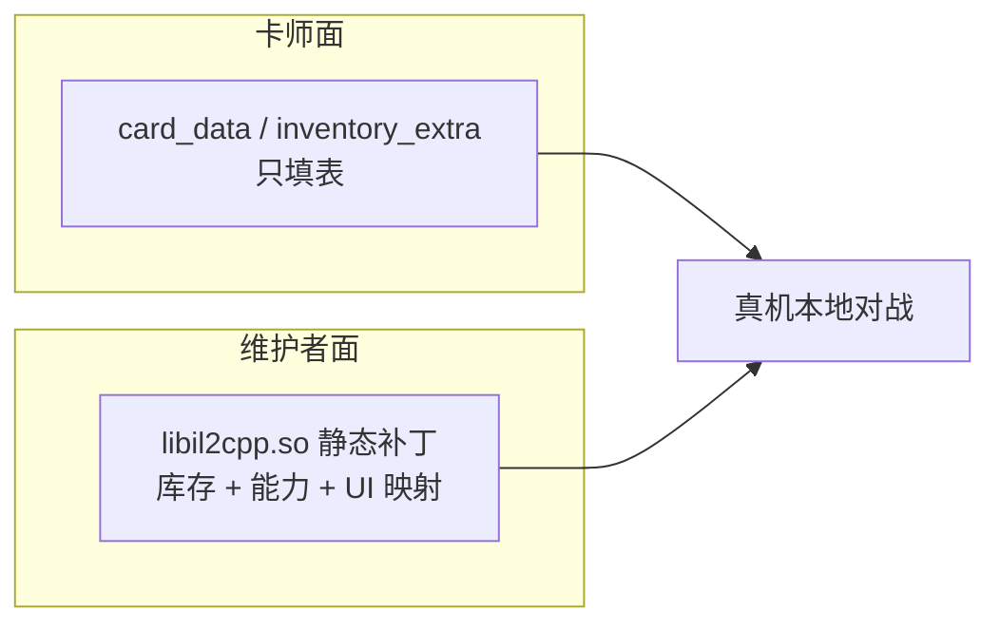

# 01. 从库存 Merge 到 Mod Base 能力扩展架构

第 11 章证明了一件事：**全静态 `libil2cpp.so` 补丁**可以在无 Frida、无 Root 的前提下，把本地 JSON 合并进 `PlayerInventory`。  
本章把该能力产品化为长期可维护的 **Mod Base**，并说明为何下一步要从「拥有权」迈向「规则扩展」。

---

## 一、 第 11 章已经解决了什么

回顾双轨架构：

```text
card_data_*          →  卡是什么（定义）
PlayerInventory      →  你有没有这张卡（拥有权）
```

| 层 | 改法 | 第 11 章结论 |
| :--- | :--- | :--- |
| 定义 | 改缓存 `card_data_*` | 社区早已可用 |
| 拥有 | 服务器不会下发自定义 GUID | **静态补丁 + `inventory_extra.json` Merge** |

交付形态固定为：

```text
替换 / 重签 APK 内的 libil2cpp.so（v3c）
+ 设备侧 files/cache/mod/inventory_extra.json
+ 可选 card_data / 贴图 / 本地化
```

玩家与卡师**不必**懂汇编；维护者负责跟版重建 so。

---

## 二、 为什么还需要「实战 2」

库存打通后，卡师很快会撞上下一个天花板：

```text
card_data 里写了 GrantAbilityEffectDescriptor
  → 希望「入场给自己装甲」
  → 官方 GrantableAbilityType 只有 0–18（Untrickable、Frenzy…）
  → 没有 Armor
  → 装甲是独立 Component + ArmorSystem，不是 GrantableAbility 子类
```

仅改 JSON **无法**让 `GrantAbilitySystem` 挂上真实 `Armor` 组件。  
这属于 **Base 内的规则扩展**：维护者在 so 里加 Hook，卡师只填扩展枚举值（如 `"19"`）。



---

## 三、 Mod Base 受众分层

| 角色 | 日常工作 | 禁止事项 |
| :--- | :--- | :--- |
| **玩家 / 卡师** | 装 Base；改 `card_data` 与 `inventory_extra.json` | 自己改 so / metadata |
| **维护者** | dump、锚点、写 payload、`build_and_patch`、真机验收、发成品语义说明 | 把未验收 Hook 塞进社区包 |

> [!IMPORTANT]
> **接口合同**：新玩法优先做成「维护者扩 Base + 卡师填字段」，而不是让每位作者各自 Frida / 手改 so。  
> 这是第 11 章「可社区传播」原则在能力层的延续。

---

## 四、 Base 能力清单（阶段演进）

| 阶段 | 能力 | 状态（参考验收） |
| :--- | :--- | :--- |
| **P0** | `SetLocalPlayerInventory` 后 Merge `inventory_extra.json` | 稳定（v3c，见第 11 章） |
| **P1** | `GrantableAbilityType = 19` → 真实 **Armor** + 减伤 | 真机已验证 |
| **P1-UI** | History `AbilityGrantedRecord` + Sprite `19→8` | 真机主路径已落地 |
| **调试便利** | 组卡单卡上限 **4 → 40**（多处 `mov #imm`） | 调试用，见 04 篇 |
| **WIP** | Splash / Multishot 等 20–23 | 未完成未验收，勿当稳定 API |

一句话架构：

```text
作者 JSON / card_data / inventory_extra
        ↓
Base 静态补丁 libil2cpp.so
        ├── inventory merge          （第 11 章）
        ├── Grant 19 → Armor + History
        ├── Sprite 19 → SpecialAbility.Armor
        └── MAX_COPIES 4 → 40（可选调试）
        ↓
真机官方客户端（仅本地 / 单机研究）
```

---

## 五、 技术底座：仍坚持 v3c，不另开 ELF 方案

能力扩展**共用**第 11 章的 RX Code Cave 策略：

1. **不**新增 `PT_LOAD`、**不**搬 PHDR 表到文件尾（Houdini / 真机 bionic 均踩过坑）。  
2. 在既有 RX 段与下一 RW 段的 VA 空隙扩展 cave，写入多个 payload 并拼接。  
3. 扩展文件后 **必须**平移所有受影响的 SHT `sh_offset`，保证 `PT_DYNAMIC.p_offset == .dynamic.sh_offset`。  
4. 每个业务 Hook 用 `B` / 短跳板切入 cave，返回时恢复寄存器与原 epilogue。

| 补丁族 | Hook 示例 | 职责 |
| :--- | :--- | :--- |
| 库存 | `SetLocalPlayerInventory` epilogue ≈ `0x1FEB4E0` | 读 extra JSON，AddCard |
| 赋甲 | `GrantAbilitySystem.ProcessEffect` ≈ `0x21F6E24` | type 19 特判挂 Armor |
| 图标 | `GetSpriteTypeFromGrantableAbilityType` ≈ `0x1EFF22C` | 19 → SpecialAbility 8 |
| 上限 | 若干 `GetMaxCopies` / `CanMoveCard` 等 | 调试破 4 张 |

具体地址以当次 `PATCH_INFO.txt` 与 dump 为准。

---

## 六、 设备侧文件合同（卡师仍只碰这些）

```text
Android/data/com.ea.gp.pvzheroes/files/
  cache/
    bundles/files/cards/card_data_*     ← 定义（含 Grant 描述符）
    mod/
      inventory_extra.json              ← 拥有权
```

**赋甲示例**（仅在已含 P1 补丁的 Base 上有效）：

```json
{
  "$type": "PvZCards.Engine.Components.GrantAbilityEffectDescriptor, EngineLib, ...",
  "$data": {
    "GrantableAbilityType": "19",
    "Duration": "Permanent",
    "AbilityValue": 2
  }
}
```

- `"19"` 作为数值字符串反序列化为扩展枚举值。  
- `AbilityValue` → 装甲量 `ArmorAmount.BaseValue`（实现里 0 常按 1 处理）。  
- **未打本补丁的客户端**会忽略或行为异常；勿用于官方联机。

原生「卡面自带装甲」仍应在实体上直接挂 `Armor` 组件，**不必**走 Grant 19。Grant 19 只服务**运行时赋能**（入场 / 技能目标等）。

---

## 七、 安全与合规边界（与第 11 章一致）

- 仅本地 / 单机研究与社区创作。  
- 不实现向官方 `inventory/sync` **上传**自定义卡。  
- 官方 PvP / 匹配不在支持范围。  
- so 与游戏客户端版本绑定；大更后维护者重 dump、重锚、重发 Base。

---

## 八、 本章阅读顺序建议

1. 本文：建立「Base 分层 + 阶段能力」心智模型。  
2. [02. 赋甲实现](02.GrantAbility赋甲ProcessEffect特判与组件安全挂载.md)：规则层如何挂组件。  
3. [03. UI 双轨](03.装甲UI双轨History发报与Sprite映射.md)：为何有甲无图标、如何接官方展示链。  
4. [04. 错误档案与检查表](04.多点静态补丁错误档案与扩展检查表.md)：扩展下一个能力前必读。
