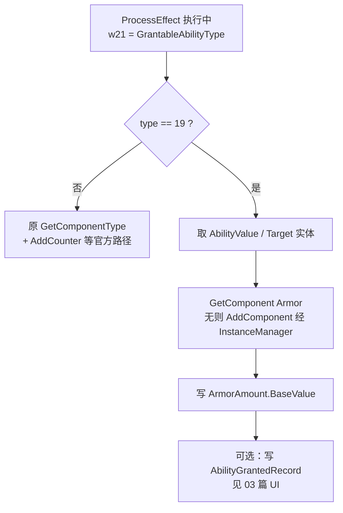

# 02. GrantAbility 赋甲：ProcessEffect 特判与组件安全挂载

本篇说明：**为什么 card_data 里写「Grant 装甲」在原版逻辑下无效**，以及 Mod Base 如何在 `GrantAbilitySystem.ProcessEffect` 中对社区扩展枚举 **`19`** 做特判，安全地挂上真实 `Armor` 组件并写入装甲数值。

---

## 一、 问题现象

社区反馈与 dump 对照后的典型现象：

```text
GrantAbilityEffectDescriptor
  GrantableAbilityType = ？装甲
  → 官方枚举没有 Armor
  → 强行塞非法值：要么无效，要么走到错误类型路径闪退
```

对局中需要的是 **ArmorSystem 识别的 `Armor` 组件**（含 `ModifiableInt ArmorAmount`），而不是再发明一套减伤逻辑。

---

## 二、 类型体系：两套完全不同的「能力」

| 类型 | 继承 | 官方 `GrantableAbilityType` | 运行时系统 |
| :--- | :--- | :---: | :--- |
| `Untrickable` / `Frenzy` 等 | `GrantableAbility`（Counters 等） | 有（0–18） | `GrantAbilitySystem` |
| **`Armor`** | 普通 `Component` + `ArmorAmount` | **无** | **`ArmorSystem`** |

官方枚举截断（摘录）：

```text
None=0 … Untrickable=17, Unhealable=18
// 没有 Armor
```

`GrantableAbilityTypeUtils` 的静态构造只把枚举键映射到 **`GrantableAbility` 子类**。  
因此不能把 Armor「塞进字典再当 GrantableAbility 用」——后续 `AddCounter` / 类型检查会失败。

### 官方 ProcessEffect 主路径（简化）

```text
GrantAbilityEffectDescriptor.ToEffect
  → GrantAbilityEffect（type、AbilityValue…）
  → GrantAbilitySystem.ProcessEffect
       type → GetComponentType(type)     // 仅认识 0–18 的 Grantable 子类
       GetOrAdd / AddCounter             // 要求 GrantableAbility
       … History / 赋能后续 …
```

### 装甲减伤路径（简化）

```text
伤害结算
  → ArmorSystem / ProcessArmoredDamage 一类逻辑
  → GetComponent<Armor>
  → CalculateArmor() → 改 Damage
```

**结论**：扩展赋甲必须在 `ProcessEffect` 里对 `type == 19` **提前分流**，落到真实 `Armor` 的 Get/Add，而不是伪造 Grantable 表项。

---

## 三、 社区约定枚举扩展

| 值 | 语义 | Base 行为（设计） | 验收状态 |
| :---: | :--- | :--- | :--- |
| **19** | Armor | Get/Add `Armor`，`ArmorAmount.BaseValue = AbilityValue`（0→1），可写 History | **真机减伤已验证** |
| 20 | SplashDamage | GetOrAdd `SplashDamage`，写 `DamageAmount`；通常无 History | **WIP，曾闪退** |
| 21 | Multishot | 标记组件 GetOrAdd | 未稳定验收 |
| 22 | AttacksInAllLanes | 标记组件 | 未稳定验收 |
| 23 | AttacksOnlyInAdjacentLanes | 标记组件 | 未稳定验收 |
| 0–18 | 官方原值 | **原样**走 `GetComponentType` + 官方逻辑 | 保持兼容 |

> [!TIP]
> 对外给卡师的稳定成品字段，目前应以 **`19` = 赋甲** 为准；20–23 仅维护者实验，未写入社区保证。

---

## 四、 静态挂点

| 项 | 值（本快照，跟版须重锚） |
| :--- | :--- |
| 函数 | `GrantAbilitySystem.ProcessEffect` |
| **Hook RVA** | **`0x21F6E24`** |
| 原指令语义 | `mov w0,w21; mov x1,xzr; bl GetComponentType` |
| 寄存器 | **`w21` = `GrantableAbilityType`**（已装入） |
| 非 19 | 恢复原 `GetComponentType` 调用并回到后续官方路径 |
| 是 19 | 执行赋甲 payload，再按设计 ret / 接 History（见 03 篇） |
| 与库存 | **同一 RX cave**：inventory payload 与 grant payload 拼接 |



构建入口（工程侧）：

```bash
python scripts/build_and_patch.py
# 赋甲实现：scripts/build_payload_grant_armor.py
```

---

## 五、 正确挂载路径：必须抄游戏，禁止手搓堆

这是本阶段**最昂贵的教训**，单独成条：

### 错误做法（会导致「能出牌但无甲」或延迟闪退）

| 错误 | 后果 |
| :--- | :--- |
| 用 `Armor..ctor` 里构造 `ModifiableInt` 的 TypeInfo 当 `typeof(Armor)` | 错误 `System.Type` → 元数据/字符串路径 **SIGSEGV** |
| 传 `Il2CppClass*` 给 `GetTypeFromHandle` | 需要的是 **`Il2CppType*`**（常为 `&klass->byval_arg`） |
| **`object_new` + 手改 `List<Component>`** | 可能「看起来挂了」但 **ArmorSystem 不认**；稍后 **`AssetGarbageCol` GC mark 崩** |

### 正确做法（对齐 `ProcessArmoredDamage` 一类官方路径）

```text
mi  = 游戏内 GetComponent<Armor> 的 MethodInfo 静态槽（经 xref 确认）
armor = Entity.GetComponent<object>(entity, mi)

if armor == null:
    // 经 MethodInfo.rgctx → GetTypeFromHandle 得到正确 System.Type
    armor = Entity.AddComponent(entity, typeof(Armor))
    // 内部走 InstanceManager.Acquire / 池化，托管对象生命周期合法

armor.ArmorAmount.BaseValue = value   // value 来自 effect.AbilityValue
```

**原则**：

1. 托管对象生命周期跟 **InstanceManager**，不跟 payload 里的 `malloc` / 手写 List。  
2. TypeInfo / MethodInfo **以「业务调用方 xref」为准**，不以 ctor 旁邻槽位猜测。  
3. Il2CppDumper 标出的部分 RVA 可能是**函数中段**，直接 `bl` 会丢参数或空跑——必须反汇编确认 prologue。

---

## 六、 card_data 用法

### 1. 运行时 Grant 装甲（本补丁）

```json
{
  "$type": "PvZCards.Engine.Components.GrantAbilityEffectDescriptor, EngineLib, ...",
  "$data": {
    "GrantableAbilityType": "19",
    "Duration": "Permanent",
    "AbilityValue": 99
  }
}
```

配合触发器示例：`PlayTrigger` + 目标 `Self` → 入场给自己赋甲。

### 2. 卡面自带装甲（无需 Grant 19）

```json
{
  "$type": "PvZCards.Engine.Components.Armor, EngineLib, ...",
  "$data": {
    "ArmorAmount": { "BaseValue": 1 }
  }
}
```

并常配合 `special_abilities` 中的 `"Armor"` 做原生展示（见 03 篇双轨 UI）。

---

## 七、 已知限制（规则层）

1. **移除**：官方 `RemoveGrantAbility` 仍按 `GrantableAbility` 处理，**不会**自动拆掉已挂上的 `Armor` 组件。  
2. **Duration**：扩展路径当前多按**永久挂组件**处理，未完整接入官方 duration 移除链。  
3. **仅本地 Base**：未打补丁的客户端不识别 19；勿用于官方联机。  
4. **跟版**：RVA、MethodInfo 槽、init flag 随 so 变化，客户端大更后需重锚。

---

## 八、 验收建议

1. 安装含赋甲补丁的 Base so / APK，冷启动不白屏。  
2. 测试卡：`GrantableAbilityType=19`，`AbilityValue` 取 1 或更高。  
3. 本地对战：对挂甲单位造成伤害，应触发装甲减免。  
4. 对照：同卡改为官方 `Untrickable=17`，仍应正常 grant。  
5. 玩 1～2 分钟，观察是否出现 **延迟** GC 闪退（比当场崩更危险）。

规则层通过后，若「有甲无图标」，继续阅读 [03. 装甲 UI 双轨](03.装甲UI双轨History发报与Sprite映射.md)。
