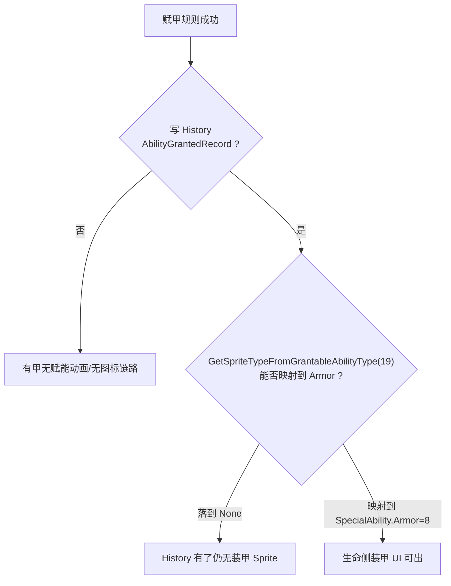

# 03. 装甲 UI 双轨：History 发报与 Sprite 映射

赋甲**数值与减伤**通了，并不等于**装甲图标**会出现。  
本篇解释游戏里至少两套「能力展示」管线，以及 Base 如何用最小补丁接上官方视图，而不是重写动画系统。

---

## 一、 先分清两层

| 层 | 对应实现 | 失败时症状 |
| :--- | :--- | :--- |
| **规则层** | `Armor` 组件 + `ArmorSystem` 减伤 | 打了没甲 / 伤害不减 |
| **展示层** | History 记录 + 视图 `HandleAbilityGranted` + 图标映射 | **有甲无图标** / 无赋能动画 |

> [!IMPORTANT]
> **减伤通了 ≠ UI 通了。**  
> 装甲原生主要走 **SpecialAbility / 生命侧图标**，不是「把 19 塞进 Grantable 表」就自动出框。

---

## 二、 游戏里的多套「能力 UI」枚举

### 1. GrantableAbilityType（可被 GrantAbility 赋予）

```text
None=0, Unhurtable=1, Deadly=2, Frenzy=3, … Untrickable=17, Unhealable=18
// 官方无 Armor；本 Base 约定 Armor=19
```

### 2. SpecialAbilityType（卡面 / 特殊能力展示，**含 Armor**）

```text
… MinHealth=7, Armor=8, Ambush=9, …
Untrickable=14, …
```

### 3. CardFrameIconType（框体具体 Sprite 槽，**含 Armor**）

```text
BasicAttack=0, BasicHealth=1, Armor=2, Deadly=3, Frenzy=4, …
```

资源侧存在 `ArmorSprite`、`FrenzySprite` 等——说明**装甲 UI 资源是一等公民**，只是入口不在 Grantable 枚举。

---

## 三、 Frenzy / Untrickable 为何「赋能看得见」

合理链路（与 dump / 反汇编一致）：

```text
GrantAbilitySystem.ProcessEffect
  → 挂上 Frenzy / Untrickable（GrantableAbility + Counters）
  → History 写入 AbilityGrantedRecord（含 GrantableAbilityType）
       ↓
AbilityGrantedRecordProcessor.ProcessRecord
  → CreateAbilityGrantedAnimation(...)
       ↓
视图 HandleAbilityGranted(GrantableAbilityType)
  → GetSpriteTypeFromGrantableAbilityType(type)
  → SpecialAbilityType
  → 生命侧 / 攻击侧 / 框体刷新
  → CardFrameIconType → 具体 Sprite
```

要点：

- UI **主触发**很大概率是 **History 发报 + 视图回调**，不是「实体上多了 Component」自动刷图标。  
- Frenzy / Untrickable 在 **Grantable 与 SpecialAbility 两侧都有对应项**（数值不必相同，中间靠映射函数）。

---

## 四、 原生装甲卡为何「开局就看得见」

card_data 中常见：

```json
"special_abilities": ["Armor", "Unique"]
```

并直接挂：

```json
"Armor": { "ArmorAmount": { "BaseValue": 1 } }
```

| 机制 | 作用 |
| :--- | :--- |
| `special_abilities` / 卡定义 | 检视、入场即把 **SpecialAbilityType.Armor** 纳入展示 |
| 生命侧图标决策 + `ArmorSprite` | 装甲多挂在**生命数字旁**，不是攻击侧 |
| `EffectTagType.Armored` 等 | 多与**减伤瞬间**特效相关，不等于常驻框图标 |

因此：

```text
原生装甲 UI ≈ 卡数据 + 生命侧 SpecialAbility
Grant 赋能 UI ≈ History + Grantable→SpecialAbility 映射
两边终点都可能落到框体 Sprite，但入口不同。
```

---

## 五、 赋甲补丁曾卡在 UI 链的哪一环

规则层成功后：

```text
type==19 → Get/Add Armor → BaseValue=AbilityValue → 减伤 ✅
```

若 payload 在赋甲后 **直接 ret**，跳过官方 `ProcessEffect` 后半段，则会：

1. **不写** `AbilityGrantedRecord` → 视图 `HandleAbilityGranted` 根本不跑（**P0-A**）。  
2. 即便补了 History，**type=19** 在 `GetSpriteTypeFromGrantableAbilityType` 中仍落到 **None**，图标仍空（**P0-B**）。



---

## 六、 Base 落地的两刀补丁（接官方链路，不发明第三套）

### P0-A：History 发报

在赋甲成功后，按与官方 `ProcessEffect` 尾部**同构**的方式写入 `AbilityGrantedRecord`：

- 字段布局对齐源/目标、能力类型等。  
- **`AbilityType` 硬编码为 19**（不能对 `Armor` 组件调用「从 Grantable 组件反推类型」——它不是 GrantableAbility）。  
- 让后续 `AbilityGrantedRecordProcessor` / 视图回调自然消费。

### P0-B：Sprite 映射表

| 项 | 值（本快照） |
| :--- | :--- |
| Hook | `CardViewIconUtils.GetSpriteTypeFromGrantableAbilityType` |
| **Hook RVA** | **`0x1EFF22C`** |
| 行为 | **`19 → SpecialAbilityType.Armor (8)`**；其余与原版一致 |
| Payload | 与库存 / 赋甲同 cave 内的 sprite-map 段 |

构建侧常见拆分：

```text
build_payload_grant_armor.py   → 赋甲 + History
build_payload_sprite_map.py    → 19→8 映射
build_and_patch.py             → 总装三 payload + v3c ELF
```

**原则**：视图已经会消费 History + 映射；Base **只接断点**，不重写整套动画 / 框体系统。

---

## 七、 验收与排查

| 检查项 | 方法 |
| :--- | :--- |
| 规则 | 本地对战伤害是否被装甲减免 |
| History / 映射 | 打出 Grant 19 测试卡后，生命侧是否出现装甲图标 |
| 对照 | 官方自带装甲单位（`special_abilities` 含 Armor）图标是否正常（排除资源本身问题） |
| 对照 | Grant `Frenzy` / `Untrickable` 是否仍有赋能表现（排除 History 整链损坏） |

> [!TIP]
> 对局图标仍建议**目视验收**固定测试卡（例如 Guid 固定 + `PlayTrigger` Self + type 19）。  
> 主界面不闪退只说明 ELF / 冷启动正常，**不能**代替对局 UI 验收。

---

## 八、 设计启示（扩其它能力时）

1. 先问：目标组件有没有**原生展示通道**？（SpecialAbility / 框体 / 仅规则无 UI）  
2. 若走 Grant 管线：缺的是 **History**、**枚举映射**，还是两者都缺？  
3. 优先补「官方已有消费者」的输入，而不是在 payload 里直接改 Sprite 指针。  
4. 标记类组件（无独立 UI）可以只做规则、明确文档写「无图标」。

下一篇汇总 [多点补丁、错误档案与扩展检查表](04.多点静态补丁错误档案与扩展检查表.md)。
