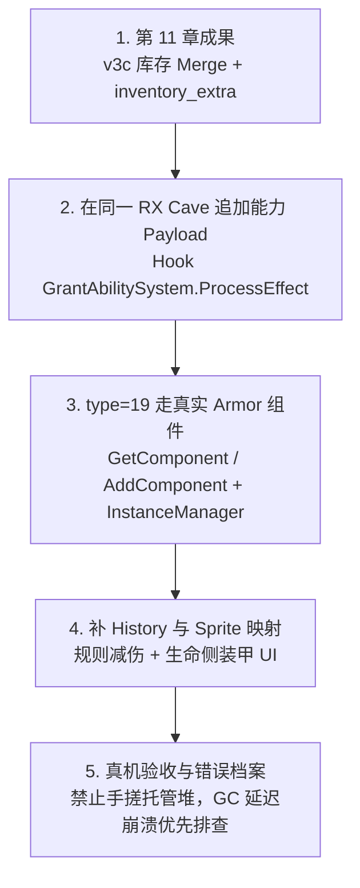

# 12. 静态高级实战 2：Mod Base 能力扩展与 Grant 赋甲

[11. 静态高级实战](../11.静态高级实战/README.md) 解决了**拥有权**问题：在 `libil2cpp.so` 上做 v3c 静态补丁，于 `SetLocalPlayerInventory` 后合并 `inventory_extra.json`，让社区自定义卡可编组、可本地对战。

本章是同一条技术主线的**第二阶段**：在库存 Merge 已稳定的 **Mod Base** 上，继续用全静态方式扩展**战斗规则能力**——让 `GrantAbilityEffectDescriptor` 能真正赋予 **装甲 (Armor)**，并接上 History / 图标展示链；同时汇总多 Hook 共洞、单卡上限破限、IL2CPP 禁区与可复用检查表。

资料基于工程 **pvzh-mod-base**（由早期 local-inventory 静态补丁样本演进）的真机验收与错误档案整理而成。阅读前建议先完成第 11 章。

---

## 目录导航

| 序号 | 专题文档 | 核心涵盖内容 |
| :---: | :--- | :--- |
| **01** | [01. 从库存 Merge 到 Mod Base 能力扩展架构](01.从库存Merge到ModBase能力扩展架构.md) | 双层受众、Base 职责边界、从 P0 库存到 P1 规则扩展的演进，以及与「只改 JSON 的卡师面」的合同。 |
| **02** | [02. GrantAbility 赋甲：ProcessEffect 特判与组件安全挂载](02.GrantAbility赋甲ProcessEffect特判与组件安全挂载.md) | 为何官方枚举无 Armor、`GrantableAbilityType=19` 社区约定、挂点 `0x21F6E24`、对齐 `InstanceManager` 的 Get/Add 路径。 |
| **03** | [03. 装甲 UI 双轨：History 发报与 Sprite 映射](03.装甲UI双轨History发报与Sprite映射.md) | 规则层 vs 展示层、Grantable / SpecialAbility 双枚举、`AbilityGrantedRecord` 与 `19→SpecialAbility.Armor(8)` 映射。 |
| **04** | [04. 多点静态补丁、错误档案与扩展检查表](04.多点静态补丁错误档案与扩展检查表.md) | 多 payload 共 RX cave、单卡 4→40、E1–E7 闪退根因、Splash 等未完成边界与新能力检查清单。 |

---

## 核心工作流概览

---

## 与第 11 章的关系

| 章节 | 解决什么 | 作者日常是否碰 so |
| :--- | :--- | :---: |
| **11. 静态高级实战** | 自定义卡**拥有权**（能编组） | 否（只改 extra JSON + card_data） |
| **12. 静态高级实战 2** | 自定义效果**规则与展示**（如入场赋甲） | 否（填 `GrantableAbilityType: "19"`）；**扩展语义由维护者打进 Base** |

---

> [!TIP]
> 🌐 **工程参考**：本章配套实现分散在工作区 `pvzh-mod-base/`（`scripts/build_and_patch.py`、`build_payload_grant_armor.py`、`build_payload_sprite_map.py` 等）。  
> 库存主线开源仓库仍见 [Show-o4210/pvzh-local-inventory-mod](https://github.com/Show-o4210/pvzh-local-inventory-mod)。  
> 所有 RVA / TypeInfo 槽位与具体游戏 so 版本绑定，跟版后必须重 dump 再锚。
