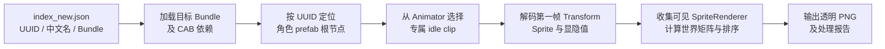

# 13. 贴图资源拼接

PVZH 的战场角色通常不是一张完整立绘，而是由多个 `SpriteRenderer`、`Sprite` 与 `Texture2D` 按节点层级组合而成。本章介绍如何从 Unity AssetBundle 中读取这些部件，按照角色 **idle 动画第一帧** 还原为一张透明 PNG。

与其他章节不同，本章同时附带可直接阅读和运行的 Python 示例脚本：一个用于理解静态拼接的最小流程，另一个用于按索引批量输出角色图片。

---

## 目录导航

| 序号 | 专题文档 | 核心涵盖内容 |
| :---: | :--- | :--- |
| **01** | [01. 从 Unity 部件到完整角色](01.从Unity部件到完整角色.md) | `Texture2D`、`Sprite`、`SpriteRenderer`、Transform 与动画首帧在拼接中的职责。 |
| **02** | [02. 批量拼接脚本使用指南](02.批量拼接脚本使用指南.md) | 环境准备、索引与 CAB 映射、命令行参数、输出目录和处理报告。 |
| **03** | [03. 显隐规则与异常排查](03.显隐规则与异常排查.md) | idle 选择、跨包依赖、节点显隐、图层排序、超大画布和特殊失败项。 |

## 附带脚本

| 文件 | 用途 |
| :--- | :--- |
| [examples/rebuild_sprite.py](examples/rebuild_sprite.py) | 最小单包示例，适合对照代码理解 Transform、pivot、PPU 和透明合成。 |
| [examples/batch_rebuild_sprites.py](examples/batch_rebuild_sprites.py) | 完整批处理示例，支持 idle 第一帧、动画显隐、跨 CAB 依赖、并发输出和 JSON 报告。 |

> [!NOTE]
> 示例依赖游戏导出的 AssetBundle 与索引数据；仓库不附带完整游戏资源。脚本默认读取当前目录的 `index_new.json`、`cab_index.json` 与 `autotagged/`，也可以通过命令行参数改为其他路径。

---

## 核心流程

关键结论是：**不能把包内所有贴图直接叠加，也不能只采用 prefab 保存时的状态。** prefab 可能同时保留攻击、受伤、成长和特效层；稳定的角色预览应以 Animator 对应的 idle 第一帧为目标姿态，同时让动画未覆盖的属性继续使用 prefab 默认值。

## 实测结果

研究样本中共有 578 条有效索引，完整脚本成功输出 572 张透明 PNG。剩余 6 项分别属于缺少 idle、UUID 根节点不匹配、异常坐标或首帧无本地可见图层。该结果说明流程适合常规单位和大多数魔法/环境资源，但特殊资源仍需结合 `处理报告.json` 单独检查。

