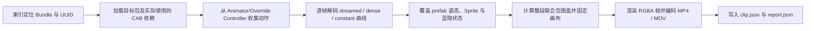

# 14. 动画资源提取

第 13 章解决了“如何把角色部件拼成 idle 首帧”，本章继续把同一套 prefab、动画绑定和 Sprite 渲染流程扩展到**整段 2D 动画**。目标是在不启动游戏和 Unity 编辑器的情况下，从 AssetBundle 离线还原 Animator 实际使用的动作，并输出便于预览的 MP4 或按需制作的透明 MOV。

本章附带可运行的 Python 脚本。默认批处理只生成带自动抠图底色的 H.264 MP4；透明 MOV 体积和耗时较高，仅建议对少量动作按需导出。

---

## 目录导航

| 序号 | 专题文档 | 核心涵盖内容 |
| :---: | :--- | :--- |
| **01** | [01. 从 idle 首帧到完整动画](01.从idle首帧到完整动画.md) | 曲线存储、绑定顺序、逐帧求值、固定画布与跨包对象身份。 |
| **02** | [02. 动画提取脚本使用指南](02.动画提取脚本使用指南.md) | FFmpeg 与 Python 环境、单卡/全库命令、参数、输出结构及断点续跑。 |
| **03** | [03. 渲染质量与异常排查](03.渲染质量与异常排查.md) | 白边、锯齿、巨型画布、Sprite 错位、空帧、透明格式和报告诊断。 |

## 附带脚本

| 文件 | 用途 |
| :--- | :--- |
| [examples/extract_animation_mov.py](examples/extract_animation_mov.py) | 单个 Bundle/卡牌的动作解码与渲染器，默认输出 MP4，可选透明 MOV。 |
| [examples/batch_extract_animations.py](examples/batch_extract_animations.py) | 按 `index_new.json` 批量调度单卡提取器，支持并发、报告和断点续跑。 |
| [examples/batch_rebuild_sprites.py](examples/batch_rebuild_sprites.py) | 两个动画脚本复用的 prefab、Sprite、Transform 与依赖加载模块。 |

> [!IMPORTANT]
> 三个脚本应放在同一目录运行；动画提取器会导入 `batch_rebuild_sprites.py`。脚本还依赖用户自行导出的 AssetBundle、`index_new.json`、`cab_index.json` 与 `autotagged/`，仓库不附带完整游戏资源。

## 核心流程

关键结论是：**动画视频不是连续导出若干张紧裁后的静态拼图。** 每一帧都必须保留 prefab 默认值并应用动画覆盖，同时整段动作共用同一个世界包围盒；否则会出现部件串位、状态层叠加或画面逐帧抖动。

