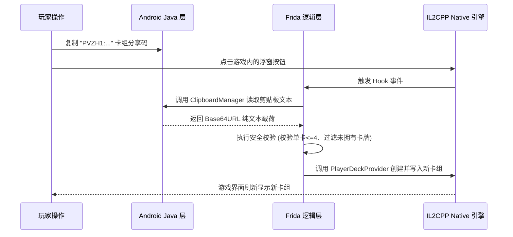

# 03. Native 与 Java 双轨 Hook 基础范式

在 Android 平台上运行的 Unity 游戏具有鲜明的**双层运行架构**：
- **外层（Android Java 层）**：负责承载 App 进程、处理 Activity 生命周期、剪贴板交互、权限申请以及系统级浮窗；
- **内层（Native C++ / IL2CPP 层）**：通过 `libil2cpp.so` 运行所有核心游戏逻辑、对局状态、卡牌数值与渲染管线。

在开发一款功能完善的 Mod 时，我们往往需要让这两层协同工作（例如：通过 Java 层读取玩家剪贴板中的卡组分享码，再传递给 Native 层创建新卡组）。

本篇详细拆解基于 Frida 的 **Native 层拦截（`Interceptor.attach`）** 与 **Java 层拦截（`Java.perform`）** 的标准代码范式。

---

## 一、 Native 层的拦截范式：`Interceptor.attach`

在计算出目标函数在内存中的绝对地址后，使用 Frida 提供的 `Interceptor.attach` API 对其执行动态挂钩。

### 1. IL2CPP 的参数传递法则（ARM64 规范）
在 ARM64 架构下，函数入参通过寄存器传递。对于 IL2CPP 编译出来的 C# 实例方法（Instance Method），参数排列遵循如下固定铁律：

```text
args[0] ──► 对象的隐式 this 指针 (指向当前类的实例在内存中的堆地址)
args[1] ──► 逻辑上的第 1 个形参
args[2] ──► 逻辑上的第 2 个形参
...
```

> [!NOTE]
> 如果该方法在 C# 中声明为静态方法（`static`），则没有 `this` 指针，`args[0]` 即为逻辑上的第 1 个形参。

### 2. 标准 Native Hook 模板

以监听卡牌对战界面或卡组编辑方法为例：

```javascript
// native_hook_example.js

function hookNativeMethod(targetAddress, methodName) {
    Interceptor.attach(targetAddress, {
        onEnter: function (args) {
            this.startTime = Date.now();
            console.log(`\n==== [Hook 进入] ${methodName} ====`);
            
            // 打印 this 指针与前两个入参指针
            const thisPtr = args[0];
            const param1 = args[1];
            console.log(`  -> this 指针: ${thisPtr}`);
            console.log(`  -> 参数 1:    ${param1}`);

            // 如果参数 1 是 IL2CPP 的 C# 字符串 (Il2CppString)
            if (!param1.isNull()) {
                const strValue = readIl2CppString(param1);
                console.log(`  -> 参数 1 字符串解析值: "${strValue}"`);
            }
        },
        onLeave: function (retval) {
            const costMs = Date.now() - this.startTime;
            console.log(`==== [Hook 退出] ${methodName} | 耗时: ${costMs}ms | 返回值: ${retval} ====\n`);
        }
    });
}
```

---

## 二、 关键工具函数：解析内存中的 C# 字符串（Il2CppString）

在 IL2CPP 中，C# 的 `System.String` 在内存中并不是 C 语言风格以 `\0` 结尾的 ASCII 字符数组，而是一个包含头部元数据的结构体：

```text
[Il2CppString 内存布局]
+0x00: Il2CppObject 头指针 (8 字节)
+0x08: 字符数组边界
+0x10: 字符串长度 (int32, 4 字节)
+0x14: UTF-16LE 编码的真实字符序列...
```

如果直接按 UTF-8 读取会导致指针越界或乱码。必须使用如下专用的读取函数：

```javascript
// il2cpp_string_helper.js

function readIl2CppString(il2cppStringPtr) {
    if (il2cppStringPtr.isNull()) return null;
    
    try {
        // 读取 0x10 偏移处的字符长度
        const length = il2cppStringPtr.add(0x10).readInt();
        if (length < 0 || length > 4096) return "[Invalid String Length]";
        
        // 读取 0x14 偏移处的 UTF-16 宽字符序列
        return il2cppStringPtr.add(0x14).readUtf16String(length);
    } catch (e) {
        return `[Error reading string: ${e.message}]`;
    }
}
```

---

## 三、 Java 层的拦截范式：`Java.perform`

当我们需要与 Android 原生系统的剪贴板交互、弹出原生 Toast 提示，或者捕获游戏 Activity 的生命周期时，必须切入 Java 虚拟机上下文。

### 1. 挂钩 Android 剪贴板服务读取分享码
以下是一段优雅读取系统剪贴板的实战脚本：

```javascript
// clipboard_reader.js

function getAndroidClipboardText() {
    return new Promise((resolve, reject) => {
        Java.perform(() => {
            try {
                // 1. 获取当前运行的 UnityPlayerActivity 实例
                const ActivityThread = Java.use("android.app.ActivityThread");
                const currentApplication = ActivityThread.currentApplication();
                const context = currentApplication.getApplicationContext();

                // 2. 获取系统剪贴板服务 (ClipboardManager)
                const Context = Java.use("android.content.Context");
                const clipboardManager = Java.cast(
                    context.getSystemService(Context.CLIPBOARD_SERVICE.value),
                    Java.use("android.content.ClipboardManager")
                );

                // 3. 提取剪贴板文本
                if (clipboardManager.hasPrimaryClip()) {
                    const clipData = clipboardManager.getPrimaryClip();
                    if (clipData.getItemCount() > 0) {
                        const item = clipData.getItemAt(0);
                        const text = item.getText();
                        if (text) {
                            resolve(text.toString());
                            return;
                        }
                    }
                }
                resolve("");
            } catch (err) {
                console.error("读取剪贴板异常:", err);
                reject(err);
            }
        });
    });
}
```

---

## 四、 双轨联动模型：从 Java 输入到 Native 响应

完整的良性 Mod（如卡组导入功能）正是通过打通双轨链路实现的：



通过将 Java 层的系统级交互能力与 Native 层的核心游戏业务逻辑结合，我们无需对 APK 进行极其危险且容易崩溃的底层汇编硬写，即可优雅、稳定地实现玩家体验的极大改善。
