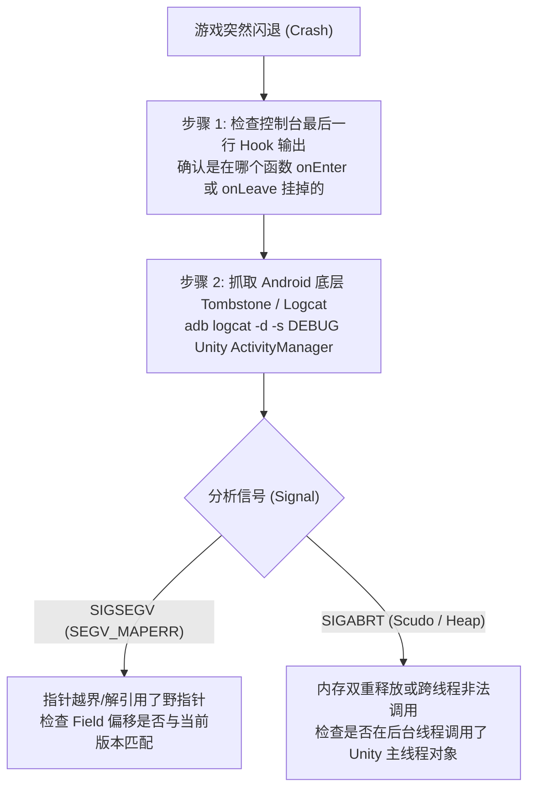

# 04. 内存探索诊断与实时日志排查

动态插桩虽然极度灵活，但也伴随着较高的调试风险：由于注入的代码直接运行在游戏的内存空间内部，一次错误的空指针解引用（Null Pointer Dereference）、或在每秒执行 60 次的渲染循环（如 `Update()`）中狂刷控制台日志，都可能瞬间导致游戏卡死或被 Android 系统的看门狗机制强制杀进程。

本篇讲解在实战中如何进行**防御性内存探索**、如何构建健壮的 **Frida RPC 交互诊断接口**，以及排查复杂运行时崩溃的实战策略。

---

## 一、 防御性编程：避免调试引发游戏崩溃

在 Native 层 Hook 时，绝不能假设所有的入参指针都是绝对有效的对象。必须遵守以下三条铁律：

### 1. 指针判空与有效性校验
在读取任何结构体偏移之前，必须首先检查指针是否为零地址：

```javascript
// safe_pointer_read.js

function safeReadIntField(objectPtr, offset) {
    // 1. 基础空指针判定
    if (!objectPtr || objectPtr.isNull()) {
        return null;
    }

    try {
        const fieldAddress = objectPtr.add(offset);
        
        // 2. 验证该内存地址是否处于有效的可读内存页内
        const memoryRange = Process.findRangeByAddress(fieldAddress);
        if (!memoryRange || !memoryRange.protection.includes("r")) {
            console.warn(`[SafeCheck] 地址 ${fieldAddress} 处于不可读内存段，跳过解引用`);
            return null;
        }

        return fieldAddress.readInt();
    } catch (e) {
        console.error(`[SafeCheck] 读取异常: ${e.message}`);
        return null;
    }
}
```

### 2. 避免高频函数（Per-Frame Methods）日志风暴
严禁在每一帧都会被调用的函数（如 `Update`、`FixedUpdate`、`OnGUI`）中无条件打印日志。过载的 I/O 阻塞会直接导致游戏帧率暴跌至个位数并触发超时崩溃：

```javascript
// 节流器示例：限制高频函数每秒最多输出一次
let lastLogTime = 0;

Interceptor.attach(pHighFrequencyFunction, {
    onEnter: function (args) {
        const now = Date.now();
        if (now - lastLogTime > 1000) {
            lastLogTime = now;
            console.log(`[Throttled Log] 当前状态正常采样...`);
        }
    }
});
```

---

## 二、 构建双向通信：Frida RPC 导出接口

通常我们希望在需要的时候（例如进入对战界面后），从 PC 终端主动向手机发送指令查询当前内存状态，而不是让脚本被动地满屏幕输出。

Frida 的 **`rpc.exports`** 机制允许我们将手机内的 JavaScript 函数封装为可以直接由 PC 调用的远程过程调用：

### 1. 手机端 Frida 脚本声明导出接口
```javascript
// agent_rpc.js

rpc.exports = {
    // 导出方法：查询当前内存模块加载状态
    getModuleInfo: function (moduleName) {
        const mod = Process.findModuleByName(moduleName);
        if (!mod) {
            return { found: false };
        }
        return {
            found: true,
            name: mod.name,
            base: mod.base.toString(),
            size: mod.size
        };
    },

    // 导出方法：主动读取指定类对象的内存标记
    inspectObject: function (ptrHex, offset) {
        const target = ptr(ptrHex);
        const value = safeReadIntField(target, offset);
        return { address: ptrHex, offset: offset, value: value };
    }
};
```

### 2. PC 端 Python 控制脚本发起调用
在电脑端编写一个简单的 Python 脚本，即可实现与游戏内存的交互式诊断：

```python
# controller.py
import frida

# 连接 USB 设备上的 PVZH 进程
session = frida.get_usb_device().attach("com.ea.gp.pvzheroes")

with open("agent_rpc.js", "r", encoding="utf-8") as f:
    script = session.create_script(f.read())

script.load()

# 直接像调用本地函数一样调用手机内的 RPC 接口
info = script.exports.get_module_info("libil2cpp.so")
print("Module Info from device:", info)

session.detach()
```

---

## 三、 实战排查：诊断异常崩溃的核心步骤

如果在动态调试过程中游戏突然退出，请不要慌张，按照以下标准排查流回溯：



### 关键检查命令：
```bash
# 抓取崩溃瞬间的详细原生调用栈
adb logcat -d -s DEBUG:V > crash_dump.txt
```

在 `crash_dump.txt` 中搜索 `backtrace:`，你可以清晰地看到导致崩溃的 PC 指针位于哪一个 SO 模块，从而精准修正错误的指针偏移。

---

## 四、 本章总结

通过本章的学习，我们掌握了：
1. **环境自洽**：真机下 Frida 的标准部署与架构排坑；
2. **符号映射**：利用 `dump.cs` 的 RVA 与基地址动态换算绝对指针；
3. **双轨驱动**：Native 与 Java 层的互通拦截与 C# 字符串解析；
4. **防御探索**：利用安全解引用与 RPC 机制进行稳健的内存诊断。

在下一章中，我们将进入更加激动人心的领域 —— **如何脱离 PC 和 Root 权限的束缚，通过把 Frida Gadget 编译封装进 APK，制作出普通玩家即装即用的免 Root Mod 安装包！**
