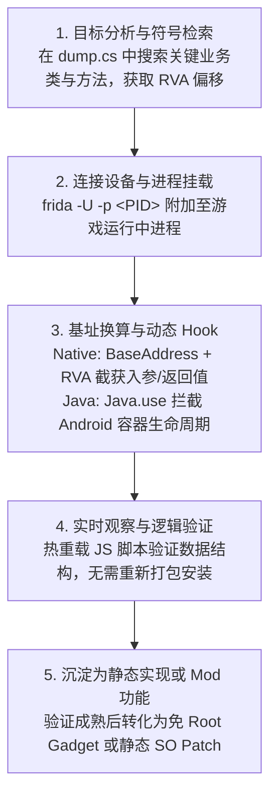

# 15. 动态运行时初探：Frida 动态插桩与内存探索

在第 11、12 章节中，我们学习了通过静态修改 `libil2cpp.so` 汇编指令来注入自定义卡牌与能力扩展。这种静态 Patch 方案在稳定发布期非常优雅，但在**探索游戏全新机制、定位未知崩溃原因或观察对象内部数据流**的研发阶段，每次修改都需要重新反编译、打补丁并重装 APK，调试迭代周期十分漫长。

为了在开发阶段能够**“免重装、秒级热重载、实时观察内存状态”**，动态插桩调试工具 **Frida** 成为了 Mod 开发者必不可少的瑞士军刀。

本章节将带领大家从零搭建真机动态调试环境，深入剖析 IL2CPP 运行时的符号映射机制，掌握 Native 与 Java 双轨 Hook 的标准范式，并学会如何优雅、安全地观察游戏运行时的内部状态。

---

## 目录导航

| 序号 | 专题文档 | 核心涵盖内容 |
| :---: | :--- | :--- |
| **01** | [01. 动态分析与 Frida 环境搭建避坑](01.动态分析与Frida环境搭建避坑.md) | 详解真机调试环境准备、ADB 连接规范、Frida 版本对齐、ABI 架构判定及常见连接报错排查。 |
| **02** | [02. IL2CPP 符号表 dump 与内存查表实战](02.IL2CPP符号表dump与内存查表实战.md) | 详解如何使用 `dump.cs` 定位类与函数、RVA 相对虚拟地址换算、`Module.findBaseAddress` 内存基址计算法则。 |
| **03** | [03. Native 与 Java 双轨 Hook 基础范式](03.Native与Java双轨Hook基础范式.md) | 详解针对 C/C++ 导出函数的 `Interceptor.attach`、针对 Android 原生界面的 `Java.perform` 以及安全参数提取。 |
| **04** | [04. 内存探索诊断与实时日志排查](04.内存探索诊断与实时日志排查.md) | 详解 Frida RPC 导出通信、动态状态监控面板、内存指针有效性验证与避免对局崩溃的安全调试守则。 |

---

## 核心工作流概览

---

> [!NOTE]
> 📖 **与静态章节的关系**：
> - 第 11 章曾提到：在 PC 模拟器（x86_64）的 Houdini 转译环境下，动态枚举 ARM64 SO 存在局限；
> - 因此，**本章的所有动态调试实操均推荐基于 ARM64 真机设备（如测试手机、开发板）展开**，真机原生运行环境不受转译层遮蔽，能完整暴露所有 IL2CPP 符号与模块基址。

> [!IMPORTANT]
> 🛡️ **技术研究与合规守则**：
> 本章所介绍的动态插桩技术仅用于**本地单机机制研究、自制 Mod 调试及良性功能探索**。请严格遵守游戏服务协议，严禁将动态插桩技术用于拦截网络认证凭据、伪造云端请求或破坏多人对战公平。
