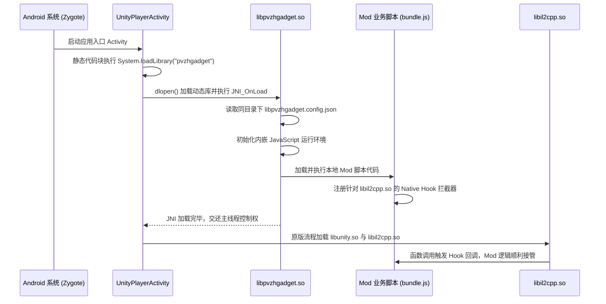

# 01. 从 Frida-Server 到 Gadget 免 Root 架构跃迁

在进入实际代码打包之前，我们必须首先在架构层面理解：**为什么 `frida-server` 无法用于大众玩家分发，而 `Frida Gadget` 能够实现零 Root 的独立运行？**

本篇对比两种插桩形态的核心区别，深入剖析 Frida Gadget 的四种运行模式，并阐述在 Mod 生产中为何应当坚定选择**脱机脚本模式（Script Mode）**。

---

## 一、 两种插桩形态的本质对比

很多初学者容易混淆 `frida-server` 与 `frida-gadget`。它们的根本区别在于**代码注入的宿主位置与特权需求**：

```text
【模式 A：frida-server 外部守护进程 (需 Root)】
┌────────────────────────┐      ptrace / 跨进程注入      ┌────────────────────────┐
│  frida-server (root)   │ ────────────────────────────► │   PVZH 游戏进程 (app)  │
│  (系统后台独立常驻)    │ (Android 安全机制默认严格拦截)│   com.ea.gp.pvzheroes  │
└────────────────────────┘                               └────────────────────────┘

【模式 B：frida-gadget 内部嵌入库 (免 Root)】
┌─────────────────────────────────────────────────────────────────────────────────┐
│ PVZH 游戏进程 (app 独立沙箱, 无需任何额外系统权限)                             │
│                                                                                 │
│   UnityPlayerActivity (Java)                                                    │
│         │ System.loadLibrary("pvzhgadget")                                      │
│         ▼                                                                       │
│   libpvzhgadget.so (原生动态库) ──► 自动加载运行 ──► mod_bundle.js (Mod 核心业务) │
│         │ (同一进程内部, 拥有合法访问权)                                        │
│         ▼                                                                       │
│   libil2cpp.so / libunity.so (游戏引擎与业务内存)                              │
└─────────────────────────────────────────────────────────────────────────────────┘
```

| 维度 | frida-server 交互模式 | Frida Gadget 嵌入模式 |
| :--- | :--- | :--- |
| **设备特权** | **必须 Root**（因 Linux ptrace 跨进程注入受 SELinux 严格封锁） | **完全无需 Root**（运行于游戏应用自身的沙箱内） |
| **外部依赖** | 必须依赖电脑 USB 连线并常驻运行 Python/终端 | **零外部依赖**（手机离线单机即可自启动运行） |
| **触发时机** | 游戏启动后，人工在命令行手动附加（容易错过启动初始化） | 游戏进程启动第一秒，由操作系统类加载器自动拉起 |
| **玩家门槛** | 极高（仅面向开发者与安全研究员） | **零门槛**（普通玩家下载 APK 安装即玩） |

---

## 二、 剖析 Frida Gadget 的四种交互模式

当 Gadget 被游戏主程序加载时，它的行为由一个**与 SO 库同名的 JSON 配置文件**决定（例如 `libpvzhgadget.so` 对应 `libpvzhgadget.config.json`）。

Gadget 官方定义了四种交互类型（`interaction`）：

### 1. `listen`（监听模式）
- **行为**：加载后，Gadget 会在手机上开启一个本地端口（默认 `27042`），并挂起主线程，等待电脑端的 Frida 命令行连上来再继续执行；
- **用途**：适合在没有 Root 的真机上调试原生 APK。但对于普通玩家，游戏会无限卡在黑屏等待电脑连接，因此**绝不能用于发布**。

### 2. `connect`（反向连接模式）
- **行为**：加载后主动向指定的远程 IP/端口建立 TCP Socket 反向连接；
- **用途**：自动化云测试场批量调试。

### 3. `script`（脱机脚本独立运行模式 —— ⭐ Mod 交付唯一首选）
- **行为**：加载后**完全不开启任何网络端口、不等待外部连线**，直接在本地文件系统查找指定的 JavaScript 脚本并立刻执行；
- **用途**：这是制作独立离线 Mod 的**绝对标准**。对玩家完全透明，游戏秒开无感。

### 4. `embed`（深度嵌入模式）
- **行为**：供 C/C++ 开发者在编写自定义宿主应用时，通过 C API 直接调用 Gadget 内部引擎。

---

## 三、 脱机 Script 模式的执行全生命周期

在采用 `script` 模式时，Gadget 从被加载到脚本生效的微观时序如下：



---

## 四、 核心架构优势与总结

1. **同 UID 权限自洽**：
   - 因为 Gadget 运行在游戏内部，它与游戏共享同一个 Linux UID；
   - 这意味着它可以直接读取游戏自身的私有数据目录（`files/`、`shared_prefs/`），而不需要向系统申请多余的存储权限。
2. **确定性初始化**：
   - 相比于通过 PC 命令行手动 `frida -U -f` 容易产生时序竞态，Gadget 是在 Java 层通过代码明确加载的，加载时机百分之百确定。

理解了 Gadget 的独立运行逻辑后，下一篇我们将学习如何使用 `frida-compile` 将零散的现代 JavaScript 代码打造成一份高效的单体发布载荷，并写好同名配置文件。
