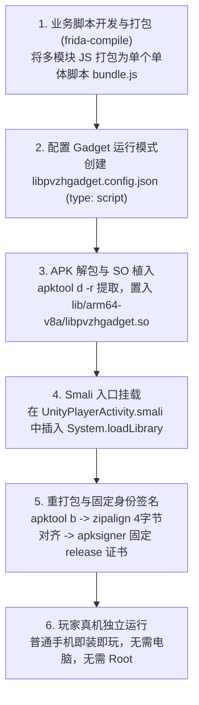

# 16. 免 Root 移动端落地：Frida Gadget 嵌入与 APK 重打包

在第 15 章中，我们掌握了基于 PC 终端和 Root 手机运行 `frida-server` 进行动态调试的方法。这种交互式调试在研发探索阶段极度高效，但当我们希望将自制的良性 Mod 功能（如本地卡组分享、界面便利性增强）交付给**普通玩家**体验时，便遇到了巨大的现实障碍：

> 绝大多数普通玩家的手机既没有 Root 权限，也没有安装配置 Python/Frida 环境的电脑。

为了让编写好的动态 JS 脚本能够在**任意未 Root 的普通 Android 手机上独立自启动运行**，Frida 官方提供了原生的嵌入式共享库方案 —— **Frida Gadget**。

本章节将完整拆解如何将动态脚本、Gadget 原生库打包并融入官方原版 APK，掌握 Smali 启动入口劫持、APK 重打包流程，以及建立一套能够支持**无缝覆盖安装、不丢玩家存档的长期固定签名规范**。

---

## 目录导航

| 序号 | 专题文档 | 核心涵盖内容 |
| :---: | :--- | :--- |
| **01** | [01. 从 Frida-Server 到 Gadget 免 Root 架构跃迁](01.从Frida-Server到Gadget免Root架构跃迁.md) | 详解注入模式对比、Frida Gadget 的四种交互模式（Listen/Connect/Script/Embed）及脱机独立运行原理。 |
| **02** | [02. Gadget 与自研脚本编译构建流](02.Gadget与自研脚本编译构建流.md) | 详解使用 `frida-compile` 打包复杂多模块 JS、同名 JSON 配置文件编写技巧与脱机 Script 模式配置。 |
| **03** | [03. APK 解包注入与 Unity 入口劫持实战](03.APK解包注入与Unity入口劫持实战.md) | 详解 `apktool` 参数避坑、SO 目录精准放置、修改 `UnityPlayerActivity.smali` 注入 `System.loadLibrary`。 |
| **04** | [04. 签名持久化与无缝覆盖安装规范](04.签名持久化与无缝覆盖安装规范.md) | 详解 Android 签名机制冲突（为何默认 debug 签名会导致覆盖失败）、4096 位固定 PKCS12 密钥库生成、Zipalign 内存对齐与 `apksigner` 校验。 |

---

## 核心工作流概览

---

> [!NOTE]
> 💡 **架构定位**：
> Frida Gadget 本质上是一个遵循 Android JNI 标准的原生动态链接库（`.so`）。一旦它被进程的主线程通过 `System.loadLibrary` 加载，它便在进程内部启动了一个内嵌的 QuickJS / V8 引擎，并在本进程内自动执行你的 Mod 脚本。

> [!IMPORTANT]
> 🛡️ **安全与资产边界守则**：
> 1. 本章介绍的重打包技术仅用于帮助开发者在**个人离线设备上测试与验证自制 Mod 功能**；
> 2. 严禁向公开网络或开源平台直接分发包含商业游戏原始资产、代码或侵犯版权的重打包 APK 安装包；
> 3. 开源分享时，推荐仅发布你的 JS/Smali 补丁源码与自动化构建脚本，引导玩家自行在本地对正版游戏进行合法注入。
