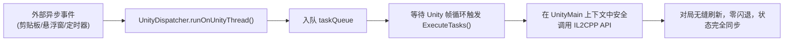

# 17. Unity 引擎动态交互：主线程安全调度实战

在掌握了 Frida Hook 基础与免 Root 打包之后，很多 Mod 开发者迫不及待地想要在拦截到事件时立即调用游戏代码（例如：当玩家点击 Android 悬浮窗的“导入”按钮时，立刻在后台调用 `PlayerDeckProviderImpl.CreateNewCustomDeck`）。

然而，紧接着迎接开发者的往往是一次**毫无征兆的瞬间闪退（Crash）**。查看 Logcat 日志，通常会看到如下著名的报错：

```text
UnityEngine.UnityException: get_transform can only be called from the main thread.
Constructors and field initializers will be executed from the loading thread when loading a scene.
```
或者底层报 `SIGSEGV / SIGABRT` 内存崩溃。

本篇将深入剖析 Unity 引擎在多线程架构下的“主线程铁律”，揭秘其背后的调度核心 **`UnitySynchronizationContext`**，并提供一套工业级、零崩溃的**主线程任务安全调度（Thread Dispatcher）标准实现**。

---

## 一、 为什么跨线程直接调用 Unity 会闪退？

### 1. Unity 引擎的单线程模型（Single-Threaded Model）
Unity 引擎的核心设计是**单线程架构**。所有涉及 `UnityEngine.Object` 的操作（如创建物体、修改组件、访问变换矩阵、操作 UI 控件、写入玩家持久化状态），都只能在唯一的一个主线程——**`UnityMain` 线程**上执行。

```text
【错误做法：在外部线程直接调用 Unity API】
┌────────────────────────────────┐
│ Android UI 线程 / 异步回调线程 │ ──直接调用──► PlayerDeckProviderImpl.CreateNewCustomDeck()
│ (Thread ID: 28012)             │                     ❌ 瞬间触发 Unity 跨线程安全检查并闪退!
└────────────────────────────────┘

【正确做法：将任务投递至主线程队列】
┌────────────────────────────────┐
│ Android UI 线程 / 异步回调线程 │
│ (Thread ID: 28012)             │
└──────────────┬─────────────────┘
               │ 投递任务包 (Task Queue)
               ▼
┌────────────────────────────────┐
│ UnityMain 主渲染线程           │ ──逐帧安全执行──► PlayerDeckProviderImpl.CreateNewCustomDeck()
│ (Thread ID: 26560)             │                     ✅ 主线程环境，安全读写游戏状态与对象
└────────────────────────────────┘
```

### 2. 外部调用的线程漂移
当我们在 Frida 中接收到 Java 层的点击事件，或者处于 RPC 回调、异步 Promise 中时，当前代码执行的上下文是 **Android 主线程（UI 线程）** 或 **Frida 的内部 Worker 线程**，**绝对不是 `UnityMain` 线程**。

如果此时直接调用 IL2CPP 的 Native 函数指针，由于未处于 Unity 的帧生命周期内，游戏内部的安全断言会立刻触发异常或导致堆栈破坏。

---

## 二、 破局核心：`UnitySynchronizationContext`

Unity 官方为了让 C# 的异步任务（`async/await`、`Task`、协程）能够回到主线程，在内部实现了一个类：**`UnityEngine.UnitySynchronizationContext`**。

在 `dump.cs` 中搜索该类，可以看到一个关键方法：

```csharp
// Namespace: UnityEngine
public sealed class UnitySynchronizationContext : SynchronizationContext // TypeDefIndex: 1234
{
    // RVA: 0x0352E2D4 Offset: 0x0352E2D4 VA: 0x0352E2D4
    public void ExecuteTasks() { }

    // RVA: 0x0352DF80 Offset: 0x0352DF80 VA: 0x0352DF80
    public override void Post(SendOrPostCallback d, object state) { }
}
```

### 运行机制：
`UnityMain` 线程在每一帧的生命周期循环中，都会调用一次 **`ExecuteTasks()`**。
这个方法会清空并执行当前任务队列中的所有等待任务。也就是说，**只要我们能搭上 `ExecuteTasks()` 这趟每一帧都会准时出发的“班车”，我们的代码就自然而然地运行在 `UnityMain` 主线程之中！**

---

## 三、 实战：构建通用的主线程任务调度器（Task Dispatcher）

基于上述原理，我们可以在 Frida 中挂载 `ExecuteTasks` 的 Hook 拦截点，构建一个线程安全的异步任务队列调度器：

```javascript
// unity_dispatcher.js

const UnityDispatcher = (function () {
    // 任务队列
    const taskQueue = [];
    let isHooked = false;

    // 1. 初始化挂钩 UnitySynchronizationContext.ExecuteTasks
    function init(executeTasksRvaHex) {
        if (isHooked) return;

        const il2cppBase = Module.findBaseAddress("libil2cpp.so");
        if (!il2cppBase) {
            console.error("[UnityDispatcher] 无法找到 libil2cpp.so");
            return;
        }

        const pExecuteTasks = il2cppBase.add(ptr(executeTasksRvaHex));

        Interceptor.attach(pExecuteTasks, {
            onEnter: function (args) {
                // 当前正处于 UnityMain 渲染主线程中！
                while (taskQueue.length > 0) {
                    const task = taskQueue.shift();
                    try {
                        task.action();
                        if (task.resolve) task.resolve();
                    } catch (err) {
                        console.error("[UnityDispatcher] 任务执行异常:", err);
                        if (task.reject) task.reject(err);
                    }
                }
            }
        });

        isHooked = true;
        console.log(`[UnityDispatcher] 主线程安全调度器初始化成功！(Hook 地址: ${pExecuteTasks})`);
    }

    // 2. 外部调用的投递接口 (返回 Promise 支持 async/await)
    function runOnUnityThread(action) {
        return new Promise((resolve, reject) => {
            taskQueue.push({ action, resolve, reject });
        });
    }

    return {
        init: init,
        runOnUnityThread: runOnUnityThread
    };
})();
```

---

## 四、 实战对比：使用调度器前后对比

### ❌ 错误做法（导致游戏瞬崩）：
```javascript
// 在 Android 悬浮窗按钮点击事件中直接调用 Native 方法
function onImportButtonClicked() {
    console.log("用户点击了导入按钮");
    // 直接在当前 Android UI 线程执行 IL2CPP 原生方法
    pCreateNewCustomDeck(pProviderInstance, pArgHeroId); // 💥 瞬间闪退！
}
```

### ✅ 正确做法（优雅、无感、稳定）：
```javascript
// 通过 UnityDispatcher 投递到下一帧执行
async function onImportButtonClicked() {
    console.log("用户点击了导入按钮，投递至 Unity 主线程...");

    await UnityDispatcher.runOnUnityThread(() => {
        // 此时代码完全运行在 UnityMain 线程内，与游戏原版逻辑处于同一渲染上下文
        const newDeck = pCreateNewCustomDeck(pProviderInstance, pArgHeroId);
        console.log(`新卡组创建成功，返回对象指针: ${newDeck}`);
        
        // 标记脏数据并通知游戏原版 UI 刷新
        pMarkDeckAsModified(pProviderInstance, newDeck);
        pPersistChanges(pProviderInstance);
    });

    console.log("主线程任务执行完毕，原版 UI 已刷新！");
}
```

---

## 五、 本章交付物总结

通过本章，我们攻克了动态 Mod 开发中最隐蔽、最致命的稳定性大敌：



掌握了主线程调度的能力后，下一章我们将正式进入界面层 —— **如何在 Unity 全屏游戏界面之上，无阻碍地叠加 Android 现代原生浮窗 UI，并排查触控与输入法焦点的经典死锁 Bug！**
