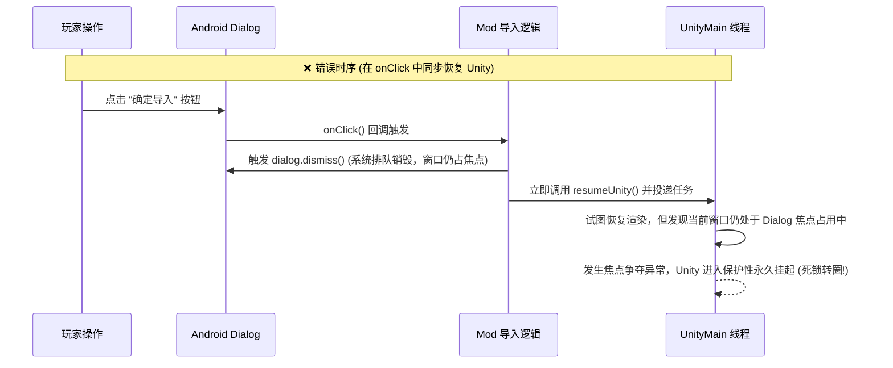
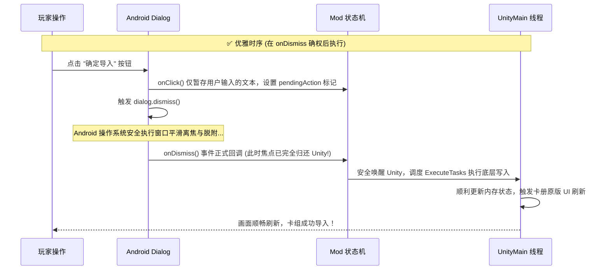

# 02. 模态对话框与 Unity 渲染挂起防死锁

在开发需要复杂输入的二级交互界面（例如让玩家输入卡组分享码的对话框 `Dialog`）时，很多开发者会遇到一个令人绝望的严重现象：

> ❌ **“无限转圈死锁”故障现象**：  
> 玩家打开 Mod 导入弹窗，输入或粘贴了卡组代码，点击“确定导入”。弹窗顺利消失了，但紧接着整个游戏画面停止了响应，中央加载圈永远转个不停，对局或卡组永远加载不出来，必须强行杀后台重启游戏！

这个 Bug 并不是由于底层汇编错误或网络异常引起的，而是由于 **Android 异步弹窗销毁机制与 Unity 主线程渲染挂起之间的“时序竞态死锁”**。

本篇深入剖析其底层根本原因，并提供一套工业级的**解耦式状态机防死锁标准实现**。

---

## 一、 为什么会发生死锁？时序竞态剖析

### 1. 弹窗与 Unity 渲染的天然矛盾
当弹出全屏或居中模态对话框时，为了防止玩家隔着弹窗继续操作底层的 Unity 游戏按钮，通常的做法是在弹窗弹出时通知 Unity 暂停渲染或剥夺焦点（`pauseUnity`）。

### 2. 致命误区：假设 `dialog.dismiss()` 是同步的
在 Android 原生开发中，很多初学者误以为调用了 `dialog.dismiss()` 后，弹窗就立刻瞬间消失了。

**事实恰恰相反：Android 系统中 `dialog.dismiss()` 是完全异步的！**
从调用 `dismiss()` 到窗口真正从 WindowManager 中脱附（Detach）、将输入法与渲染焦点完全交还给 Activity，中途需要经历多次跨进程 Binder 通信和布局刷新。



在错误的旧逻辑中，我们在 `onClick` 里一边让 Dialog 关闭，一边立刻向 Unity 投递任务。此时 Dialog 尚未完成脱附，Unity 恢复渲染时撞上了正在销毁的窗口表面，导致渲染管线彻底挂起。

---

## 二、 破局方案：基于 `OnDismissListener` 的后置延时调度

彻底解决转圈死锁的唯一黄金法则：
> **绝对不要在按钮的 `onClick` 回调中直接恢复 Unity 或执行原生写入！必须将所有的业务触发与渲染恢复，整体后置到系统的 `OnDismissListener` 确权回调中执行！**



---

## 三、 标准防死锁代码范式（Frida Java 实现）

以下是一套经过实机数千次回归测试验证的无死锁对话框标准封装：

```javascript
// safe_modal_dialog.js

function showImportDialog(activity, onConfirmCallback) {
    Java.perform(() => {
        const AlertDialog = Java.use("android.app.AlertDialog$Builder");
        const EditText = Java.use("android.widget.EditText");
        const DialogInterface = Java.use("android.content.DialogInterface");

        let pendingPayload = null;
        let isConfirmed = false;

        const builder = AlertDialog.$new(activity);
        builder.setTitle("导入卡组分享码");

        // 1. 创建输入框
        const input = EditText.$new(activity);
        input.setHint("请在此粘贴 PVZH1: 开头的分享码");
        builder.setView(input);

        // 2. 确定按钮：只收录数据，不执行业务！
        const OkListener = Java.registerClass({
            name: "com.pvzh.mod.DialogOkListener",
            implements: [DialogInterface.OnClickListener],
            methods: {
                onClick: function (dialog, which) {
                    const text = input.getText().toString().trim();
                    if (text.length > 0) {
                        pendingPayload = text;
                        isConfirmed = true;
                    }
                    // 仅关闭弹窗，不直接调 Unity！
                    dialog.dismiss();
                }
            }
        });
        builder.setPositiveButton("导入", OkListener.$new());
        builder.setNegativeButton("取消", null);

        const dialogInstance = builder.create();

        // 3. 核心：在 onDismiss 中才真正唤醒 Unity 执行业务
        const DismissListener = Java.registerClass({
            name: "com.pvzh.mod.DialogDismissListener",
            implements: [DialogInterface.OnDismissListener],
            methods: {
                onDismiss: function (dialog) {
                    console.log("[DialogLifecycle] 对话框已完全脱附，输入焦点已归还游戏");

                    if (isConfirmed && pendingPayload) {
                        // 4. 此时焦点已完全稳定，安全投递至 Unity 主线程调度器
                        setTimeout(() => {
                            onConfirmCallback(pendingPayload);
                        }, 50); // 留出 50ms 缓冲，确保底层 Surface 完全激活
                    }
                }
            }
        });

        dialogInstance.setOnDismissListener(DismissListener.$new());

        // 5. 展示对话框
        dialogInstance.show();
    });
}
```

---

## 四、 核心成效

采用这套后置确权模型后：
1. **彻底终结渲染死锁**：彻底解决了点击导入后游戏由于焦点丢失而陷入“无限转圈”的偶发/必然卡死；
2. **逻辑与展示解耦**：Dialog 只负责搜集用户输入并安全退场，具体的内存解析与游戏刷新全部由 UnityDispatcher 在安全环境下接管，系统健壮性呈数量级提升。

然而，在解决了生命周期死锁后，如果将应用安装在 **Android 14~16+** 的全新旗舰机上，输入框本身却可能触发一次底层 AOSP 的空指针崩溃！下一篇我们将直面这一罕见而致命的深水区 Bug。
