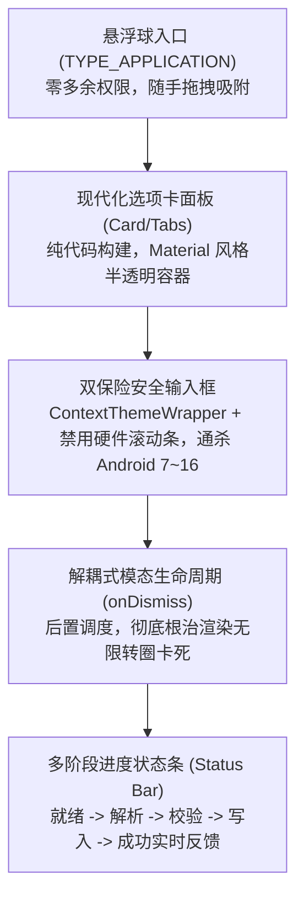

# 04. 现代化多选项卡与统一状态条实战

在前面的小节中，我们已经解决了窗口挂载、防触控穿透、防渲染死锁以及高版本 Android 输入框空指针等一系列深水区稳定性难题。

现在的最后一步，就是将这些分散的原子能力组装成一个**极具美感、操作流畅、具备实时进度反馈的现代化多功能面板**。

本篇讲解如何完全基于纯代码（无需任何 XML 依赖，适配动态注入场景）动态构建包含**“选项卡切换（Tabs）”**、**“卡片式容器（Cards）”**以及**“多阶段状态进度条（Status Bar）”**的高级 UI 界面。

---

## 一、 界面架构设计：三栏多选项卡布局

为了给玩家提供清晰的操作入口，我们将面板拆分为三个高频功能卡片：

```text
┌────────────────────────────────────────────────────────┐
│  [PVZH 牌组助手]                           [✕ 关闭]    │
├────────────────────────────────────────────────────────┤
│  [ 📥 导入牌组 ]      [ 📤 导出当前 ]      [ ℹ 关于 ]   │  <--- 顶部选项卡
├────────────────────────────────────────────────────────┤
│                                                        │
│  [卡组代码输入区 / 复制预览区]                         │
│  ┌──────────────────────────────────────────────────┐  │
│  │ PVZH1:eyJ2IjoxLCJuYW1lIjoiLi4uIn0=               │  │  <--- 动态内容卡片
│  └──────────────────────────────────────────────────┘  │
│                                                        │
│  [ 一键读取剪贴板并导入 ]                               │  <--- 核心操作按钮
│                                                        │
├────────────────────────────────────────────────────────┤
│  ● 状态: [校验中] 正在核验 40 张卡牌阵营与英雄兼容性...  │  <--- 统一状态条
└────────────────────────────────────────────────────────┘
```

---

## 二、 核心机制：统一多阶段状态条（Status Bar）

在异步执行卡组解析与 Unity 主线程写入时，**绝对不能让界面毫无反馈**。
优秀的交互体验必须提供明确的多阶段状态机驱动：

```javascript
// 状态枚举定义
const ModUiState = {
    IDLE:       { text: "就绪：等待玩家操作", color: "#757575" },
    PARSING:    { text: "正在解析：Base64 字符串解码中...", color: "#1976D2" },
    VALIDATING: { text: "正在校验：检查卡牌 GUID 与单卡 4 张上限...", color: "#F57C00" },
    DISPATCH:   { text: "正在写入：投递至 Unity 主线程持久化...", color: "#7B1FA2" },
    SUCCESS:    { text: "成功：卡组已导入，原版收藏界面已刷新！", color: "#388E3C" },
    ERROR:      { text: "失败：卡组格式不合法或英雄阵营不匹配", color: "#D32F2F" }
};
```

---

## 三、 纯代码构建现代化面板完整实现

以下是一套完整的纯原生动态面板构建逻辑，支持运行于 Frida Gadget 内部：

```javascript
// modern_overlay_panel.js

function buildModernModPanel(themedContext, onImportAction, onExportAction) {
    const LinearLayout = Java.use("android.widget.LinearLayout");
    const TextView = Java.use("android.widget.TextView");
    const Button = Java.use("android.widget.Button");
    const EditText = Java.use("android.widget.EditText");
    const View = Java.use("android.view.View");
    const GradientDrawable = Java.use("android.graphics.drawable.GradientDrawable");
    const Color = Java.use("android.graphics.Color");

    // 1. 根容器 (卡片式半透明纯白/深色微拟物圆角面板)
    const root = LinearLayout.$new(themedContext);
    root.setOrientation(1); // VERTICAL
    root.setPadding(32, 32, 32, 32);

    const rootBg = GradientDrawable.$new();
    rootBg.setCornerRadius(24);
    rootBg.setColor(Color.parseColor("#F5FFFFFF")); // 96% 高清微透白
    rootBg.setStroke(2, Color.parseColor("#E0E0E0"));
    root.setBackground(rootBg);

    // 2. 标题栏
    const title = TextView.$new(themedContext);
    title.setText("PVZH 牌组管理助手");
    title.setTextSize(18);
    title.setTextColor(Color.parseColor("#212121"));
    title.setTypeface(null, 1); // 粗体
    root.addView(title);

    // 3. 顶部导航选项卡 (Tabs 栏)
    const tabRow = LinearLayout.$new(themedContext);
    tabRow.setOrientation(0); // HORIZONTAL
    tabRow.setPadding(0, 16, 0, 16);

    const btnTabImport = Button.$new(themedContext);
    btnTabImport.setText("导入卡组");
    const btnTabExport = Button.$new(themedContext);
    btnTabExport.setText("导出当前");

    tabRow.addView(btnTabImport);
    tabRow.addView(btnTabExport);
    root.addView(tabRow);

    // 4. 内容展示区 (输入框)
    const editInput = EditText.$new(themedContext);
    editInput.setHint("请在此粘贴分享码，或点击下方自动读取...");
    editInput.setVerticalScrollBarEnabled(false); // 规避 Android 16 NPE
    editInput.setBackgroundColor(Color.parseColor("#EEEEEE"));
    editInput.setPadding(20, 20, 20, 20);
    root.addView(editInput);

    // 5. 核心操作按钮
    const btnExecute = Button.$new(themedContext);
    btnExecute.setText("立即执行导入");
    btnExecute.setBackgroundColor(Color.parseColor("#1976D2"));
    btnExecute.setTextColor(Color.WHITE.value);
    root.addView(btnExecute);

    // 6. 底部统一状态条 (Status Bar)
    const statusText = TextView.$new(themedContext);
    statusText.setPadding(0, 20, 0, 0);
    statusText.setTextSize(13);
    
    // 状态切换方法
    function updateState(stateKey, customMsg) {
        const state = ModUiState[stateKey];
        statusText.setText(customMsg || state.text);
        statusText.setTextColor(Color.parseColor(state.color));
    }

    updateState("IDLE");
    root.addView(statusText);

    // 7. 绑定操作事件
    btnExecute.setOnClickListener(Java.registerClass({
        name: "com.pvzh.mod.ExecuteClickListener",
        implements: [Java.use("android.view.View$OnClickListener")],
        methods: {
            onClick: function (v) {
                const code = editInput.getText().toString().trim();
                if (!code) {
                    updateState("ERROR", "输入内容为空，请先粘贴有效代码！");
                    return;
                }

                updateState("PARSING");
                setTimeout(() => {
                    updateState("VALIDATING");
                    
                    // 触发外部业务回调
                    onImportAction(code, (success, err) => {
                        if (success) {
                            updateState("SUCCESS");
                        } else {
                            updateState("ERROR", "导入失败: " + err);
                        }
                    });
                }, 100);
            }
        }
    }).$new());

    return {
        view: root,
        updateState: updateState
    };
}
```

---

## 四、 本章交付物总结

至此，我们已经完整构建了一套媲美商业软件的 **Unity 顶层现代化交互体系**：



在下一个章节 —— **第 19 章《良性 Mod 实战：离线卡组分享与编解码协议规范》** 中，我们将把这套 UI 与此前学到的 IL2CPP 内存调用完美合体，设计一套优雅、紧凑且严格受限的离线数据交换标准！
