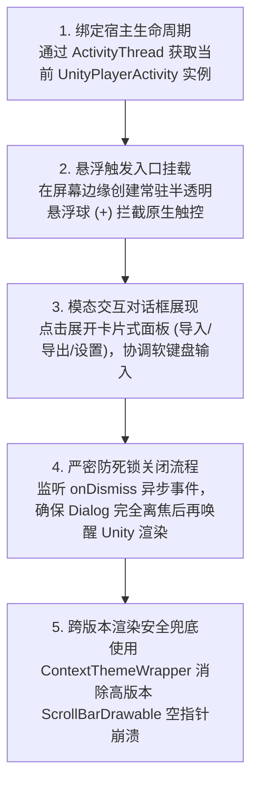

# 18. 现代原生浮窗 UI 混合开发与避坑实录

在完成 Native 函数的 Hook 与主线程调度后，Mod 的业务能力已经齐备。但对于玩家而言，最直接的触点依然是**用户界面（User Interface）**。

在 Unity 游戏之上实现自定义 UI，通常有两种流派：
1. **纯 Unity 改包流**：通过 UABEA 逆向修改游戏原版 Prefab/AssetBundle 塞入新按钮。这种方法极度脆弱，游戏小版本一更新资源即报废；
2. **Android 原生浮窗流（Native Overlay）**：通过 Frida/Java 在运行期直接利用 Android 原生系统的 `WindowManager` 或 `Dialog` 体系，在 Unity 游戏画面正上方动态绘制矢量级现代 UI。

原生浮窗流具备**无需重做美术资源、跨版本自适应高分屏、完美继承系统软键盘输入与剪贴板**的绝对优势。但在全屏运行的 Unity 游戏之上叠加 Android 原生组件，隐藏着触控穿透、渲染挂起死锁以及 Android 高版本系统专有的底层深水区崩溃。

本章节将完整公开一套在真实高版本 Android 真机上打磨成熟的**原生浮窗 UI 架构与故障修复实录**。

---

## 目录导航

| 序号 | 专题文档 | 核心涵盖内容 |
| :---: | :--- | :--- |
| **01** | [01. Unity 顶层原生浮窗架构设计](01.Unity顶层原生浮窗架构设计.md) | 详解 `WindowManager` 布局参数选择、`TYPE_APPLICATION` 窗口挂载、半透明拖拽悬浮球实现与防触控穿透策略。 |
| **02** | [02. 模态对话框与 Unity 渲染挂起防死锁](02.模态对话框与Unity渲染挂起防死锁.md) | 深入排查导致游戏无限转圈卡死的根本原因：异步 `dialog.dismiss()` 与 Unity 帧恢复竞态，提供解耦状态机修复范式。 |
| **03** | [03. Android 高版本输入框滚动条空指针避坑](03.Android高版本输入框滚动条空指针避坑.md) | **独家深水区档案**：剖析 Android 16（API 36）下 `ScrollBarDrawable.mutate()` NPE 闪退的 AOSP 根因与安全样式初始化方案。 |
| **04** | [04. 现代化多选项卡与统一状态条实战](04.现代化多选项卡与统一状态条实战.md) | 详解基于原生 Java 动态构建卡片式选项卡、多阶段进度状态条（校验/转换/写入/就绪）与优雅的错误反馈设计。 |

---

## 核心工作流概览

---

> [!NOTE]
> 💡 **架构原则**：
> 游戏界面的所有渲染由 GPU 直接通过 SurfaceView 完成。我们的原生 Android 视图（View/ViewGroup）是由系统的 WindowManager 叠加在 SurfaceView 上方的独立透明图层，两者内存相互隔离，互不污染。

> [!IMPORTANT]
> 🛡️ **体验与合规守则**：
> 悬浮窗设计应当遵循极简原则，提供清晰的折叠/收起入口，并设置合理的透明度，绝不遮挡游戏核心战斗区或模拟欺诈性点击。
