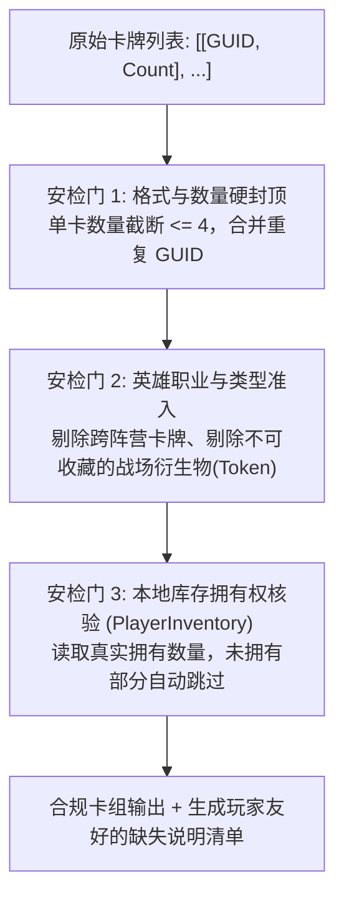

# 02. 卡牌合法性校验与未拥有资产过滤

为什么很多外挂会被反作弊系统封禁，而一个优秀的 QoL（生活质量改善型）Mod 能够被社区和平台长久接纳？

**核心分水岭就在于“客户端合法性校验（Client-Side Validation）”**：
- **作弊工具的特征**：无视游戏规则，强行将未拥有的卡牌、单卡 99 张的非法数值塞入内存，甚至跨阵营塞牌；
- **良性 Mod 的特征**：在代码进入游戏写入管线之前，**建立一道严格的规则过滤器**。任何超额、跨职业、未拥有的卡牌均被优雅过滤，只导入玩家合法持有的真实资产。

本篇讲解如何构建一套严密的卡牌合法性校验链，实现**单卡硬封顶、职业兼容性匹配**以及**未拥有卡牌的优雅降级（Graceful Degradation）**。

---

## 一、 校验流水线设计三部曲

当解析器得到一份解密后的卡牌列表后，必须依次经过以下三重安检门：



---

## 二、 安检门 1：数量硬封顶与重复条目合并

在 PVZH 中，一套正规卡组的上限是 40 张，且任何非特殊规则下的常规卡牌**单卡上限绝对不得超过 4 张**。

必须对输入做强制归一化处理，防止脏数据：

```javascript
// card_sanitizer.js

function sanitizeCardCounts(rawCards) {
    const cardMap = new Map(); // GUID -> Count

    for (const item of rawCards) {
        if (!Array.isArray(item) || item.length < 2) continue;
        const guid = parseInt(item[0], 10);
        let count = parseInt(item[1], 10);

        if (isNaN(guid) || isNaN(count) || count <= 0) continue;

        // 如果分享码里存在重复条目，累加后合并
        const current = cardMap.get(guid) || 0;
        cardMap.set(guid, current + count);
    }

    const sanitizedList = [];
    let totalCount = 0;

    for (const [guid, count] of cardMap.entries()) {
        // 核心硬封顶: 任何卡牌单卡最多 4 张！超出的部分直接截断
        const clampedCount = Math.min(count, 4);
        sanitizedList.push([guid, clampedCount]);
        totalCount += clampedCount;
    }

    return {
        cards: sanitizedList,
        total: totalCount
    };
}
```

---

## 三、 安检门 2：职业与阵营兼容性核验

每个英雄固定属于两个职业（如绿影属于巨化 + 聪明；耀斑花属于日光 + 爆破）。

此外，游戏数据库中存在大量**“衍生卡（Token / Superpower）”**（例如魔豆寻宝产生的“神奇豆茎”）。这些卡牌在战斗外是不可收藏的，如果强行编进卡组，会导致游戏进入对局时服务器校验失败。

```javascript
// card_rules_validator.js

function validateCardCompatibility(heroId, cardGuid, cardMetadataCatalog) {
    const cardInfo = cardMetadataCatalog.get(cardGuid);
    
    // 1. 卡牌是否存在于官方资料库中
    if (!cardInfo) {
        return { valid: false, reason: "未知卡牌 GUID" };
    }

    // 2. 是否为可收藏卡牌 (IsCollectible)
    if (!cardInfo.isCollectible) {
        return { valid: false, reason: "战斗衍生物(Token)不可直接编入初始卡组" };
    }

    // 3. 阵营与职业匹配 (例如植物英雄只能使用植物卡，且必须属于英雄的双职业之一)
    if (!isHeroClassCompatible(heroId, cardInfo.classes)) {
        return { valid: false, reason: `该卡牌不属于 ${heroId} 英雄的阵营或职业` };
    }

    return { valid: true };
}
```

---

## 四、 安检门 3：动态查询本地库存与优雅降级（核心亮点）

很多新手在导入网上的主流卡组时，手里可能只有 30 张，缺少 10 张传奇或超级稀有卡。
- ❌ **野蛮做法**：因为缺卡直接报错，拒绝导入；或者通过篡改数据给玩家非法加上；
- ✅ **优雅降级（Graceful Degradation）**：有多少张就导入多少张！缺的卡牌自动留空，并在导入完成后弹窗友好地告诉玩家：“*卡组已为您导入 34 张；缺少 4 张【火龙草】与 2 张【双胞向日葵】，您可以稍后在卡册中手动替换补齐！*”

### 查询本地库存实战代码：
```javascript
// inventory_filter.js

function filterWithLocalInventory(heroId, sanitizedCards, playerInventoryInstance) {
    const acceptedCards = [];
    const skippedFeedback = [];
    let totalImported = 0;

    for (const [guid, desiredCount] of sanitizedCards) {
        // 1. 查询当前登录玩家在内存中的实际拥有数量
        // 调用 IL2CPP 内存方法: PlayerInventory.GetCardCount(int guid)
        const ownedCount = queryPlayerInventoryCardCount(playerInventoryInstance, guid);

        if (ownedCount <= 0) {
            // 完全未拥有该卡
            skippedFeedback.push({ guid, missing: desiredCount, reason: "未拥有" });
            continue;
        }

        // 2. 取期望数量与拥有数量的较小值
        const actualCount = Math.min(desiredCount, ownedCount);
        acceptedCards.push([guid, actualCount]);
        totalImported += actualCount;

        if (actualCount < desiredCount) {
            skippedFeedback.push({
                guid,
                missing: desiredCount - actualCount,
                reason: `数量不足 (拥有 ${ownedCount} / 需求 ${desiredCount})`
            });
        }
    }

    return {
        acceptedCards: acceptedCards,
        totalImported: totalImported,
        feedback: skippedFeedback
    };
}
```

---

## 五、 本篇小结

通过建立这套严苛的客户端过滤器，我们的 Mod 做到了：
1. **防作弊自洽**：绝不向游戏输入任何违规数据，单卡封顶 4 张，过滤非可收藏卡牌；
2. **保护玩家资产**：绝不越权窃取或伪造卡牌，玩家账号在对战与联网时 100% 安全；
3. **极佳的交互宽容度**：即使缺少高阶卡牌，也能先导入基础骨架，极大降低了玩家互相抄卡组的门槛。

过滤出绝对纯净合法的卡牌数据后，下一篇我们将直面最关键的写入操作 —— **如何让游戏官方原版的 `PlayerDeckProviderImpl` 为我们生成合法的数据模型并优雅落地！**
