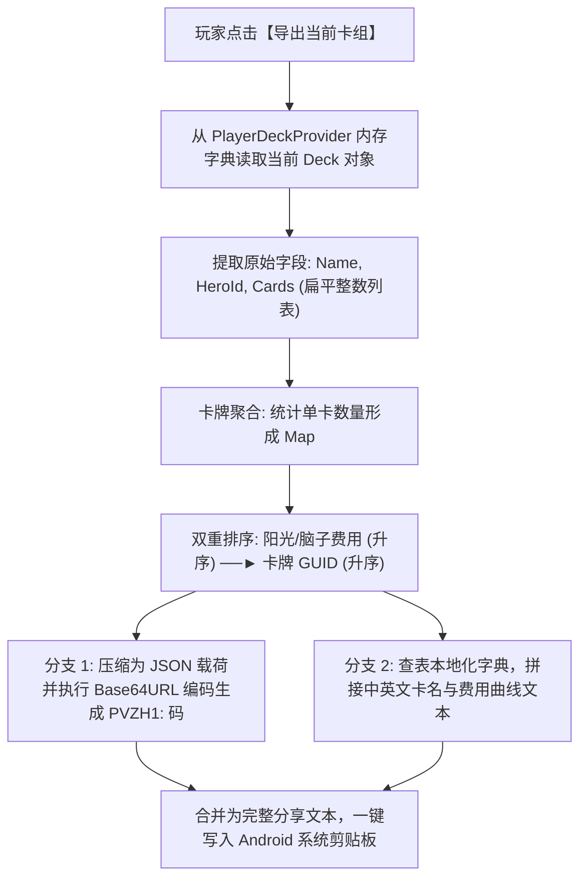

# 04. 牌组双向导出与人性化清单生成

一个真正成熟的卡组分享系统，绝不能只具备单向导入的能力，更需要让玩家能够**一键把自己精心构筑的卡组打包导出**，以便发送给好友或发帖分享。

优秀的导出功能需要同时满足两类受众的需求：
1. **面向机器（导入器）**：必须输出严格遵循 `PVZH1:` 标准的 Base64URL 纯文本代码；
2. **面向人类（社群玩家）**：必须同时生成一份**排版优美、按费用升序排列、带有中英文卡名的清单**，方便别人在不进游戏的情况下快速预览卡组构成与策略曲线。

本篇讲解如何从内存中逆向读取已保存的卡组模型、实现“费用 $\to$ GUID”双重排序算法，并生成社交媒体友好型清单。

---

## 一、 导出数据流水线设计



---

## 二、 内存数据提取与双重排序算法

从 `PlayerDeck` 模型读取到的 `Cards` 字段是一个包含 40 个数字的无序数组。为了生成清晰的费用曲线，必须对卡牌进行结构化聚合与排序：

```javascript
// deck_exporter.js

function formatAndSortDeck(rawCardIds, cardCatalog) {
    // 1. 数量聚合: 统计每种卡牌的张数
    const countMap = new Map();
    for (const guid of rawCardIds) {
        countMap.set(guid, (countMap.get(guid) || 0) + 1);
    }

    // 2. 转换为带元数据的结构化对象列表
    const structuredCards = [];
    for (const [guid, count] of countMap.entries()) {
        const info = cardCatalog.get(guid) || {
            cost: 99,
            nameZh: `未知卡牌 (${guid})`,
            nameEn: `Unknown (${guid})`
        };
        structuredCards.push({
            guid: guid,
            count: count,
            cost: info.cost,
            nameZh: info.nameZh,
            nameEn: info.nameEn
        });
    }

    // 3. 双重排序铁律：优先按费用（Cost）升序，费用相同时按 GUID 升序
    structuredCards.sort((a, b) => {
        if (a.cost !== b.cost) {
            return a.cost - b.cost;
        }
        return a.guid - b.guid;
    });

    return structuredCards;
}
```

---

## 三、 生成双格式社交分享文本

将结构化卡牌列表同时输出为“人类清单”与“机器分享码”：

```javascript
// share_text_generator.js

function generateShareText(deckName, heroId, structuredCards) {
    // 1. 构造紧凑型协议数据包 (用于机器解析)
    const machineCards = structuredCards.map(item => [item.guid, item.count]);
    const payloadObject = {
        v: 1,
        name: deckName,
        hero: heroId,
        cards: machineCards
    };

    // 执行 Base64URL 编码
    const jsonStr = JSON.stringify(payloadObject);
    const base64UrlCode = base64UrlEncode(jsonStr);
    const pvzhShareCode = `PVZH1:${base64UrlCode}`;

    // 2. 构造人类友好型清单 (带费用、中文名、英文名及张数)
    let humanText = `==============================\n`;
    humanText += `【卡组名称】: ${deckName}\n`;
    humanText += `【适配英雄】: ${heroId}\n`;
    humanText += `【卡牌总数】: ${structuredCards.reduce((acc, c) => acc + c.count, 0)} 张\n`;
    humanText += `------------------------------\n`;

    for (const card of structuredCards) {
        // 输出格式例如: [1费] 火龙草 / Snapdragon x3
        humanText += `[${card.cost}费] ${card.nameZh} x${card.count}\n`;
    }

    humanText += `------------------------------\n`;
    humanText += `【一键导入分享码】(直接复制全文即可导入):\n`;
    humanText += `${pvzhShareCode}\n`;
    humanText += `==============================`;

    return humanText;
}
```

---

## 四、 最终成品输出效果示范

当玩家在 Mod 界面中点击“导出”后，剪贴板中将直接获得如下格式的优雅文本：

```text
==============================
【卡组名称】: 节奏快攻绿影
【适配英雄】: GreenShadow
【卡牌总数】: 40 张
------------------------------
[1费] 豌豆射手 x4
[1费] 营火苔藓 x3
[2费] 甜菜骑兵 x4
[3费] 火龙草 x3
[5费] 深蓝海王星 x2
... (余下卡牌按费用升序罗列)
------------------------------
【一键导入分享码】(直接复制全文即可导入):
PVZH1:eyJ2IjoxLCJuYW1lIjoi6IqC5aWP5b+r5pS757u/5b2xIiwiaGVybyI6IkdyZWVuU2hhZG93IiwiY2FyZHMiOlsbNTQzLDRdLFs1ODgsM11dfQ
==============================
```

### 绝妙的协同体验：
1. **发到群里大家都能看懂**：即使别人没有装这个 Mod，也能直接通过清单看清这套卡牌的费用曲线和核心单卡；
2. **装了 Mod 的人一键秒导**：安装了 Mod 的玩家，直接连带这段文字一整段复制到剪贴板，打开游戏点击导入，我们在第 01 篇编写的“宽容解析器”会自动忽略上方的人类文字，精准捕获 `PVZH1:` 代码完成自动填充！

---

## 五、 全系列收官总结

到此为止，我们完成了整整五个章节的宏大跨越：

```text
第 15 章：动态运行时初探 ──► 开启 Frida 动态分析大门，掌握 IL2CPP 符号映射机制；
第 16 章：免 Root 移动端落地 ──► 攻克 Gadget 伪装与长期固定签名规范，实现独立分发；
第 17 章：Unity 引擎动态交互 ──► 构建 UnityDispatcher 调度器，彻底根除跨线程闪退；
第 18 章：现代原生浮窗 UI ──► 打造高颜值半透明面板，修复 Android 16 AOSP 滚动条崩溃；
第 19 章：良性 Mod 实战 ──► 设计 PVZH1 协议与优雅降级过滤，完美落地双向卡组分享！
```

这套体系证明了一个真理：**真正的技术力，不需要靠网络黑客手段或破坏规则来证明；在完全合规、尊重原版、纯本地运行的约束之下，我们依然能够打造出体验惊艳、广受社区赞誉的顶级良性 Mod！**
