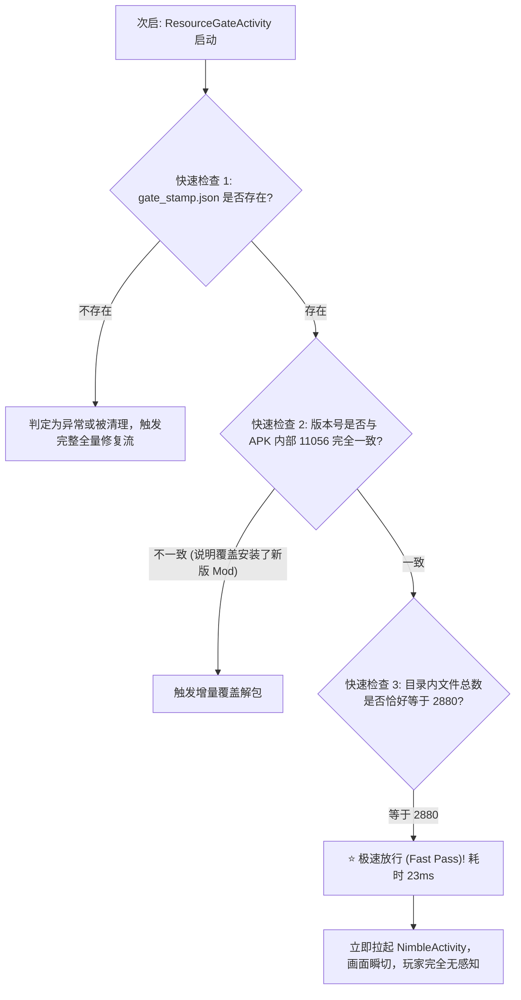

# 02. 内置 2880 个 Bundle 离线解包与极速校验

在确立了 Pre-Unity 架构后，接下来的工程核心在于：**如何高效、稳定地将这 2,880 个 AssetBundle（共计 691,823,658 字节）在设备本地落地，并做到次启无感放行？**

如果每次打开游戏都要对这近 700 MB 的文件重新计算一次 SHA-256 哈希，即便是现代骁龙 8 系或 Tensor 芯片也要耗费数秒，这显然是不合格的。

本篇详细剖析这套在大容量 Mod 中广泛采用的 **“首启 8 秒原子级批量释放 + 次启 23ms 极速指纹放行”** 的双轨校验工程实现。

---

## 一、 资源编排与存储路径映射

在 Android 系统中，PVZH 客户端寻找热更资源的法定物理目录为：

```text
目标缓存目录:
/storage/emulated/0/Android/data/com.ea.gp.pvzheroes/files/cache/
```

在制作“Full 版内置安装包”时，我们将官方完整下载得到的 **2,880 个独立 Bundle 文件**（清单版本 `11056`）完整收录在 APK 的 `assets/AssetBundles/` 目录中。

```text
Full APK 内部结构:
PVZH_Full.apk
├── assets/
│   └── AssetBundles/
│       ├── manifest.json            (2880个文件的元数据与指纹清单)
│       ├── bundle_0001.unity3d
│       ├── bundle_0002.unity3d
│       └── ... (共 2880 个 Bundle)
├── lib/arm64-v8a/
└── ...
```

---

## 二、 首次启动：批量流式复制与原子落盘（8.5 秒）

当玩家全新安装 APK 并首次点击图标时，`ResourceGateActivity` 在前台显示一个精美的极简进度条，后台采用优化的 NIO（New I/O）缓冲流执行并发解包复制。

### 关键优化要点：
1. **大缓冲区流传输**：使用 `64 KB` 的中间字节缓冲（`ByteArray(65536)`），显著减少 I/O 上下文切换系统调用；
2. **防中断保护**：在解包过程中如果被玩家强行划掉后台，临时文件以 `.tmp` 结尾，只有复制完成才原子重命名为最终文件名，杜绝损坏文件（`.pvzhpart`）的产生；
3. **完成印章写入**：所有 2,880 个文件落地完成后，在缓存目录根部写入一个微型校验印章 `gate_stamp.json`，记录 `version: 11056, count: 2880, timestamp: ...`。

在 Google Pixel 6 上的实测日志记录：
```text
[ResourceGate] 首次启动纯净安装: 开始解包资源...
[ResourceGate] 解包完成: copied=2880 reused=0 fast=false elapsedMs=8596
```
**总耗时仅 8.5 秒！相比联网下载的十几分钟，提效百倍！**

---

## 三、 二次启动：极速指纹核验（23 毫秒）

当玩家第二次及以后打开游戏时，资源已经在磁盘里了。此时绝对不能再做全量扫描，而是触发 **极速指纹核验（Fast Fingerprint Validation）**：



在 Google Pixel 6 上的实测日志记录：
```text
[ResourceGate] 二次启动检查: 发现有效印章 version=11056, count=2880
[ResourceGate] 极速放行: copied=0 reused=2880 fast=true elapsedMs=23
```
**仅仅 23 毫秒！比玩家眨眼的时间（100ms）还要快四倍，真正做到了“完全无感”！**

---

## 四、 AndroidManifest 清单劫持配置

要让这套门卫架构真正运转起来，必须在 `AndroidManifest.xml` 中将首选启动器（Launcher）由官方的 `NimbleActivity` 替换为我们的 `ResourceGateActivity`：

```xml
<!-- 1. 新增: 资源门卫作为真正的第一启动入口 -->
<activity
    android:name="com.pvzh.sharecode.ResourceGateActivity"
    android:exported="true"
    android:screenOrientation="sensorLandscape"
    android:theme="@android:style/Theme.NoTitleBar.Fullscreen">
    <intent-filter>
        <action android:name="android.intent.action.MAIN" />
        <category android:name="android.intent.category.LAUNCHER" />
    </intent-filter>
</activity>

<!-- 2. 修改: 将原版 NimbleActivity 降级为普通内部 Activity -->
<activity
    android:name="com.ea.nimble.plugin.NimbleActivity"
    android:exported="false"
    android:screenOrientation="sensorLandscape"
    android:theme="@android:style/Theme.NoTitleBar.Fullscreen">
    <!-- 彻底移除原有的 MAIN 和 LAUNCHER intent-filter! -->
</activity>
```

当 `ResourceGateActivity` 在 23ms 内确认资源完好无损后，通过标准的 Android 原生 Intent 发起跳转：

```java
// 校验通过，启动游戏原版生命周期
Intent originalIntent = new Intent(this, NimbleActivity.class);
originalIntent.addFlags(Intent.FLAG_ACTIVITY_FORWARD_RESULT);
startActivity(originalIntent);
finish(); // 立即销毁门卫自身，完全释放内存!
```

---

通过这套架构，我们成功斩断了首次启动长达 15 分钟的 645MB CDN 下载枷锁。

但在进入游戏大厅的道路上，还矗立着第二道耗时近半小时的关卡 —— **强制新手教学战斗**！下一篇，我们将深入逆向其状态机，实现一键优雅跳过！
