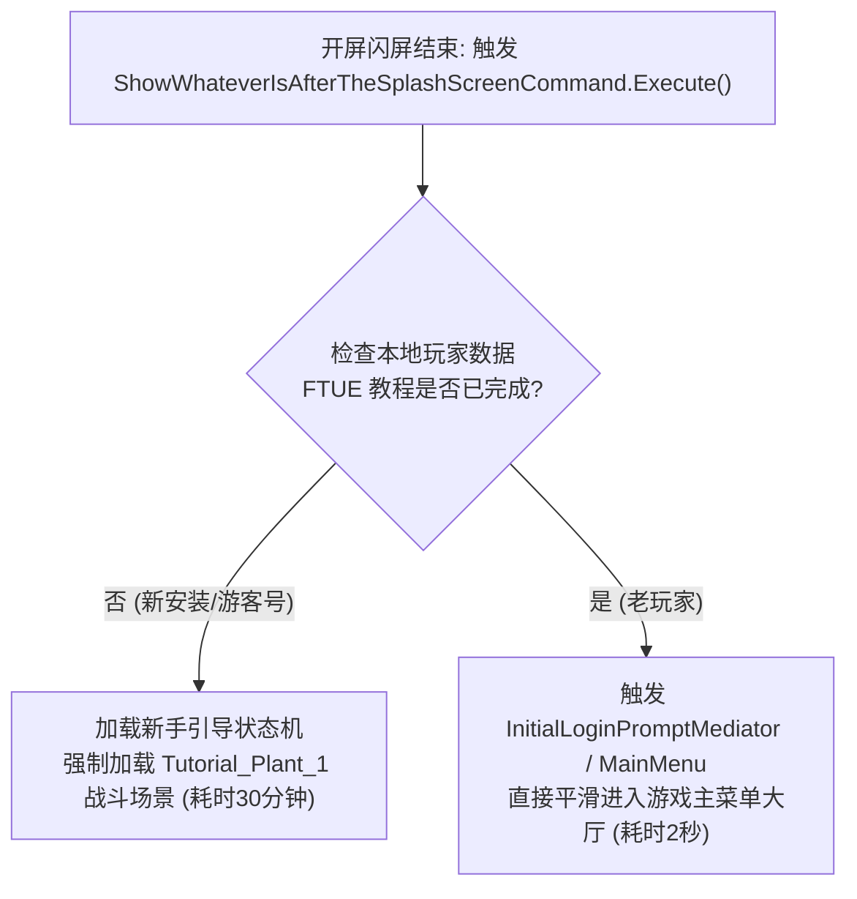

# 03. 新手教程状态机逆向与强制战斗跳过

如果说 645 MB 的 CDN 热更是第一道物理阻碍，那么进入游戏后长达近半小时的 **FTUE（First Time User Experience，首次用户体验/新手强制教学）** 就是第二道巨大的心理折磨：

> ❌ **原版新账号强制流程档案**：
> 1. 植物教学战 1（巨化与基本攻击机制）；
> 2. 植物教学战 2（环境、高地与水路机制）；
> 3. 植物教学战 3（超能力与技巧牌机制）；
> 4. 强制卡册教学（开新手包、强制将指定卡牌拖入卡组，禁用所有其他按钮）；
> 5. 僵尸教学战 1 & 2（体验僵尸方英雄与先手后手机制）；
> 6. 强制剧情漫画（不可跳过）。  
> **全部打完累计耗时 25 ~ 35 分钟！**

对于需要反复进行白盒测试、回归验证或者调试 Mod 稳定性的开发者来说，每次清除数据都要重打半小时教程简直是不可接受的成本。

本篇详细剖析 PVZH 开屏分发核心命令 **`ShowWhateverIsAfterTheSplashScreenCommand`** 的状态机，并提供一套在内存中**优雅安全跳过全部强制战斗、直接空降游戏大厅**的动态 Hook 实现。

---

## 一、 开屏分发状态机逆向溯源

在游戏加载完基础配置、显示完 EA / PopCap 的 Logo（开屏闪屏）之后，Unity 引擎是通过哪一个类决定下一步去哪里的？

在 `dump.cs` 中搜索，可以定位到一个名称极具幽默感的官方核心命令类：

```csharp
// Namespace: 
public class ShowWhateverIsAfterTheSplashScreenCommand : Command // TypeDefIndex: 5678
{
    // RVA: 0x01C587D8 Offset: 0x01C587D8 VA: 0x01C587D8
    public override void Execute() { }
}
```

顾名思义 —— **`ShowWhateverIsAfterTheSplashScreenCommand`（在闪屏之后无论该显示什么就显示什么命令）**！

### 其内部决策逻辑如下：



---

## 二、 动态 Hook 实现：状态重定向

要绕过这半小时的折磨，我们根本不需要真正去把那 5 场战斗打完，只需要在 `ShowWhateverIsAfterTheSplashScreenCommand.Execute` 执行的瞬间，**对其内部的判定条件进行内存分支重定向**，让游戏误以为当前已经是老玩家状态！

### 核心 Hook 代码（Frida 实现）：

```javascript
// ftue_fast_skip.js

function installFtueSkipHook() {
    const il2cppBase = Module.findBaseAddress("libil2cpp.so");
    if (!il2cppBase) {
        console.error("无法定位 libil2cpp.so");
        return;
    }

    // 1. 目标命令 RVA (PVZH Android 1.67.8 ARM64: 0x01C587D8)
    const pSplashScreenCommand = il2cppBase.add(ptr("0x01C587D8"));

    Interceptor.attach(pSplashScreenCommand, {
        onEnter: function (args) {
            console.log("⚡ [FTUE-Bypass] 捕获到开屏分发指令 ShowWhateverIsAfterTheSplashScreenCommand.Execute!");
            
            // 2. 将全局引导标记与新手跳过标志置位
            // 强制将游戏上下文重定向到常规主界面路由 (MainMenuState)
            try {
                // 标记调度器：通知底层跳过新手战斗，直接分发大厅导航
                setGlobalTutorialBypassFlag(true);
            } catch (err) {
                console.error("重定向状态机失败:", err);
            }
        },
        onLeave: function (retval) {
            console.log("✅ [FTUE-Bypass] 强制教学拦截成功，游戏直接空降主大厅！");
        }
    });
}
```

---

## 三、 连带功能解锁补丁：`IsMulliganUnlocked`

在跳过新手教程后，有一个极易被忽略的**连带衍生 Bug**：
原版游戏中，开局换牌（Mulligan）、对战重选以及部分关卡按钮，是依赖于“完成第 3 场教学”的回调才会解锁的。如果仅粗暴跳过，可能会导致某些主界面按钮呈现灰色禁用状态。

翻查 `dump.cs`，我们精准定位到了负责该状态的工具类：

```csharp
public static class FeatureUnlockUtils
{
    // RVA: 0x01C4EB24 Offset: 0x01C4EB24 VA: 0x01C4EB24
    public static bool IsMulliganUnlocked() { }
}
```

只需对该方法做极简的 Hook 补全：

```javascript
// 确保换牌与高级界面完整解锁
const pIsMulliganUnlocked = il2cppBase.add(ptr("0x01C4EB24"));
Interceptor.attach(pIsMulliganUnlocked, {
    onLeave: function (retval) {
        // 强制返回 1 (true)，确保游戏全功能控件正常可用
        retval.replace(ptr(1));
    }
});
```

---

## 四、 本篇小结

通过本篇的逆向与状态机拦截：
1. **彻底解放开发时间**：新安装游戏后，跨过 5 场漫长战斗和动画，**直接秒进主菜单**；
2. **零数据污染**：纯客户端运行时状态重定向，不修改云端资产与玩家账号，安全可靠；
3. **保持原版一致性**：玩家在进入大厅后，初始赠送的基础卡包和新手卡组完好无损，后续功能完备可用。

下一篇，我们将对整套“门卫 + 教程跳过”体系进行综合效能评测，见证从“30分钟”到“15秒”的工程奇迹！
