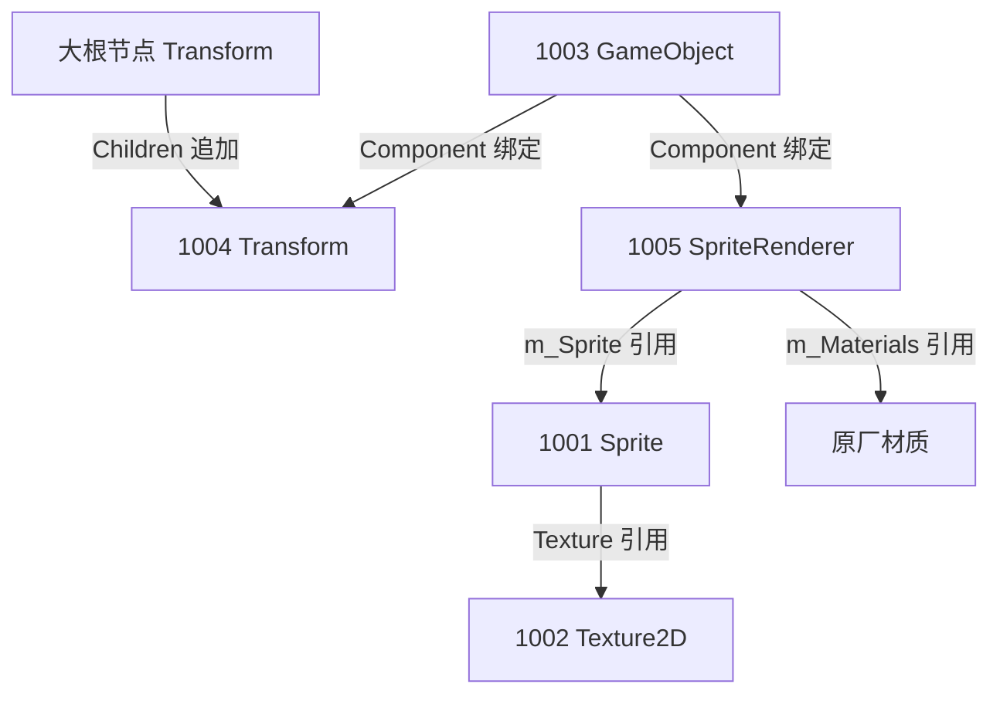

# Unity 2D AssetBundle Modding 技术指南：从“碎骨骼”到“纸片人”与“视频卡牌”的逆向实战

本指南基于《植物大战僵尸：英雄》（PvZ Heroes）底层 2D 骨骼动画 AssetBundle 实战模改经验整理。系统阐述了如何在不修改游戏 C# 代码的前提下，通过对 AssetBundle 进行二进制与类型树（TypeTree）层面的解构、注入与重绑定，实现以下两类主流 Mod 的制作：
1. **纸片人 Mod（单张 1024×1024 贴图替换多碎骨骼，注入对齐动画）**
2. **视频卡牌 Mod（卡牌立绘替换为本地循环播放的 MP4 视频，且支持音频）**

---

## 一、 底层核心原理与核心约束

进行此类 AssetBundle 修改，需要具备对 Unity 底层资产序列化结构的认识，以避免真机加载时崩溃或渲染异常。

### 1. Unity 序列化结构与 PPtr 引用机制
* **PPtr（Property Pointer）**：Unity 内部表示对象间引用的指针。其由两个核心字段构成：
  * `m_FileID`：引用文件 ID。当 `m_FileID = 0` 时，表示引用的对象在**当前包（AssetBundle）内部**；当 `m_FileID > 0` 时，表示对**外部依赖包**（如公共材质包、Shader 包）的引用，其数值对应外部文件依赖列表（Externals）的索引。
  * `m_PathID`：对象在对应 Asset 序列化文件中的唯一标示符（有符号 64 位整数）。
* **类型树（TypeTree）**：定义了每个 ClassID 的序列化数据结构。由于安卓真机环境对资产结构要求极严，我们在注入自定义组件（如 `VideoPlayer`、`AudioSource`）时，必须使用与游戏引擎大版本（本项目为 **Unity 2022.3.x**）及平台（**Android**）完全兼容的类型树。

### 2. 组件生命周期（Lifecycle）与挂载约束
* **关键约束**：在 Unity 中，像 `VideoPlayer` 和 `SpriteRenderer` 这样的渲染/逻辑组件，**必须挂载在游戏场景中处于激活状态的 GameObject 上**，引擎才会触发其生命周期（如 `Awake`, `Start`, `Update`），从而加载视频或渲染画面。
* 如果将其挂载在未激活的节点、或者完全隔离的独立节点上，引擎在卡牌上场时将无法触发播放逻辑，视频将完全不显示。

### 3. PPU（Pixels to Units）与尺寸映射
* 2D 游戏画面大小的核心控制参数是 Sprite 的 `m_PixelsToUnits` (PPU)。
  * **换算关系**：$\text{世界单位大小} = \text{像素大小} / \text{PPU}$。
  * **缩放规律**：**PPU 越小，真机上显示的图片/视频物理尺寸越大**。调整此参数比直接修改 Transform 缩放更稳定，能有效避免因动画曲线覆盖 Transform 缩放而导致的尺寸异常。

---

## 二、 方案一：纸片人 Mod（单张贴图重构）

### 1. 核心目标
将原本由几百个散碎骨骼贴图组成的、利用骨骼动画驱动的 2D 单位，自动重构为**单张 1024×1024 的扁平纸片人**，并注入修改后的动画使之动起来。

### 2. 结构重组设计：“五件套”注入法
为接管原厂复杂的碎骨骼结构，我们在包内程序化注入 5 个专有资产（分配固定的 ID，如 1001~1005），建立起一套完整、干净的纸片人渲染链路：



* **1001 Sprite**：命名为 `"character"`，类型为 Sprite，PPU 设为自定义缩放值（一般在 `75 ~ 80` 之间以获得完美尺寸），关联贴图为 1002。
* **1002 Texture2D**：命名为 `"character"`，灌入 1024×1024 的新皮肤 PNG 数据。
* **1003 GameObject**：组件列表仅包含 1004 (Transform) 和 1005 (SpriteRenderer)。
* **1004 Transform**：挂载于原版卡牌预制体的“大根节点”（即没有父节点的第一个 Transform 组件，`m_Father = 0`）下，本地位置初始化为 `(0, y_offset, 0)`。
* **1005 SpriteRenderer**：关联 GameObject 1003，渲染 Sprite 1001，材质复制包内原厂材质引用以防止红紫块报错。

### 3. 数据清理与白名单机制
为了极致精简包体并防止干扰，需要将原包中的碎骨骼贴图与 Sprite 剔除。
* **物理剔除**：直接从 AssetBundle 的对象列表中 `del` 掉所有的旧 Texture2D 和 Sprite（除了注入的五件套）。
* **保护白名单**：游戏中用于卡牌手牌显示（in-hand）的立绘一般存储在 `assets/ship/.../generatedsprites/inhand/` 容器路径下。**必须通过扫描 Container 路径，将这部分 Texture2D 和 Sprite 加入白名单予以保留**，否则会导致卡牌手牌图标缺失。

### 4. 动画 Dump 曲线注入与哈希重定向
原厂 `AnimationClip` 动画是为碎骨骼设计的，其每帧记录了各个骨骼节点的 `Position`、`Rotation` 等参数。要让纸片人动起来，必须进行重绑定：
1. **动画分类匹配**：根据动画文件名称匹配（`idle`, `attack`, `damage`, `die`, `enter`, `inhand`, `special` 等关键词）。
2. **重写 AnimationClip 类型树**：将事先用 UABEA 导出的、已对齐的模板动画 `.txt` 重新灌入 `AnimationClip` 中。
3. **哈希路径重定向**：Unity 动画通过路径哈希定位节点。手动对齐使用的目标节点 `"character"` 的路径 CRC32 哈希值为 **`2474291252`**。将所有要动起来的动画轨（`genericBindings`）的目标路径哈希全部强行覆写为此值，使动画曲线直接驱动 1004 Transform 节点。

---

## 三、 方案二：视频播放 Mod（卡牌 Video 播放）

### 1. 核心目标
在卡牌上场后，自动循环播放本地的高清 MP4 视频，且画面大小及垂直高度完美契合卡牌边框。

### 2. 注入设计与组件链绑定
该 Mod 主要是将 Unity 引擎原生的 `VideoPlayer` 重度挂载到主预制体中。具体做法如下：

* **选取挂载节点**：选取身体主节点 `Guacodile_body_base`（GO PathID: `2505563530246109078`）。
* **注入组件**：在包中注入 `VideoPlayer` (PathID: `999999`) 和 `AudioSource` (PathID: `999993`)。
* **拼装引用指针**：
  * 在 GameObject 组件列表中追加这两个 ID。
  * 将 `VideoPlayer.m_GameObject` 指向身体 GO。
  * 将 `VideoPlayer.m_TargetMaterialRenderer` 指向身体 `SpriteRenderer` (PathID: `-824107450763009214`)。
  * 将 `VideoPlayer.m_TargetMaterialProperty` 覆写为 `"_MainTex"`（这一步至关重要，决定了视频将覆写材质的哪张贴图）。

```
Guacodile_body_base (GameObject)
├── Transform (Transform) -> 本地高度提升 Y +8.0 
├── SpriteRenderer (SpriteRenderer) -> 材质保持原厂材质，Sprite 改为 4 顶点矩形
├── VideoPlayer (VideoPlayer) -> Mode = MaterialOverride, Property = _MainTex, Mode = AudioSource
└── AudioSource (AudioSource) -> 2D 模式，Volume = 1.0
```

### 3. 规避视频裁剪：网格重构（Mesh Reconstruction）
* **痛点**：默认情况下，Unity 的 `SpriteRenderer` 是基于 Sprite 的多边形 Tight 网格渲染的（即图片周围紧密贴合的 12 个或更多顶点）。若直接在此渲染器上覆盖视频，视频画面会像“剪纸”一样被裁切成角色的身体轮廓。
* **解决办法**：对身体 Sprite (PathID: `-7039357134312480387`) 的 `m_RD` 网格信息进行改写：
  * 将顶点数强行改为 **4 顶点**，UV 坐标对应 `(0,0)`, `(1,0)`, `(0,1)`, `(1,1)` 四个角。
  * 索引缓冲区重置为 **6 个索引**，形成一个纯矩形面片（Quad）。
  * 这样视频播放时即可铺满整个矩形区域，显示完整的画幅。

### 4. 音效支持：Android 安全音频模式
* **模式选择**：`VideoPlayer.m_AudioOutputMode` 必须设为 `1`（`AudioSource` 模式），不要使用 `2`（Direct 模式，真机极易闪退）。
* **AudioSource 参数**：配置为 2D 音效（将空间混合曲线 `panLevelCustomCurve` 的所有 Key 均设为 `0.0`），默认音量 `Volume = 1.0`。
* **视频编码**：真机 MP4 音轨必须为标准 AAC 编码。

---

## 四、 黄金避坑与防错指南

| 常见致命异常 | 根本原因 | 黄金预防方案 |
| :--- | :--- | :--- |
| **洋红/紫色块** | 改动了材质（Material）引用，将其变更为 `Sprites-Default`（PathID 10754）等没有打包进 APK 的外部 shader 或材质，导致材质丢失。 | **坚决使用原厂材质引用**！即使修改渲染器组件，其 `m_Materials` 必须指向原本就在依赖包中的 PPtr 指针（如 `FileID=1, PathID=-1819920480324351361`）。 |
| **视频能播，但跟着卡牌动画移位后脱节** | 将视频卡牌 Jans 轴抬高偏移直接写入了**网格顶点坐标（Mesh Vertices）**，导致网格中心偏离了 GameObject 节点中心。 | 保持网格在局部坐标下绕 Pivot 居中。**高度偏移量一律只加到挂载该渲染器的 Transform 局部坐标中（`body_base.m_LocalPosition.y`）**。 |
| **真机贴图全黑/全白消失** | 注入 `.dat` 五件套模板文件后，在 Python 中再次直接调用了 `ObjectReader.read()`。由于 UnityPy 缓存机制，这会用过期的原包偏移数据覆盖掉刚写入的模改数据。 | 注入后，若需要修改字段，必须使用专门编写的从 `obj.data` 二进制读取并解析的 `read_injected_typetree(obj)`，严禁直接使用原厂 `obj.read()` 覆盖写入。 |
| **纸片人严重偏斜/颠倒** | 模板数据 `1004.dat` 在创建时被赋予了带有 Z 轴偏角的旋转数据，直接注入造成了旋转污染。 | 在注入 Transform 时，强制手动将四元数旋转重置归零：`m_LocalRotation = (0, 0, 0, 1)`。 |
| **包体文件极度臃肿（约 ~500KB）** | 封包保存时，采用了无压缩机制（`packer="none"`）。 | 调用 UnityPy 保存函数时，参数必须显式声明为 **`packer="original"`** 或 `"lz4"`，保持包体原压缩算法，体积自然回缩至正常范围（约 ~228KB）。 |
| **卡牌加载时崩溃闪退** | 注入的模板二进制数据中，部分 PPtr 链接依然保存着开发环境里的无效旧 PathID（过期指针）。 | 模板 `.dat` 只提供基础字节骨架，**一旦注入必须通过代码重新绑定所有关键指针**（大根组件、父级 Transform、对应 Sprite、对应 GameObject）。 |

---

## 五、 参数调参实用经验

在 Modding 中，对尺寸（`DISPLAY_SCALE`）和高度（`DISPLAY_Y_OFFSET`）的微调是打磨视觉表现的关键。

### 1. 尺寸微调（绕中心等比缩放）
* **做法**：调节 Sprite 的 `m_PixelsToUnits` 参数。
* **计算与经验值**：
  * 原版默认的卡牌 PPU 约为 `22.92`。
  * 将将其除以尺寸系数 `DISPLAY_SCALE`。通常设置为 `3.0`，计算得到目标 PPU 约为 `7.64`。
  * **真机效果**：图片/视频尺寸将完美等比扩大 3 倍，且没有锯齿。
  * **注意**：绝对不要试图放大父级 Transform，这会放大 `LocalPosition`，导致卡牌瞬间飞出屏幕。

### 2. 高度微调（Y 轴垂直对齐）
* **做法**：对挂载 VideoPlayer 节点的 Transform 本地 Y 坐标进行累加。
* **计算与经验值**：
  * 放大 3 倍后，网格物理半高扩展至原来的 3 倍（对于 Guacodile 来说半高从 3.7 单位扩展到了 11.1 单位）。
  * 底部会因为尺寸放大而向下溢出，造成画面偏下。
  * **定稿偏移**：增加高度偏移 `DISPLAY_Y_OFFSET = 8.0`（作用在 `body_base.m_LocalPosition.y` 上，而不是修改 Mesh 顶点），刚好补偿下垂，使卡牌完美居中对齐卡牌边框。

---

## 六、 规范化打包流程

完成 Python 修改脚本后，可以使用下述工作流高效迭代验证：

1. **环境归置**：将**干净原包**放入 `input/` 文件夹下，待处理的新立绘放入 `2_new_skins/` 文件夹。
2. **配置微调**：如有高度或缩放微调需求，编辑 `config.py`（针对纸片人）或 `fix_video_ab.py` 中的 `DISPLAY_SCALE` / `DISPLAY_Y_OFFSET` 参数。
3. **自动化打包**：
   ```bash
   # 纸片人批量打包
   python auto.py
   
   # 视频卡牌打包
   python scripts/fix_video_ab.py guacodile
   ```
4. **验证与校验**：脚本会自动回读保存好的 Bundle，检查五件套完整性，并自动在 `output/` 输出报告 `<bundle>.report.json`。
5. **部署测试**：使用 ADB 或手工将 patched 后的 Bundle 覆盖进真机对应的缓存目录，配合本地 MP4 视频，启动游戏即可在对战中直接看到酷炫的动态效果。
